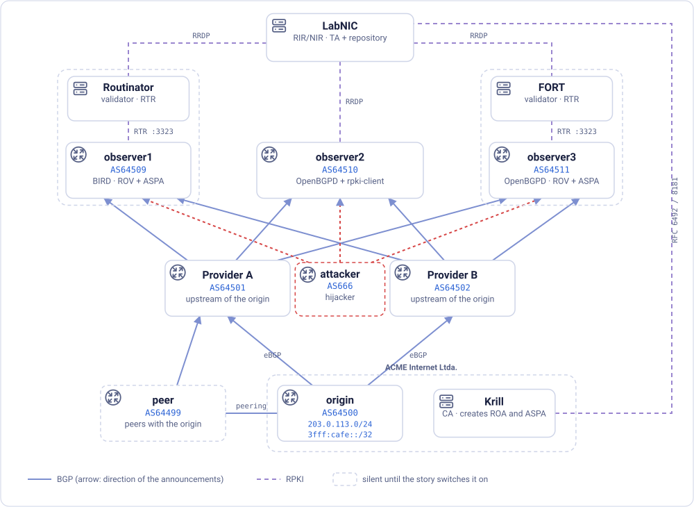
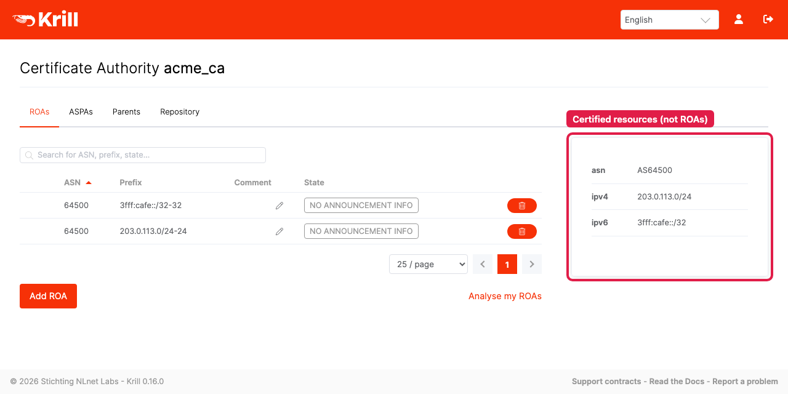
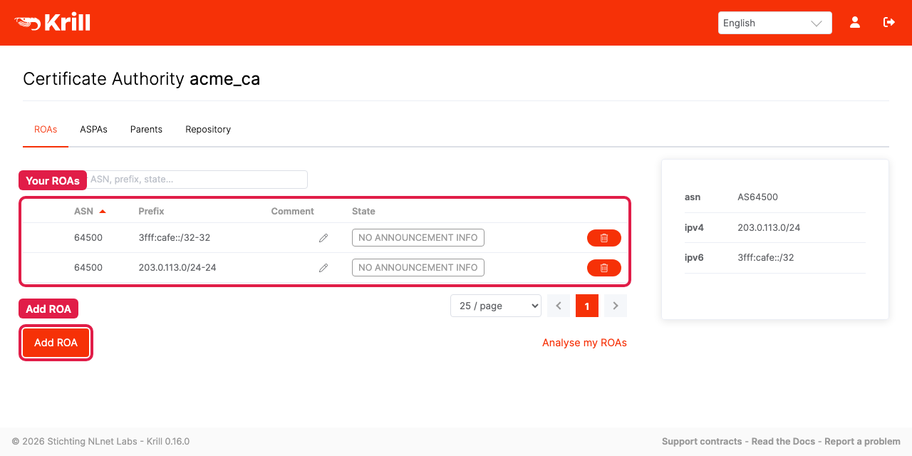
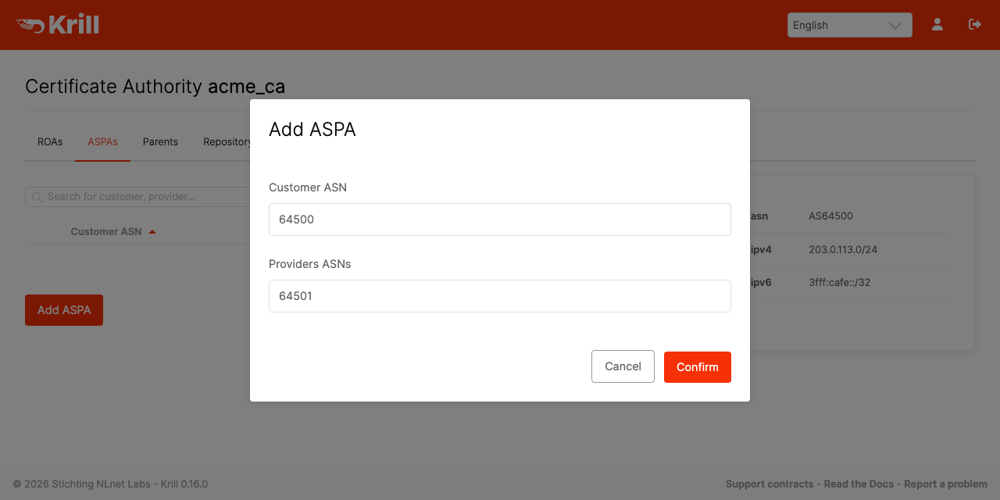

# RPKI SelfLab

*Standalone Lab and Self-Study Guide for RPKI, ROA, ROV, and ASPA*

*[English](GUIDE.en.md) · [Español](GUIDE.es.md) · [Português](GUIDE.pt.md)*

**Goal:** follow a hijacker and a leaky peer through a lab that runs on your
own machine. See what origin validation (ROV) catches, what slips past it,
and what ASPA adds on top, with every verdict checked twice, by two
independent stacks (BIRD + Routinator, and OpenBGPD + FORT).

Everything runs in containers on your computer. The guide assumes you already
know the basics of RPKI, ROAs, ROV and ASPA. You can certify your resources
entirely locally or, if you'd rather work with a real registry, against
Registro.br's test system.

The guide is a single story in nine steps: it sets up **three attacks and shows
which check stops each one**. A short preparation comes first (install Docker,
bring the lab up, certify your resources), and a few extra exercises come
after.

> [!TIP]
> **How to use this lab.** The panel controls a complete lab: real BGP
> routers, two real RPKI validators, a real CA and a registry, all running on
> your computer. **Following this guide step by step is the recommended
> path**, because each step sets up the next. Once you've finished it, use the
> lab freely: try your own configurations, break things on purpose, invent
> scenarios (the last section, *Exploring on your own*, has ideas). If
> something breaks, the command for the step you're on puts the lab back the
> way that step expects.

On the panel, the guide is interactive. Expected outputs stay hidden behind
a button until you've run the command yourself, and some steps are
**challenges**: the solution stays hidden until you ask for it, a timer runs,
and *Check my lab* looks at your lab's real state to see whether you got
there. Anything hidden opens with one click, if you'd rather read straight
through.

## What RPKI asks of your own AS, and what this lab deploys

Deploying RPKI means doing two things, publishing and validating, for each of
two questions:

| | The origin publishes... | ...and routers validate |
|---|---|---|
| **Who may originate a prefix** | **ROAs** (Route Origin Authorizations) | **ROV** (Route Origin Validation) |
| **Which paths are plausible** | an **ASPA** object (Autonomous System Provider Authorization) | **ASPA verification** |

In real life, **both belong in the AS you operate**, and they protect different
things. *Publishing* ROAs and an ASPA object protects **your own prefixes**:
networks that validate will reject a hijack or a leak of your address space, so
traffic headed to you keeps reaching you. *Validating* protects **the decisions
your own routers make**: they reject bogus routes towards other people's
prefixes, so your traffic, and your customers', doesn't get diverted. Neither
side works alone: your objects protect you only where other networks validate,
and your validation protects you only for prefixes whose holders published
objects. Publish without validating, and your prefixes are protected wherever
others validate, while your own network still accepts hijacked routes to
everyone else. Validate without publishing, and your network steers clear of
bogus routes to other people's prefixes, but nobody, not even your own routers,
can tell a hijack of your prefixes from the real thing.

This lab splits the two up, for teaching purposes:

- **Publication is deployed only in the Origin AS** (AS64500, whose CA lives in
  Krill). It's the only AS that creates ROAs and an ASPA object.
- **Validation is deployed only in the Observer ASes** (observer1 and
  observer2), the two routers you'll be watching. Everything else in the lab
  is an ordinary BGP router that never looks at RPKI.

Validation goes on the observers **in two stages, for each check**. First the
router only *marks* what the check flags (a community, a lower preference,
nothing actually dropped), so you can see what would happen. Then it *drops*
it. Dropping invalid routes is what real routers do; marking is the rehearsal
you run before trusting a check enough to let it reject anything.

## Glossary

These are the terms the guide uses most. The definitions are short and
describe how each term is used in this lab; the RFCs under *References* have
the full details. If you already know them, skip ahead to the topology.

On the panel, these terms are underlined with dots wherever they appear in the
guide. Hover over one to see its definition.

### Concepts

| Term | Meaning |
|---|---|
| **RIR/NIR** | Regional/National Internet Registry: allocates ASNs and IP blocks and, in RPKI, certifies that you hold them |
| **CA** | Certificate Authority: the RPKI engine that turns "these resources are yours" into signed certificates and objects |
| **TA** | Trust Anchor: the CA at the root of a validator's chain of trust; every other certificate the validator accepts chains up to it |
| **TAL** | Trust Anchor Locator: a small file that tells a validator where to fetch the TA's certificate and which key to expect |
| **ROA** | Route Origin Authorization: a signed object saying "this ASN may originate this prefix, up to this length" |
| **ASPA** | Autonomous System Provider Authorization: a signed object in which an AS (the *customer*) lists all of its upstream providers, the only ASes authorized to pass its routes on upward |
| **ROV** | Route Origin Validation: checks a route's *last* AS (the one that originated it) against the ROAs |
| **ASPA verification** | checks the *whole path*, hop by hop, against the ASPA objects |
| **Upstream / downstream** | the two ASPA verification algorithms; which one applies depends on who sent you the route: a customer or a lateral peer (upstream, the strict one) or a provider (downstream) |
| **RRDP** | RPKI Repository Delta Protocol: how a validator fetches signed objects from a publication point |
| **RTR** | RPKI-to-Router protocol: how a validator hands its verdicts to a router; ASPA needs RTR version 2 |
| **VRP** | Validated ROA Payload: the (ASN, prefix, max length) triple a validator derived from a ROA |
| **AS_PATH** | the list of ASes a BGP announcement went through; the last one is the origin |
| **Prepend** | repeating your own ASN in the AS_PATH to make a path look longer, and so less attractive |
| **Multihomed** | an AS connected to more than one provider |
| **local_pref** | BGP's local preference: the highest wins, and it's compared before the AS_PATH length |
| **Large community** | a numeric label (RFC 8092) attached to a route; observer1 uses them to record its verdicts |
| **Role** | the relationship declared on a BGP session (RFC 9234: provider, customer, peer...); on OpenBGPD, it's what selects the ASPA algorithm |
| **Hijack** | announcing a prefix that belongs to someone else, as if it were yours (or as if it came through them) |
| **Route leak** | passing on a route you learned from one neighbor to another neighbor you shouldn't (RFC 7908); nobody lies about the origin, but the path has a shape that couldn't legitimately happen |

### The lab's software

| Term | Meaning |
|---|---|
| **Docker** | runs each piece of the lab in its own container, an isolated little Linux system; `docker compose` starts them all together |
| **BIRD** | BIRD Internet Routing Daemon, free routing software (BGP, OSPF and more) from CZ.NIC. It runs observer1, the origin, both providers, AS666 and the peer; you talk to it with `birdc` |
| **OpenBGPD** | the free BGP implementation from the OpenBSD project. It runs observer2, computes ROV and ASPA natively, and you talk to it with `bgpctl` |
| **Krill** | RPKI CA software from NLnet Labs. It's the holder's CA here (and, in local mode, the simulated registry's too); it has a web UI and the `krillc` command line |
| **Routinator** | RPKI validator from NLnet Labs; it feeds observer1 |
| **FORT** | FORT Validator, the RPKI validator from NIC México; it feeds observer2 |

---

## The topology



AS64500 is multihomed, and it has a preference: **Provider B is the way in,
Provider A is the backup.** To get that, the origin *prepends* its own ASN
twice when it announces to Provider A (`64500 64500 64500` instead of just
`64500`), so every path through A looks two hops longer than the one through
B. This is common inbound traffic engineering.

The two providers pass the **same prefix** on to both observers, with the same
origin AS. The lab runs the whole story **twice, in parallel**, on two
independent stacks: observer1 and observer2 see exactly the same announcements
and the same RPKI objects, but each has its own router and its own validator.

In BGP terms, the observers sit *above* the two providers: they sell them
transit, so the providers are the observers' customers, and every route
reaches the observers from a customer. Keep that in mind for Step 5, where
it decides which ASPA algorithm runs.

Two more routers join the story, drawn with dashed borders in the figure.
Both are on the panel, and both are silent until the story switches them on:

- **AS666, the attacker**, has direct BGP sessions with both observers, as
  their customer. Any customer can send them an announcement, and nobody
  checks it unless the observers validate.
- **The peer**, AS64499, has a private peering link with the origin, and buys
  transit from Provider A.

| Component | ASN | Role |
|---|---|---|
| origin | 64500 | your AS; originates the prefixes |
| Provider A | 64501 | one of the origin's two upstreams, the backup (the origin prepends twice to it) |
| Provider B | 64502 | the origin's other upstream, the preferred one |
| observer1 | 64510 | validating router: **BIRD** + **Routinator** |
| observer2 | 64511 | validating router: **OpenBGPD** + **FORT Validator** |
| AS666 | 666 | the attacker: a customer of the observers, and hijacks the origin's prefixes |
| peer | 64499 | a legitimate network that peers with the origin, and buys transit from Provider A |

ASNs 64496–64511 are reserved documentation ASNs (RFC 5398), and every ASN in
this lab lives inside that block, except AS666, which sits
outside it on purpose. 666 isn't reserved for anything; it's just memorable.
None of them touch the real Internet.

> [!NOTE]
> The origin's ASN and prefixes live in the **`lab.conf`** file, at the lab's
> root. If you want different ones, edit it there and run
> `./scripts/lab.sh up`: the routers, the scripts, and this guide all pick up
> the new values. (The guide is written with `{{ NAME }}` markers in
> `guide/templates/`; `up` compiles it into `guide/GUIDE.*.md` with the
> values from `lab.conf`. Edit the templates, never the compiled files.)

### How the story is organized

Every step opens with a **State** box: which deployment stage the observers
are in, what AS666 and the peer are doing, which RPKI objects should exist.
If your lab doesn't match, the box also tells you how to fix it. On the panel,
the header shows which step your lab looks like right now
(*lab ≈ Step 5*), and the **Checkpoint** boxes inside each step tick
themselves as your lab gets there.

That recovery is deliberately simple. **Each `./scripts/lab.sh stepN-*`
command sets its step's *entire* state**, not just what changed since the
previous one. Run `step9-leak-off`, then `step3-rov-mark`, and you land
exactly where Step 3 expects: the leak, the drop stage, everything Step 9
left behind is gone, wiped by `step3-rov-mark` itself. That holds for any pair
of steps, in either direction. The commands don't assume you're moving
forward, and they don't leave anything behind for the next one to trip over.
Three things move together every time a `stepN-*` command runs:

- **The observers' deployment stage.** They start with no validation at all,
  and the story walks them through four stages: both checks are marked
  before either one drops anything, and then both start dropping together,
  in Step 8. Each command sets a whole stage on **both** observers at once,
  whatever stage they were in before:

  | Stage | What the observers do | Command |
  |---|---|---|
  | `none` | plain BGP, no validation (how the lab starts) | `step1-clean` |
  | `rov-mark` | ROV deployed, invalid routes only *marked* | `step3-rov-mark` |
  | `aspa-mark` | ASPA verification joins in, also only *marking* | `step5-aspa-mark` |
  | `aspa-drop` | both ROV and ASPA start *dropping*, production | `step8-drop` |

  Each stage is one complete config file per observer
  (`bird/observer1-<stage>.conf`, `openbgpd/observer2-<stage>.conf`), and the
  guide asks you to open them: **the lines that change from one file to the
  next are exactly what deploying that check takes.** You don't have to
  remember which stage you're in. The stage indicator in the panel's header
  says it (*validation: none*, *ROV: marking*, *ROV: dropping*, ...) and turns
  orange if the two observers disagree. observer2 restarts every time the stage
  changes, because OpenBGPD negotiates its RFC 9234 roles and its RTR version
  when a session opens. Give it ten or fifteen seconds to settle before drawing
  any conclusions from what it shows.
- **AS666 and the peer.** Every `stepN-*` command also sets their state
  (silent, naive hijack, forged path or leaking) to whatever the guide's text
  for that step describes, even the ones whose name doesn't mention them
  (`step6-add-provider-b` and `step8-drop`, for instance, still put AS666
  back in its forged-path form, since that's what those steps expect).
- **The origin's RPKI objects**, in Krill: the ROAs (created once, from
  `step3-rov-mark` on) and the ASPA object, kept at exactly the list each
  step expects. `krillc aspas add` replaces the whole object, so a command
  can grow it (Step 6) or shrink it back (jumping to Step 5 after Step 6 ran)
  just as easily.

  This is also the one place a `stepN-*` command can fail through no fault of
  its own. From `step3-rov-mark` on, each one starts by checking that
  Preparation actually finished: the CA exists, has an active parent, holds
  the AS number and prefixes from `lab.conf`, has a working repository. If it
  hasn't, the command stops and tells you so, instead of quietly creating
  ROAs Krill can't actually publish. Preparation is the one part of the story
  a `stepN-*` command can't do for you.

The names of all these commands carry the number of the step they belong to.

---

## Preparation 1: Install Docker and bring the lab up

The lab has two modes, chosen with the `MODE` variable in `lab.conf`:

| MODE | Who certifies | Needs Internet? |
|---|---|---|
| `local` (default) | **LabNIC**, a simulated registry that runs inside the lab | only to download the lab the first time |
| `beta` | **beta.registro.br**, Registro.br's test system | yes, and a beta.registro.br login |

Both modes use exactly the same protocols: RFC 8183 for the XML documents you
exchange to set things up, RFC 6492 for delegation and RFC 8181 for
publication. What changes is the panel where you paste the XML, and
how long the objects take to show up at the validator: seconds in local
mode, a few minutes on beta. The next preparation step has one version per
mode; only do the one that matches yours.

### Before you start: Docker

The lab needs **Docker with Compose v2** (the `docker compose` command), a
64-bit computer (Intel/AMD or ARM, Apple Silicon included), about **2 GB of
memory for Docker** and **4 GB of free disk**, and a browser. Once it's
running, the whole lab uses around 300 MB of memory.

**Linux**

1. Install Docker Engine and the Compose plugin for your distribution:
   https://docs.docker.com/engine/install/
2. Let your user run Docker without `sudo` (log out and back in afterwards):
   https://docs.docker.com/engine/install/linux-postinstall/

Prefer a graphical app? Docker Desktop for Linux also works:
https://docs.docker.com/desktop/setup/install/linux/

**macOS**

- **OrbStack** (lighter and faster; the lab is tested with it):
  https://docs.orbstack.dev/quick-start
- or **Docker Desktop for Mac**:
  https://docs.docker.com/desktop/setup/install/mac-install/

**Windows**

The lab's scripts are bash scripts, so on Windows they run inside **WSL 2**
(a real Linux inside Windows), with Docker Desktop providing the containers:

1. Install WSL 2 with Ubuntu: open PowerShell as administrator and run
   `wsl --install` (details: https://learn.microsoft.com/windows/wsl/install).
2. Install Docker Desktop for Windows with the WSL 2 backend:
   https://docs.docker.com/desktop/setup/install/windows-install/
3. In Docker Desktop, under *Settings → Resources → WSL integration*, turn on
   your Ubuntu distribution (https://docs.docker.com/desktop/features/wsl/).
4. Open the **Ubuntu** terminal and do everything from there. Keep the lab's
   folder inside Linux (for example `~/rpki-selflab`), not under `/mnt/c/...`:
   it's much faster, and it avoids line-ending and permission problems.

Can't or don't want to install anything? The lab also comes as a ready-made
virtual machine, with Docker and the images already inside: see
`vm/README.md`.

**Check that Docker works** (in any system's terminal):

```cmd @host
docker version
docker compose version
docker run --rm hello-world
```

The last one prints *Hello from Docker!*. If you're new to Docker, the official
introduction is worth twenty minutes: https://docs.docker.com/get-started/

### Bring the lab up

1. In your terminal, inside the lab's folder:

   ```cmd @host
   ./scripts/lab.sh up
   ```

   The first time, Docker downloads the images and builds a few local ones,
   which takes a few minutes. If something goes wrong, run
   `./scripts/lab.sh doctor`: it checks Docker, the ports, the containers and
   the preparation, and says what to do about each problem.

   > [!WARNING]
   > The lab only needs **port 8080** free on your computer. If another
   > program is using it, `up` stops and says which one; free it, or pick
   > another port with `PANEL_PORT` in `lab.conf`. (`EXPOSE_PORTS=yes`
   > in `lab.conf` also publishes each service's own port, 3000, 3323,
   > 8081..., which you only need to connect outside tools straight to a
   > service.)

2. Open the lab's panel in your browser:

   **http://localhost:8080**

   Use exactly `localhost`: the panel reaches every other service through
   names like `krill.localhost`, which browsers send to your own computer.

3. **A quick tour of the panel.**

   - **This guide** is the left column. ◀ and ▶ move between steps, and the
     thin bar under them shows your progress.
   - **The topology** is in the middle: clicking a box shows that component's
     state, addresses and terminal on the right. Under it, **Verdicts** lists
     every route the observers hold, and **Events** tells you, in words,
     everything that changed (the same news pops up briefly in the corner).
   - **The bar at the top** is always in the same place. **Terminal** opens
     the Lab terminal, already in the lab's folder; **Commands** lists what
     each `./scripts/lab.sh` command does, with a ▶ to run it; **Krill**,
     **Routinator** and **Registry** open those web interfaces. Terminals and
     web interfaces open inside the panel, in tabs; ↗ opens the current one
     in a separate browser tab.

   **Where to run each command.** Every command block in this guide says
   where it runs, in its header: *Run on observer1 · Shell*, *Run in the Lab
   terminal*, and so on. On the panel, **▶ open terminal** opens exactly that
   terminal, and **copy** copies the commands (without any prompt). If you'd
   rather use your own computer's terminal, prefix the command with
   `docker exec lab-<box>` and run it in the lab's folder (for example,
   `docker exec lab-observer1 birdc show protocols`).

4. Check that the routers came up and that the BGP sessions are established.
   On the panel, each router's box shows how many of its BGP sessions are up
   (for example *BGP 6/6*). To see the detail:

   ```cmd @observer1
   birdc show protocols
   ```

   ```cmd @observer2
   bgpctl show summary
   ```

   You should see `provider_a_v4`, `provider_a_v6`, `provider_b_v4` and
   `provider_b_v6` in `Established` on observer1, plus `attacker_v4` and
   `attacker_v6`, the sessions with AS666, which is up but silent for now.
   observer2 lists the same six sessions. There's no `routinator` protocol
   yet: the observers don't validate anything until Step 3.

---

## Preparation 2: Certify your resources (MODE=local)

> Do this if `lab.conf` has `MODE=local` (the default). If it has `MODE=beta`,
> skip to Preparation 2-B.

Here you'll play **both sides** of the conversation: the holder, in Krill, and
the registry, in the LabNIC panel. It's the same XML exchange that happens
between a network operator and its RIR.

### Your side: the CA in Krill

1. Open Krill: the **Krill** button at the top of the panel (or
   **http://krill.localhost:8080** in a tab of its own).

2. Log in with the token **`labpass`**.

3. Create your CA named **`acme_ca`**.
   If Krill's interface isn't in English, switch it in the top-right corner:
   this guide uses the English labels.

### The registry's side: the LabNIC panel

4. Open the registry panel: the **Registry** button at the top (or
   **http://registry.localhost:8080**).

   Notice the *Allocated resources* section: it lists the ASN and blocks from
   your `lab.conf`, and the certificate the registry is about to issue will
   cover exactly that set.

### Part 1: CA delegation (RFC 6492)

5. In Krill, go to *Parent CAs* → *Add a new parent CA* and copy the XML from
   the *Child Request* field (the `child_request`).

6. In the LabNIC panel, paste that XML into box **1 · CA delegation** and click
   *Issue certificate*.

7. The registry hands back the `parent_response`. Copy it.

8. Back in Krill, under *Parent CAs* → *Parent Response*, paste the XML. In
   the *Parent CA name* field use **`labnic`** and confirm.

### Part 2: Publication service (RFC 8181)

9. In Krill, go to *Repository* → *Add a repository* and copy the XML from
   the *Publisher Request* (the `publisher_request`).

10. In the LabNIC panel, paste it into box **2 · Publication service** and
    click *Authorize publication*.

11. Copy the `repository_response` that appears and paste it into Krill,
    under *Repository* → *Repository Response*. Confirm.

### Checking

12. In Krill, the CA's page has four tabs (*ROAs*, *ASPAs*, *Parents*,
    *Repository*) and, **on the right**, a box with the resources the parent
    certified: the ASN 64500 and the prefixes 203.0.113.0/24 and 3fff:cafe::/32.
    In a narrow window that box moves **below** the *Add ROA* button, where it
    looks like it belongs to something else. It's the same box.

    

    Other ways to see the same thing: click the **Krill** box in the panel's
    topology (it lists the CA's resources, ROAs and ASPA), or run `krillc
    show` in Krill's terminal.

13. In the LabNIC panel, the *Delegated RPKI* section now shows **active**,
    with the date of the latest Up-Down exchange and the count of objects in
    the repository.

<!-- checkpoint: prep -->

> **Why two separate parts?** The first says *which resources are yours*; the
> second says *where you're going to publish the signed objects*. They're
> independent: an RIR can certify your resources while you publish somewhere
> else entirely, on your own publication server, for example.

**Notice what you have *not* done:** created a ROA, or an ASPA object. Your
resources are certified, but nothing says who may announce them. That's where
the story begins.

---

## Preparation 2-B: Certify your resources (MODE=beta)

> Only do this if `lab.conf` has `MODE=beta`. It needs Internet access and a
> beta.registro.br login.

1. Open Krill (the **Krill** button at the top), log in with the token
   **`labpass`**, and create the CA **`acme_ca`**.

2. In a browser tab, log in to **https://beta.registro.br/login/** (on the
   panel, the **beta.registro.br** button at the top opens it). In the
   Panel, go to *Holdership*, select the AS, and scroll down to the **RPKI**
   section → *Configure RPKI*.

3. In Krill, under *Parent CAs* → *Add a new parent CA*, copy the XML from
   the *Child Request* field and paste it into the field indicated on
   Registro.br.

4. On success, "RPKI enabled successfully!" appears, along with a
   **Parent response** field. Copy the XML and paste it into Krill, under
   *Parent CAs* → *Parent Response*, with the parent CA name
   **`nicbr_ca`**.

5. Still on Registro.br, go to *Configure RPKI* → *Configure remote publication*.
   In Krill, under *Repository* → *Add a repository*, copy the *Publisher
   Request* and paste it there.

6. The field turns into **Repository response**. Copy it and paste it into
   Krill, under *Repository* → *Repository Response*.

7. In the end, Krill should show the resources received from the parent, in
   the box on the right of the CA's page (see Preparation 2, item 12).

<!-- checkpoint: prep -->

**Notice what you have *not* done:** created a ROA, or an ASPA object. Your
resources are certified, but nothing says who may announce them. That's where
the story begins. (On beta, expect objects to take a few minutes to reach the
validators whenever a step asks you to create one.)

---

## Step 1: A clean baseline

> **State:** stage `none` (no validation) · AS666 silent · peer silent · no
> ROAs, no ASPA.
>
> **If yours differs:** `./scripts/lab.sh step1-clean` silences AS666 and the
> peer *and* puts both observers back to plain BGP. If ROAs or an ASPA object
> are left over from an earlier run, `./scripts/lab.sh clean-objects` removes
> them and keeps your CA, so you don't have to redo the preparation.

1. Make sure the lab is at its baseline:

   ```cmd @lab
   ./scripts/lab.sh step1-clean
   ```

2. Check that the origin's prefix reaches both observers, over both
   providers, and which one they prefer. On observer1 (BIRD):

   ```cmd @observer1
   birdc show route table master4 all 203.0.113.0/24
   ```

   ```output @observer1
   203.0.113.0/24  unicast [provider_b_v4 ...] * (100) [AS64500i]
        bgp_path: 64502 64500
        bgp_local_pref: 100

                unicast [provider_a_v4 ...] (100) [AS64500i]
        bgp_path: 64501 64500 64500 64500
        bgp_local_pref: 100
   ```

   And on observer2 (OpenBGPD):

   ```cmd @observer2
   bgpctl show rib 203.0.113.0/24
   ```

   ```output @observer2
   flags  vs destination          gateway          lpref   med aspath origin
   *>    N-? 203.0.113.0/24          10.200.6.10       100     0 64502 64500 i
   *     N-? 203.0.113.0/24          10.200.5.10       100     0 64501 64500 64500 64500 i
   ```

   Two paths on each observer: `64502 64500` (selected: the origin's
   preferred way in, 2 hops) and `64501 64500 64500 64500` (the backup,
   kept in the table but 4 hops long because of the prepends). Neither carries
   a verdict: BIRD has no communities yet, OpenBGPD's `N-?` just means "nothing
   to compare against", and the panel shows `—` for both. That's because **the
   observers aren't validating anything yet.** The stage indicator in the
   panel's header says *validation: none*.

3. **Take a look at how these routers are configured.** Open the observers'
   baseline files:

   ```cmd @lab
   cat bird/observer1-none.conf
   cat openbgpd/observer2-none.conf
   ```

   You'll find ordinary BGP: sessions with the two providers (and with AS666,
   which is silent for now), and a policy that accepts everything:

   ```conf @observer1
   template bgp CUSTOMER4 {
       local as OBSERVER1_ASN;
       ipv4 {
           import all;                 # <- BIRD: accept whatever the neighbor sends
           export none;
           import table on;
       };
   }
   ```

   ```conf @observer2
   deny from any
   allow from any                      # <- OpenBGPD: same idea
   ```

   There's no RTR session to Routinator or FORT (both are running, but nothing
   listens to them), and no configuration that uses RPKI at all. From here on,
   the story changes these two files step by step, and those changes are all it
   takes to deploy RPKI validation on a router.

<!-- checkpoint: step1 -->

**Along the way:** the validators, the CA and the repository all exist by
now, and the resources are certified. Even so, none of this affects the
routers until they're configured to talk to a validator.

---

## Step 2: The naive hijack

> **State:** stage `none` · AS666 silent (about to change) · peer silent · no
> ROAs, no ASPA.
>
> **If yours differs:** `./scripts/lab.sh step1-clean`.

AS666 announces the origin's prefix as if it were its own.

1. Switch it on:

   ```cmd @lab
   ./scripts/lab.sh step2-hijack-simple
   ```

2. **Before you look:** AS666's path is just `666`, shorter than the
   legitimate `64502 64500` (and shorter than the backup through A too).
   Which one do you expect the observers to prefer? Is there anything at all
   they could use to tell the two apart?

<!-- predict id=s2 answer=1: The hijack: its path is shorter, and nothing else tells them apart | The legitimate path through Provider B: the observers know the origin's real ASN | Neither: the observers notice the conflict and drop both -->

3. Now look, on both observers:

   ```cmd @observer1
   birdc show route table master4 all 203.0.113.0/24
   ```

   ```output @observer1
   203.0.113.0/24  unicast [attacker_v4 ...] * (100) [AS666i]
        bgp_path: 666
        bgp_local_pref: 100
   ```

   ```cmd @observer2
   bgpctl show rib 203.0.113.0/24
   ```

   ```output @observer2
   *>    N-? 203.0.113.0/24          10.200.8.10       100     0 666 i
   *     N-? 203.0.113.0/24          10.200.6.10       100     0 64502 64500 i
   *     N-? 203.0.113.0/24          10.200.5.10       100     0 64501 64500 64500 64500 i
   ```

   The hijack **won**. It's the selected route (`*`, `*>`) on both observers:
   its AS path is shorter (1 hop against 2 and 4), and nothing else tells the
   two apart. On the panel, the attacker's box reads *hijacking* and its
   links to the observers turn **orange**: an observer is accepting what it
   announces. The *Verdicts* table gets new rows labeled *AS666*, with no
   verdicts, because there's no validation to give one.

<!-- /predict -->

<!-- checkpoint: step2 -->

**Along the way:** a hijack with the wrong origin ASN. This is the most basic
kind of hijack, and the one ROAs were designed to stop.

---

## Step 3: ROV enters, marking what looks wrong

> **State:** stage `none` (about to change) · AS666 doing the naive hijack ·
> peer silent · no ROAs yet (you'll create them here), no ASPA.
>
> **If yours differs:** `./scripts/lab.sh step1-clean`, then
> `./scripts/lab.sh step2-hijack-simple`.

This step has two halves, in this order: the **Origin publishes** ROAs, then
the **Observers validate** them, only marking, for now.

### The Origin publishes: create the ROAs

> [!IMPORTANT]
> **Wait for the CA to receive its certificate before creating ROAs.** Right
> after the preparation the CA might not have the parent's resources yet, and
> Krill then accepts a ROA without creating anything. Check that the box **on
> the right** of the CA's page (below *Add ROA* in a narrow window) already
> lists your prefixes. If it's empty, wait a few seconds or run
> `krillc bulk refresh` in Krill's terminal.

<!-- challenge id=roas check=step3-roas time=300: Create the two ROAs that authorize AS64500 to originate 203.0.113.0/24 and 3fff:cafe::/32, each with a max length equal to its own prefix length, and get both validators to see them. -->
<!-- hint: In Krill, the CA's page has a ROAs tab with an Add ROA button. Or use krillc roas update in Krill's terminal. -->
<!-- hint: The max length is the prefix's own length: 24 for the IPv4 one, 32 for the IPv6 one. Afterwards, ./scripts/lab.sh refresh in the Lab terminal makes the validators look again. -->

1. In Krill, on the CA's **ROAs** tab, click *Add ROA*. Your ROAs will be
   listed in the table on that tab.

   

2. Create the IPv4 ROA:

   | field | value |
   |---|---|
   | ASN | 64500 |
   | Prefix | 203.0.113.0/24 |
   | Max length | 24 |

3. Create the IPv6 ROA:

   | field | value |
   |---|---|
   | ASN | 64500 |
   | Prefix | 3fff:cafe::/32 |
   | Max length | 32 |

   Prefer the command line? In Krill's terminal:

   ```cmd @krill
   krillc roas update --add "203.0.113.0/24-24 => 64500"
   krillc roas update --add "3fff:cafe::/32-32 => 64500"
   krillc roas list
   ```

   (If Krill says a ROA is a *duplicate*, it's already there.)

   > [!NOTE]
   > Krill's *State* column shows **NOT SEEN** or **NO ANNOUNCEMENT INFO** for
   > every ROA. That column compares your ROAs with the BGP announcements Krill
   > knows about, and Krill doesn't see this lab's BGP table at all. Ignore it:
   > it doesn't mean anything is wrong.

4. Make the validators pick them up, and check that they did:

   ```cmd @lab
   ./scripts/lab.sh refresh
   ./scripts/validate.sh
   ```

   `validate.sh` prints what Routinator validated (two ROAs). On the panel,
   the Routinator and FORT boxes show `2 VRP`, and the Krill box shows
   `2 ROA`. If nothing shows up yet, give it a moment: Krill has to publish
   and the validators have to reread (seconds in local mode, minutes on
   beta). Run `refresh` again.

<!-- /challenge -->

<!-- checkpoint: step3-roas -->

Nothing has changed for the routers yet. The ROAs are published and
validated, but **no router is listening to the validators.** Check the
observers again if you like: the hijack is still winning.

### The Observers validate

1. Deploy ROV on both observers, in its safe first form:

   ```cmd @lab
   ./scripts/lab.sh step3-rov-mark
   ```

2. **See what this deployment is made of.** Compare the new files with the
   baseline you read in Step 1. `diff` shows exactly what was added:

   ```cmd @lab
   diff bird/observer1-none.conf bird/observer1-rov-mark.conf
   diff openbgpd/observer2-none.conf openbgpd/observer2-rov-mark.conf
   ```

   > [!IMPORTANT]
   > Don't skip the `diff`s. They are the actual lesson of this step: the lines
   > they show are everything it takes to deploy ROV on a router.

   The same three pieces on both routers:

   **(a) A session to a validator**, over which the router learns the ROAs:

   ```conf @observer1
   protocol rpki routinator {
       remote 172.30.0.20 port 3323;
       roa4 { table roa4_table; };
       roa6 { table roa6_table; };
       ...
   }
   ```

   ```conf @observer2
   rtr 172.30.0.50 {
       port 3323
   }
   ```

   **(b) A test on every route**, comparing its origin AS (the *last* AS in the
   path) and prefix with the ROAs. BIRD computes it in the import filter and
   records the result in a large community, so you can read it later;
   OpenBGPD computes it natively into the route's `ovs` attribute:

   ```conf @observer1
   filter import_customer_v4 {
       if roa_check(roa4_table, net, bgp_path.last) = ROA_INVALID then {
           bgp_large_community.add((OBSERVER1_ASN,1,0));
           bgp_local_pref = 10;                    # <- (c) an action: lose to any valid route
       } else if roa_check(roa4_table, net, bgp_path.last) = ROA_VALID then
           bgp_large_community.add((OBSERVER1_ASN,1,2));
       else
           bgp_large_community.add((OBSERVER1_ASN,1,1));
       accept;
   }
   ```

   **(c) An action on the result.** In this stage the action is only to
   *lower the preference* of an invalid route; nothing is rejected:

   ```conf @observer2
   match from any ovs invalid    set { localpref 10 }
   ```

   > [!TIP]
   > **This isn't a BIRD or OpenBGPD quirk.** Any router that supports ROV
   > has the same three pieces, just different syntax: a session to a
   > validator (RTR), a policy that matches the validation state, and an
   > action. On Cisco IOS XR it's a `route-policy` testing `validation-state`;
   > on Junos, a `policy-statement` matching `validation-database`; on
   > Huawei, `if-match rpki` in a route-policy. Check your platform's
   > documentation for the exact syntax. BIRD and OpenBGPD show up here
   > because they're free and easy to run in containers, not because
   > they're common in production networks.
   >
   > **Want to type it yourself?** In the Lab terminal, copy the baseline
   > into the `work/` folder (the one place the panel can write to), add the
   > three pieces with `nano` or `vim`, and load your file on observer1:
   >
   > `cp bird/observer1-none.conf work/my-rov.conf` · `nano work/my-rov.conf` ·
   > `docker exec lab-observer1 birdc 'configure "/etc/lab-work/my-rov.conf"'`
   >
   > `./scripts/lab.sh step3-rov-mark` puts the guide's version back.

3. **Before you look:** the hijack is still being announced, exactly as
   before. What do you expect to happen to it now?

<!-- predict id=s3 answer=2: It disappears from the observers' tables | It stays in the table, marked Invalid with a lower preference, and loses to the legitimate paths | Nothing changes: it still wins, because ROV only marks -->

4. Now look at the routes again:

   ```cmd @observer1
   birdc show route table master4 all 203.0.113.0/24
   ```

   ```output @observer1
   203.0.113.0/24  unicast [attacker_v4 ...] (100) [AS666i]
        bgp_path: 666
        bgp_local_pref: 10
        bgp_large_community: (64510, 1, 0)                   <- ROV Invalid
   ```

   ```cmd @observer2
   bgpctl show rib 203.0.113.0/24
   ```

   ```output @observer2
   *>    V-? 203.0.113.0/24          10.200.6.10       100     0 64502 64500 i
   *     V-? 203.0.113.0/24          10.200.5.10       100     0 64501 64500 64500 64500 i
   *     !-? 203.0.113.0/24          10.200.8.10        10     0 666 i
   ```

   The hijack is still in the table, but now it carries
   **ROV Invalid** and a `local_pref` of 10, so it loses to the legitimate
   paths, and Provider B's route is selected again. The stage indicator in the
   header reads *ROV: marking*, and the attacker's links turn **red**: it's
   still announcing, and both observers are flagging it now. Everything checks
   out: the hijack is flagged, the legitimate paths read `Valid`, nothing
   legitimate got hurt. This is what the marking stage is for: it shows
   what the check would do before you let it reject anything.

   ROV stays in marking mode for the rest of the story. Lowering the
   preference only helps while a valid alternative exists: if the invalid
   route is the only one, the router still uses it, and a hijack of a *more
   specific* prefix wins anyway, because routers forward on the longest
   match before preference comes into play. Marking is a test phase, not a
   defense. Dropping, for ROV and ASPA together, comes in Step 8, once both
   checks have proved themselves this way.

<!-- /predict -->

<!-- checkpoint: step3 -->

### How to read the verdicts

The two observers show them differently:

- **observer1 (BIRD)** has no per-route validation attribute, so its filters
  record each verdict in a large community:

  | community | meaning | | community | meaning |
  |---|---|---|---|---|
  | (64510,1,0) | ROV Invalid | | (64510,2,0) | ASPA Invalid |
  | (64510,1,1) | ROV NotFound | | (64510,2,1) | ASPA Unknown |
  | (64510,1,2) | ROV Valid | | (64510,2,2) | ASPA Valid |

- **observer2 (OpenBGPD)** computes both natively. The `vs` column is the
  pair **ovs-avs**: origin validation state, then ASPA validation state,
  each one `V` (valid), `!` (invalid), or `N`/`?` (not-found / unknown).
  So `V-!` is ROV Valid and ASPA Invalid. (No ASPA verification is
  deployed yet, so the second half is `?` for now.)

The panel's *Verdicts* table shows both observers side by side, already
decoded.

**Along the way:** what "deploying ROV" is made of (an RTR session, a test on
every route, an action on the result), and how new objects reach the
routers: Krill publishes, the validators reread, the routers get the change
over RTR. You've now seen each of these hops.

---

## Step 4: The forged path

> **State:** stage `rov-mark` · AS666 doing the naive hijack (marked invalid,
> losing) · peer silent · ROAs for both prefixes · no ASPA.
>
> **If yours differs:** `./scripts/lab.sh step4-hijack-posrov`; it also makes
> sure the ROAs exist and puts the observers back in `rov-mark`.

ROV only checks the **last** AS in the path. What happens if an attacker puts
the right AS there?

1. Switch AS666 to the forged-path attack:

   ```cmd @lab
   ./scripts/lab.sh step4-hijack-posrov
   ```

   AS666 now announces the path `666 64500`: as if it had received the
   prefix directly from the real origin.

   **That relationship doesn't exist.** AS666 has no BGP session with
   AS64500, neither peering nor transit; the two aren't even connected. The
   `666 64500` adjacency exists only because AS666's configuration
   *writes it into the path*. You can see how in the attacker's own shell:

   ```cmd @attacker
   cat /etc/bird.conf
   ```

   (It's the file `bird/attacker-posrov.conf` in the lab's folder.) Find the
   `forge_export` filters: `bgp_path.prepend(ORIGIN_ASN)` puts the origin's
   number into the path *before* the router adds its own on export. That
   one line is all the forgery takes. Compare it with
   `bird/attacker-simple.conf` (no filter,
   so the path is just `666`), and check that neither file has a session
   with the origin, only the two observers.

2. **Before you look:** ROV is only marking right now, not dropping anything,
   but the naive hijack still got flagged Invalid and lost the race. Will
   this forged path get flagged the same way?

<!-- predict id=s4 answer=2: Yes: it's still AS666 announcing someone else's prefix | No: the path ends in AS64500, exactly what the ROA authorizes, so ROV calls it Valid | It depends on which provider it arrives through -->

3. Look:

   ```cmd @observer2
   bgpctl show rib 203.0.113.0/24
   ```

   ```output @observer2
   flags  vs destination          gateway          lpref   med aspath origin
   *>    V-? 203.0.113.0/24          10.200.8.10       100     0 666 64500 i
   *m    V-? 203.0.113.0/24          10.200.6.10       100     0 64502 64500 i
   *     V-? 203.0.113.0/24          10.200.5.10       100     0 64501 64500 64500 64500 i
   ```

   It isn't flagged. ROV says `Valid`: the path ends in 64500, exactly what
   the ROA authorizes, so it gets full `local_pref` (100) like any
   legitimate route, and it's the selected one. The attacker's links on the
   panel turn **orange**, no longer red: ROV has nothing left to flag. All
   three paths are ROV Valid, one of them is forged, and nothing deployed
   so far can tell them apart.

   > The forged path (`666 64500`, 2 hops) ties with Provider B's
   > (`64502 64500`, also 2 hops), and the attacker wins the tie by a
   > tie-breaker: its router ID happens to be lower. Provider A's backup, at 4
   > hops, was never in the race. The tie-break doesn't matter here. What
   > matters is that ROV considers all three routes valid and offers no way to
   > choose between them.

<!-- /predict -->

<!-- checkpoint: step4 -->

**Along the way:** can origin validation tell two paths for the same prefix
apart, when the origin is the same and a ROA matches? No: it only looks at the
last AS.

---

## Step 5: ASPA enters, also marking first

> **State:** stage `rov-mark` · AS666 forging the path · peer silent · ROAs for
> both prefixes · no ASPA yet (you'll create it here).
>
> **If yours differs:** `./scripts/lab.sh step3-rov-mark` and
> `./scripts/lab.sh step4-hijack-posrov`; if an ASPA object already exists,
> `krillc aspas remove --customer AS64500` in Krill's terminal.

Same shape as Step 3: the **Origin publishes** an ASPA object, then the
**Observers validate** it, in the same safe, marking-only form ROV used.

### The Origin publishes: create the ASPA object

<!-- challenge id=aspa check=step5-aspa time=300: Publish an ASPA object for AS64500 that authorizes only Provider A (AS64501) as its upstream (yes, only A: the next step shows why), and get both validators to see it. -->
<!-- hint: Krill's CA page has an ASPAs tab with an Add ASPA button. On the command line, it's krillc aspas add in Krill's terminal. -->
<!-- hint: In Krill's form, the customer is 64500 and the provider list is 64501: plain numbers, no "AS". Then ./scripts/lab.sh refresh in the Lab terminal. -->

1. In Krill, go to the CA's **ASPAs** tab and click *Add ASPA*.

   

2. Fill in the form declaring which providers may propagate routes from
   AS64500. For the story's sake, list **only Provider A** for now:

   | field | value |
   |---|---|
   | Customer ASN | 64500 |
   | Providers ASNs | 64501 |

   Write plain numbers, with no `AS` in front: the form refuses
   `AS64501` ("The provider ASN list is invalid"). Several providers
   are separated by commas.

   Prefer the command line? In Krill's terminal (here the `AS` is required):

   ```cmd @krill
   krillc aspas list
   krillc aspas add --aspa "AS64500 => AS64501"
   krillc aspas list
   ```

3. Make the validators pick it up:

   ```cmd @lab
   ./scripts/lab.sh refresh
   ```

   > [!IMPORTANT]
   > **Don't skip the `refresh`.** Without it, the validators may take a couple
   > of minutes to notice the new object, and everything you look at in the
   > rest of this step would seem wrong. On the panel, the Routinator and FORT
   > boxes must read `2 VRP · 1 ASPA` before you move on.

<!-- /challenge -->

<!-- checkpoint: step5-aspa -->

> **About the notation.** Early drafts of the ASPA profile let an object
> restrict a provider to one address family, and older Krill versions wrote
> it as `AS64501(v4)`. Later versions of the profile **removed** that
> option, and Krill 0.16 rejects it: a single ASPA object applies to both
> IPv4 and IPv6 at once.
>
> **One object per customer AS.** The ASPA profile expects a single object
> per customer ASN, listing *all* its providers. `krillc aspas add` replaces
> the whole object (so it's safe to repeat); to change the list, use
> `krillc aspas update` (or edit it on the ASPAs tab).
>
> **Watch out for a flag.** Without `--enable-aspa`, Routinator simply
> ignores ASPA objects. It's the number-one mistake when setting up a lab
> like this one; here it's already on.

As with the ROAs, nothing changes for the routers yet. The object is
published, and no router is verifying paths.

### The Observers validate

1. Deploy ASPA verification on both observers; ROV keeps only marking:

   ```cmd @lab
   ./scripts/lab.sh step5-aspa-mark
   ```

   > [!IMPORTANT]
   > Check the stage indicator in the panel's header: it must read
   > **ROV: marking · ASPA: marking** (`aspa-mark`). observer2 restarts to
   > apply it, so give it ten or fifteen seconds before looking at its routes.

2. **Compare with the stage you just left** (`rov-mark`):

   ```cmd @lab
   diff bird/observer1-rov-mark.conf bird/observer1-aspa-mark.conf
   diff openbgpd/observer2-rov-mark.conf openbgpd/observer2-aspa-mark.conf
   ```

   The same three ideas, this time for paths:

   **(a) The validator now also delivers ASPA objects.** ASPA only travels in
   RTR version 2, so each router asks for it:

   ```conf @observer1
   aspa table aspa_table;
   protocol rpki routinator {
       ...
       aspa { table aspa_table; };                 # ASPA only exists on RTR version 2
   }
   ```

   ```conf @observer2
   rtr 172.30.0.50 {
       port 3323
       min-version 2                               # without it, no ASPA ever arrives
   }
   ```

   **(b) A test on every path**, and **(c) an action on the result**, in this
   stage only marking:

   ```conf @observer1
   case aspa_check_upstream(aspa_table) {
       ASPA_INVALID: {
           bgp_large_community.add((OBSERVER1_ASN,2,0));
           bgp_local_pref = 20;                    # lose to a valid path
       }
       ASPA_VALID: {
           bgp_large_community.add((OBSERVER1_ASN,2,2));
           bgp_local_pref = 200;                   # prefer a proven path
       }
       ASPA_UNKNOWN: bgp_large_community.add((OBSERVER1_ASN,2,1));
   }
   ```

   ```conf @observer2
   neighbor 10.200.5.10 {
       remote-as $provider_a_asn
       role provider                               # <- what turns ASPA verification on
   }
   ...
   match from any avs invalid    set { localpref 20 }      # lose to a valid path
   match from any avs valid      set { localpref 200 }     # prefer a proven path
   ```

   Raising Valid paths to 200 is a choice made for this lab, so the effect
   is easy to see. In production, operators usually act only on Invalid and
   leave Valid and Unknown paths at the same preference.

   > **Why "upstream"?** The observer treats each neighbor as its
   > *customer*. For routes coming from a customer, the strictest algorithm
   > applies: every hop of the path has to be an authorized
   > customer→provider pair. BIRD asks for it by name
   > (`aspa_check_upstream`); OpenBGPD selects it through the session's RFC
   > 9234 role. It's also the check that catches route leaks; you'll meet one
   > in Step 7. Extra exercise A pulls it apart and shows what changes if you
   > ask for the *downstream* algorithm instead.
   >
   > ASPA verification is newer than ROV, and support in commercial
   > platforms is still arriving. Where it exists, it has the same anatomy as
   > the ROV deployment you saw in Step 3.

3. **Before you look:** the ASPA object lists only Provider A. Which path do
   you expect the observers to select now?

<!-- predict id=s5 answer=3: The forged path, which still ties at 2 hops | Provider B's path, the origin's preferred way in | Provider A's path, the backup, the only one ASPA calls valid -->

4. Look at the routes:

   ```cmd @observer2
   bgpctl show rib 203.0.113.0/24
   ```

   ```output @observer2
   *>    V-V 203.0.113.0/24          10.200.5.10       200     0 64501 64500 64500 64500 i
   *     V-! 203.0.113.0/24          10.200.8.10        20     0 666 64500 i
   *     V-! 203.0.113.0/24          10.200.6.10        20     0 64502 64500 i
   ```

   The forged path is now **ASPA Invalid**: the hop `64500 → 666` isn't
   authorized, since only 64501 is listed. Still visible, but with a
   `local_pref` of 20 it loses to Provider A's path (`V-V`, 200). The
   attacker's links turn **red** again.

   But two routes carry `V-!`. Look closely at the second one: it's **Provider
   B**, the origin's own preferred way in from Step 1's traffic engineering.
   The ASPA object you just created lists only Provider A, so ASPA calls
   Provider B's path invalid too, and what gets selected instead is Provider
   A's path, the *backup*, the one the origin deliberately made longer with its
   prepends. Nothing is dropped yet, so you get to catch the mistake before it
   costs anything. The next step fixes it.

<!-- /predict -->

<!-- checkpoint: step5 -->

**Along the way:** the ASPA verdict ROV could never give (the path itself is
what's wrong, even though the origin is right), and a reminder of why
marking runs before dropping. It's what let you catch a mistake in your own
ASPA object before it took anything down.

---

## Step 6: You forgot a provider

> **State:** stage `aspa-mark` · AS666 forging the path · peer silent · ROAs
> for both prefixes · ASPA listing Provider A only.
>
> **If yours differs:** `./scripts/lab.sh step5-aspa-mark`, and in Krill's
> terminal `krillc aspas add --aspa "AS64500 => AS64501"` (this replaces the
> object with exactly that list), then `./scripts/lab.sh refresh`.

Provider B's route, flagged ASPA Invalid next to the forged one at the end of
the last step, is *legitimate*. It's **the very path the origin prefers**,
demoted only because the ASPA object is incomplete. The observers fall back to
the backup through Provider A, the path the origin made longer on purpose, so
the origin's own traffic engineering is undone. Once this stage drops instead
of marks (Step 8), every network that verifies ASPA rejects the path through
Provider B, and traffic from those networks moves to the backup. If Provider A
didn't exist, that traffic would stop reaching the origin at all. This lab has
no data plane, so you can't watch the traffic move, but you can watch the
route's preference collapse, which shows the same effect.

<!-- challenge id=fix check=step6 time=240: Fix the ASPA object so that the origin's preferred path is valid and selected again, without touching anything but the object. -->
<!-- hint: Which of the origin's two providers is missing from the object? -->
<!-- hint: Add AS64502 to the object (ASPAs tab in Krill, or krillc aspas update in its terminal), then run ./scripts/lab.sh refresh. -->

1. Fix the object, in Krill's terminal:

   ```cmd @krill
   krillc aspas update --customer AS64500 --add "AS64502"
   krillc aspas list
   ```

   (Or, on Krill's **ASPAs** tab, edit the object and make the provider list
   `64501, 64502`.) Then:

   ```cmd @lab
   ./scripts/lab.sh refresh
   ```

2. Check the observers:

   ```cmd @observer2
   bgpctl show rib 203.0.113.0/24
   ```

   ```output @observer2
   *>    V-V 203.0.113.0/24          10.200.6.10       200     0 64502 64500 i
   *     V-V 203.0.113.0/24          10.200.5.10       200     0 64501 64500 64500 64500 i
   *     V-! 203.0.113.0/24          10.200.8.10        20     0 666 64500 i
   ```

   Both legitimate paths are back at `V-V` and `local_pref` 200, and Provider
   B, the origin's preferred way in, is reselected: once they're tied on
   preference, its shorter path wins. The forged one stays demoted (`V-!`,
   20), and AS666, still announcing, stays defeated. Notice that the fix
   didn't touch AS666 at all: the ASPA object describes *your*
   relationships, and anything that contradicts them loses, no matter who's
   sending it.

   (`./scripts/lab.sh step6-add-provider-b` does exactly this fix; it's the
   command to jump straight to this step's state later, from anywhere in the
   story, without typing the `krillc` command by hand again.)

<!-- /challenge -->

<!-- checkpoint: step6 -->

BIRD picked up the change on its own, with nobody touching the router,
because its sessions are set up with `import table on` and `rpki reload
on`. To force revalidation by hand:

```cmd @observer1
birdc reload in provider_b_v4
```

**Along the way:** what happens when an ASPA object forgets a real provider
(every network that verifies ASPA treats paths through that provider as
invalid), and how
a fix propagates: republish, revalidate, no router touched by hand.

Leave AS666 running. It's harmless now, and it's a useful reminder on the panel
of what's being kept out.

---

## Step 7: The peer leaks (and ASPA catches what ROV can't)

> **State:** stage `aspa-mark` · AS666 forging the path (marked, losing) · peer
> silent · ROAs for both prefixes · ASPA listing Providers A and B.
>
> **If yours differs:** `./scripts/lab.sh step6-add-provider-b`; it sets up
> everything this step needs (ASPA listing both providers, peer silent)
> without the leak.

This one isn't an attack. The peer, a legitimate network, has a private
peering link with the origin, so it *learns* the origin's prefixes. A peering
link is bilateral: what the peer learns there isn't meant for its own
provider. Then a configuration error makes the peer pass them on to Provider A.

1. Switch the leak on:

   ```cmd @lab
   ./scripts/lab.sh step7-leak-on
   ```

   The peer now re-announces to Provider A what it learned from the origin.
   Nothing is forged: the peer is telling the truth about where the route
   came from. On the panel, the peer's box reads *leaking*.

2. **Before you look:** Provider A now has two routes for the origin's prefix,
   the origin's own, and the peer's. Which one does Provider A pass on to the
   observers? And since the observers are still only marking, will you be able
   to see it when it arrives?

<!-- predict id=s7 answer=2: The origin's own route: it comes straight from its customer | The peer's route: it's shorter (2 hops against the prepended 3) | Both: Provider A passes on every route it has -->

3. Look at Provider A first:

   ```cmd @provider-a
   birdc show route 203.0.113.0/24 all
   ```

   ```output @provider-a
   203.0.113.0/24  unicast [customer_peer_v4 ...] * (100) [AS64500i]
        bgp_path: 64499 64500
        bgp_local_pref: 100
                unicast [customer_v4 ...] (100) [AS64500i]
        bgp_path: 64500 64500 64500
        bgp_local_pref: 100
   ```

   Provider A only ever passes on its *best* route, and nothing special was
   configured to make the peer's win: it's simply **shorter**, 2 hops against
   the origin's own 3. The prepends that made Provider A the *backup* also made
   a leak through it the preferred route. This happens a lot in practice: a
   leaked route wins because someone's traffic engineering made the honest path
   look worse. (See `bird/provider-a.conf`; there's no policy there at all.)

4. Now the observers:

   ```cmd @observer2
   bgpctl show rib 203.0.113.0/24
   ```

   ```output @observer2
   *>    V-V 203.0.113.0/24          10.200.6.10       200     0 64502 64500 i
   *     V-! 203.0.113.0/24          10.200.8.10        20     0 666 64500 i
   *     V-! 203.0.113.0/24          10.200.5.10        20     0 64501 64499 64500 i
   ```

   **Provider A's own path is already gone.** It stopped advertising it the
   moment it picked the peer's shorter one as best. That happened at Provider
   A, not at the observers. What arrives from Provider A instead is the leaked
   path, `64501 64499 64500`, and since marking never removes anything from
   the table, you get to look straight at it. Two things worth noticing:

   - **ROV Valid.** The origin really is 64500. Nothing is forged. *ROV can
     never catch a leak*: the origin is genuine; what's wrong is *where the
     route went*.
   - **ASPA Invalid.** The hop `64500 → 64499` was never authorized: the
     origin's ASPA object lists Providers A and B, and the peer is neither.

   The peer's link on the panel turns **red**. Provider B's path is still
   selected (`V-V`, 200); it doesn't need any help from ASPA to win, since
   it's the shorter one anyway, but the damage is real: the origin has lost
   its *backup*, and Provider A's other customers are now sending their
   traffic to the origin through the peer.

<!-- /predict -->

<!-- checkpoint: step7 -->

**Along the way:** in a route leak nothing is forged: a route is passed on to
a neighbor it shouldn't reach. ROV can't detect it, because the origin at the
end of the path is correct. ASPA catches it for the same reason it caught Step
4's forgery: an unauthorized hop, wherever it happens to sit in the path.

---

## Step 8: Deploying for real (drop)

> **State:** stage `aspa-mark` · AS666 forging the path (marked, losing) ·
> the peer leaking (marked, losing) · ROAs for both prefixes · ASPA listing
> Providers A and B.
>
> **If yours differs:** `./scripts/lab.sh step7-leak-on`; it sets up
> everything this step needs, leak included.

Every invalid route you've seen so far has stayed on the table, demoted but
visible, deliberately, so you could look at exactly what each check decided
before trusting it with anything. **A real router doesn't stop there.**
Marking a route invalid and still using it whenever nothing better shows up
isn't what ROV or ASPA are for: a demoted route is still used when it's the
only one, and a more specific hijack wins regardless of preference. Only
rejecting invalid routes closes those gaps. This is the step where that
happens, for both checks together, the way you'd configure a production
router from the start.

1. Switch both observers to dropping:

   ```cmd @lab
   ./scripts/lab.sh step8-drop
   ```

2. Compare the stage you just left with this one; the change is one line of
   policy per check, on each router:

   ```cmd @lab
   diff bird/observer1-aspa-mark.conf bird/observer1-aspa-drop.conf
   diff openbgpd/observer2-aspa-mark.conf openbgpd/observer2-aspa-drop.conf
   ```

   ```conf @observer1
       if roa_check(roa4_table, net, bgp_path.last) = ROA_INVALID then
           reject "ROV Invalid: ", net, " origin AS", bgp_path.last;
       ...
       ASPA_INVALID: reject "ASPA Invalid: ", net, " AS_PATH ", bgp_path;
   ```

   ```conf @observer2
   deny from any ovs invalid
   deny from any avs invalid
   ```

3. **Before you look:** how many routes for 203.0.113.0/24 do you expect
   observer2 to keep now?

<!-- predict id=s8 answer=1: One: Provider B's | Two: Provider B's and Provider A's own path, which comes back | Three: nothing changes until the validators refresh -->

4. Look at the routes again:

   ```cmd @observer2
   bgpctl show rib 203.0.113.0/24
   ```

   ```output @observer2
   *>    V-V 203.0.113.0/24          10.200.6.10       200     0 64502 64500 i
   ```

   **Two routes disappeared.** AS666's forged path is gone, as
   expected. So is the entry that used to sit under Provider A, the leaked
   path you just inspected.

<!-- /predict -->

5. The rejected routes aren't lost, though: BIRD keeps what it rejects, in
   a separate view of its table. Find them on observer1:

<!-- challenge id=filtered time=180: Show the routes for 203.0.113.0/24 that observer1 rejected. -->
<!-- hint: It's the same birdc show route command you've been using, with one more word. -->

   ```cmd @observer1
   birdc show route table master4 filtered 203.0.113.0/24
   ```

<!-- /challenge -->

   The stage indicator now reads *ROV + ASPA: dropping*. Notice what dropping
   did **not** fix: Provider A's own, legitimate path is still nowhere to be
   seen, because Provider A itself is still advertising the leaked route
   *instead of* its own, and no policy on the observers can make Provider A
   propagate something it isn't sending. ASPA protects the observers from
   *using* the leak; only the peer fixing its export policy stops the leak
   at the source. Step 9 does that.

<!-- checkpoint: step8 -->

**Along the way:**

- **Marking versus dropping.** Same verdicts as Steps 3, 5 and 7; the policy
  is what changed. Marking is how you roll a check out without breaking
  anything; dropping is what actually protects the network.
- **Dropping doesn't repair upstream damage.** It only controls what the
  observers themselves accept. Provider A propagating the leak is a separate
  problem, fixed at the source, not at the observers.
- **From here on, both checks keep dropping.** Production routers stay in
  drop mode.

---

## Step 9: Put it away

> **State:** stage `aspa-drop` · AS666 forging the path (defeated) · the peer
> leaking · ROAs for both prefixes · ASPA listing Providers A and B.

1. Stop the leak:

   ```cmd @lab
   ./scripts/lab.sh step9-leak-off
   ```

   Provider A's own path returns on both observers.

2. If you're going on to the extra exercises, silence AS666 too; they'll be
   easier to read without it:

   ```cmd @lab
   ./scripts/lab.sh step9-hijack-off
   ```

<!-- checkpoint: step9 -->

The observers stay fully deployed, ROV and ASPA both dropping, which is
where a real router ends up. (`./scripts/lab.sh step1-clean` is the way back
to the very beginning: it silences AS666 and the peer, *and* takes validation
off the observers.)

---

## Recap: what caught what, and what the story answered

| Attack | ROV | ASPA |
|---|---|---|
| Naive hijack (AS_PATH `666`) | **catches it** (wrong origin) | nothing to check (one-AS path) |
| Forged path (AS_PATH `666 64500`) | **fooled** (origin looks right) | **catches it** (the hop `64500 → 666` isn't authorized) |
| Route leak (AS_PATH `64501 64499 64500`) | **can't see it** (origin is genuine) | **catches it** (the hop `64500 → 64499` isn't authorized) |

You need both. ROV stops attackers who lie about the origin; ASPA
stops paths that couldn't have happened. And the origin has to do its part
too: an ASPA object that forgets a real provider (Step 6) diverts traffic by
itself, and cuts it off entirely if that provider was the only way in.

Along the way, the story also answered these questions:

- **What does "deploying validation" on a router actually consist of?** A
  session to a validator, a test on every route or path, and an action on the
  result: the same three pieces for ROV (Step 3) and ASPA (Step 5), on any
  vendor's router.
- **Why mark first and drop later, and why drop at all?** Marking lets you
  see what a check would do before you trust it; it's what caught your own
  incomplete ASPA object in Step 6 before it broke anything. Dropping is
  what real routers do, and what makes the check protect anything. Step 8
  turns both checks on at once, the way a production router is configured
  from the start.
- **Can ROV tell two paths for the same prefix apart?** No (Step 4).
- **What does a hijack with the wrong origin ASN look like?** Step 2, and how
  ROV flags it in Step 3.
- **What happens when an ASPA forgets a real provider?** Step 6.
- **Does a fix propagate on its own?** BIRD revalidates by itself; the objects
  take a republish and a revalidation to arrive (Steps 3, 5 and 6).
- **Do the two independent stacks agree?** Every step shows both, and they
  agree everywhere the story looks; Extra exercise A shows where they don't.
- **What's a route leak, and why can't ROV see it?** Step 7 shows it; Step 8
  shows what dropping does, and doesn't, fix about it.

Four topics didn't fit in the story and live in the extras below: how the
upstream and downstream algorithms differ (and the `role` that picks one), a
hijack that gets the ASN right but the length wrong, a look inside the
validators and RTR, and the **NotFound** and **Unknown** verdicts, the "no
opinion" ones you haven't met yet, because the story never left a prefix
uncovered.

---

## Extra exercises

The extras assume you finished the story (the observers in `aspa-drop`, the
peer silent, `step9-hijack-off` run) with objects for both prefixes and an
ASPA listing Providers A and B. Each one says which stage it wants; the `step`
commands move both observers there in one go.

### A. Upstream, downstream, and the role that decides

*Stage:* `step5-aspa-mark`.

In `bird/observer1-aspa-mark.conf` the ASPA check is:

```conf @observer1
case aspa_check_upstream(aspa_table) { ... }
```

The observer treats each neighbor as its **customer**. For routes coming
from a customer, the *Algorithm for Upstream Paths* applies, and it's the
strictest one: every hop in the path has to be an authorized
customer→provider relationship. This is the check that catches route leaks.
The same algorithm applies to routes from a lateral peer. Only if the session
were with a provider would the right call be `aspa_check_downstream()`,
which is more permissive. BIRD offers both.

OpenBGPD does it with a session **role** (RFC 9234). Look at
`openbgpd/observer2-aspa-mark.conf`:

```conf @observer2
neighbor 10.200.5.10 {
    remote-as $provider_a_asn
    role provider
}
```

OpenBGPD only performs ASPA verification on a session that carries a role,
and **the role decides which ASPA algorithm runs**. `role provider` says the
local system is the providers' upstream (routes arrive from a customer),
and that selects the *upstream* algorithm, the same one observer1 asks BIRD
for with `aspa_check_upstream()`.

To see the difference, you need a path that the strict algorithm rejects and
the permissive one doesn't. Take Provider B back out of the ASPA object, in
Krill's terminal, and refresh:

```cmd @krill
krillc aspas add --aspa "AS64500 => AS64501"
```

```cmd @lab
./scripts/lab.sh refresh
```

The path through Provider B now reads Invalid on both observers.

1. **Before you change anything:** the objects on disk won't change at all,
   only one word in a config file will. Do you expect the path through
   Provider B to still read Invalid, or to flip?

2. `openbgpd/observer2-extra-a-role-customer.conf` is
   `openbgpd/observer2-aspa-mark.conf` with exactly that one word changed:
   `role provider` to `role customer` on the Provider B neighbors
   (10.200.6.10 and fd00:6::10). Compare the two in the Lab terminal:

   ```cmd @lab
   diff openbgpd/observer2-aspa-mark.conf openbgpd/observer2-extra-a-role-customer.conf
   ```

   Then apply it by hand, not through `lab.sh`, since this state only exists
   for this exercise:

   ```cmd @observer2
   cp /etc/openbgpd-lab/observer2-extra-a-role-customer.conf /etc/bgpd.conf && bgpctl reload
   bgpctl show rib 203.0.113.0/24
   ```

   The path through Provider B comes back **Valid**. Same objects, same
   AS_PATH, a different verdict, and neither implementation is wrong. It shows,
   more clearly than anything else in the lab, that "is this path ASPA-valid?"
   can't be answered without also saying *from whom* you received it.

3. Now do the equivalent on BIRD: `bird/observer1-extra-a-downstream.conf` is
   `bird/observer1-aspa-mark.conf` with `aspa_check_upstream` swapped for
   `aspa_check_downstream` in both filters. Compare it the same way, then
   apply it by hand (the single quotes matter: BIRD needs the double quotes
   around the file name to reach it):

   ```cmd @observer1
   birdc 'configure "/etc/bird-lab/observer1-extra-a-downstream.conf"'
   ```

   **Before you look:** do you expect observer1's new verdict to match
   observer2's `role customer` result (`Valid`), or its `role provider`
   result (`Invalid`)?

   ```cmd @observer1
   birdc show route table master4 all 203.0.113.0/24
   ```

   Neither. BIRD reports the Provider B path as **ASPA Unknown**
   (`(64510, 2, 1)`). Both readings are far more permissive than the upstream
   algorithm, which said `Invalid`, but where OpenBGPD calls the path valid,
   BIRD just says it can't tell. The two implementations read the same corner
   case of the draft differently.

4. Compare the observers side by side, then discuss: if "upstream" and
   "downstream" is fundamentally about *who you received the route from*,
   what should happen in a topology where the same neighbor is a provider for
   one prefix and a customer for another? (OpenBGPD ties the algorithm to
   the `role` inside each `neighbor` block, one per session. BIRD calls
   `aspa_check_*()` from the import filter, so a filter could even choose
   the algorithm per prefix. The ASPA drafts call these *complex
   relationships* and admit that ASPA can't describe them fully.)

5. Undo: put Provider B back into the ASPA object and return both observers
   to the guide's `aspa-mark` configuration:

   ```cmd @krill
   krillc aspas add --aspa "AS64500 => AS64501, AS64502"
   ```

   ```cmd @lab
   ./scripts/lab.sh step6-add-provider-b
   ```

6. One more edge case, while you're here: switch AS666 back to its naive
   hijack (`./scripts/lab.sh step2-hijack-simple`). With **one AS** in the path
   there's no customer→provider hop to check, so ASPA has nothing to say about
   *who may originate a prefix*; that was never its job. BIRD calls such a path
   `Valid` (`(64510, 2, 2)`), OpenBGPD `Unknown` (`?`). Another corner case
   read two ways. Go back with `./scripts/lab.sh step9-hijack-off`.

### B. Right ASN, prefix too specific

*Stage:* `step3-rov-mark` (so the invalid route stays visible).

Step 2 was a hijack with the wrong origin ASN. This is the opposite mistake:
the origin is completely legitimate, but the prefix exceeds what the ROA
authorized. An IPv4 example would mean deaggregating 203.0.113.0/24 down to a
`/25`, something that gets filtered network-wide on the real Internet and
would feel contrived here. Announcing an IPv6 block more specific than a
`/32` (a `/36` or `/40`, say) is completely ordinary operational practice,
so that's what this exercise uses instead. To make the point that it isn't
about either provider, it uses **two** sub-blocks of 3fff:cafe::/32, one
announced only to Provider A and the other only to Provider B.

`bird/origin-extra-b.conf` is `bird/origin.conf` plus exactly that: two
static routes for `3fff:cafe:1000::/40` and `3fff:cafe:2000::/40` (both
inside 3fff:cafe::/32, both more specific than 32 authorizes),
and each provider's export filter extended to also carry its own sub-block.
Compare it with `bird/origin.conf` (`diff bird/origin.conf
bird/origin-extra-b.conf` in the Lab terminal) before applying it by hand on
the origin:

```cmd @origin
birdc 'configure "/etc/bird-lab/origin-extra-b.conf"'
```

Look at what each provider actually received:

```cmd @provider-a
birdc show route
```

```cmd @provider-b
birdc show route
```

Provider A has `3fff:cafe:1000::/40`; Provider B has `3fff:cafe:2000::/40`.
Each only got the one meant for it. Now the observers:

```cmd @observer2
bgpctl show rib 3fff:cafe:1000::/40
bgpctl show rib 3fff:cafe:2000::/40
```

```output @observer2
*>    !-? 3fff:cafe:1000::/40  fd00:5::10         10     0 64501 64500 64500 64500 i
```

```output @observer2
*>    !-? 3fff:cafe:2000::/40  fd00:6::10         10     0 64502 64500 i
```

Both paths are **ROV Invalid**: legitimate announcements, through authorized
providers, flagged for the same reason. The ROA for 3fff:cafe::/32 only authorizes
announcements up to `/32`, and both sub-blocks are more specific than that.
The cause is the prefix length, not the provider. In `rov-mark` both stay
visible, demoted, exactly like the hijack in Step 3. Run `step8-drop` and they
vanish the same way the hijack later did.

Undo when you're done (a bare `configure` reloads the origin's normal file):

```cmd @origin
birdc configure
```

> **The pattern:** ROV checks *what is being announced and by whom*. ASPA
> checks *whether the path that carried it here agrees with the providers each
> AS in it declared*. This exercise, and the naive hijack of Step 2, break ROV
> without touching ASPA; the forged path and the leak break ASPA without
> touching ROV. A real deployment wants both running.

### C. Inside the validators, and RTR

*Stage:* `step5-aspa-mark` (so both the ROA and the ASPA tables exist).

The story only ever looked at the routers' verdicts. This looks at how they
got there.

1. Open Routinator: the **Routinator** button at the top of the panel.

   It's configured to validate **only** the lab's own trust anchor, not the
   whole Internet:

   ```conf @routinator
   --no-rir-tals  --extra-tals-dir=/tals  --enable-aspa
   ```

   The TAL is installed automatically when the lab comes up. In `MODE=local`
   it comes from LabNIC's own trust anchor (and is available for download
   from the registry panel); in `MODE=beta`, from
   `https://rpki-test-ta.beta.registro.br/ta/ta.tal`.

2. Look at the validated set, with ROAs and ASPAs, as JSON. From the Lab
   terminal, Routinator is reached by its name inside the lab's network:

   ```cmd @lab
   curl -s http://routinator:8323/json
   ```

   (From your own computer's terminal, the same data is at
   `http://localhost:8080/api/routinator/json`.)

3. See what observer1 received over RTR:

   ```cmd @observer1
   birdc show protocols all routinator
   birdc show route table roa4_table
   birdc show route table aspa_table
   ```

   The RTR protocol needs to be `Established`. The ASPA table only gets
   filled with **RTR version 2**, the version Routinator negotiates when
   ASPA is turned on.

4. And observer2, which gets its objects from FORT instead:

   ```cmd @observer2
   bgpctl show rtr
   bgpctl show sets
   ```

   `show rtr` has to say `Version: 2`. ASPA only travels in RTR version 2
   PDUs: on version 1 the session still comes up and the ROAs still arrive,
   but every ASPA verdict would stay `unknown`. `show sets` lists one ROA
   entry for IPv4, one for IPv6, and one ASPA (`#ASnum 1`).

### D. NotFound and Unknown

*Stage:* `step5-aspa-mark`.

The story only ever showed **Valid** and **Invalid**. The other two verdicts,
**NotFound** (no ROA covers the prefix at all) and **Unknown** (no ASPA
object exists for that customer ASN), are actually the *default* state on
the real Internet, and the most common one: most prefixes still have no RPKI
coverage at all. They never showed up because every route in the story was
covered. Make them appear on purpose, by taking objects away:

1. Remove the IPv4 ROA and the ASPA object, in Krill's terminal:

   ```cmd @krill
   krillc roas update --remove "203.0.113.0/24-24 => 64500"
   krillc aspas remove --customer AS64500
   krillc bulk publish
   ```

2. Confirm they're really gone before moving on (`krillc roas list` and
   `krillc aspas list` should both come back without them; the Krill box on
   the panel shows the same), then refresh:

   ```cmd @lab
   ./scripts/lab.sh refresh
   ```

3. Check the verdicts for `203.0.113.0/24` on both observers: both paths should
   now read **ROV NotFound, ASPA Unknown**, "we have no opinion," not a
   rejection. They stay in the table even though both checks are on. Notice
   that `3fff:cafe::/32` is unaffected: its own ROA is still there, so it
   keeps its normal verdicts. Coverage is per prefix; having none for one
   says nothing about another. (This is also why validating only protects
   the prefixes whose holders published ROAs: a hijack of a prefix with no
   ROA reads NotFound, and nothing catches it.)

4. Restore both objects and refresh again:

   ```cmd @krill
   krillc roas update --add "203.0.113.0/24-24 => 64500"
   krillc aspas add --aspa "AS64500 => AS64501, AS64502"
   krillc bulk publish
   ```

   ```cmd @lab
   ./scripts/lab.sh refresh
   ```

> If the verdicts in step 4 don't come back after one refresh, it usually
> just means that refresh ran before Krill had actually finished publishing
> (check with `krillc roas list`/`krillc aspas list` first, as in step 2).
> Running `./scripts/lab.sh refresh` again a few seconds later resolves it.

---

## Exploring on your own

You've followed the story. From here on there's no script: the lab is a
complete RPKI testbed, and the best way to make what you learned stick is to
use it to answer your own questions. Some ideas, with no solutions on
purpose:

- **Make the leak pass ASPA.** What would the peer have to lie about for the
  leaked path to read `Valid`? Is it still a "leak" at that point, or has it
  become a forgery?
- **A loose ROA.** Recreate the IPv6 ROA with a max length of 48 and redo
  Extra exercise B. What changes? Why do operators advise against loose max
  lengths (RFC 9319)? Which attack does a loose ROA make easy again?
- **Someone else's ASPA.** Try to publish an ASPA object for Provider A
  (customer AS64501) from your CA. Krill refuses: why? Who would have to
  publish it, and would any verdict in this lab change if they did?
- **Your own router configuration.** Write, from scratch, an observer1
  configuration with ROV and ASPA both dropping, in `work/`, and load it with
  `birdc 'configure "/etc/lab-work/<your-file>.conf"'`. Then do the same for
  observer2 (copy it over `/etc/bgpd.conf` and `bgpctl reload`).
- **Different numbers.** Change the ASN and the prefixes in `lab.conf`, run
  `./scripts/lab.sh up`, and redo the preparation and the story.
- **Your work router.** Write the policy you'd deploy on the vendor you use
  at work (IOS XR, Junos, ...) for the `rov-mark` and `aspa-drop` stages, using
  the anatomy from Steps 3 and 5.

The `work/` folder (see `work/README.md`) is where your own files live: it's
writable from the Lab terminal, where `nano` and `vim` are available, and
every router reads it at `/etc/lab-work`. Whenever you want to get back on
track, run the step command for the state you want, or `./scripts/lab.sh
clean-objects` to start over from a clean CA.

---

## If something doesn't work

Start with **`./scripts/lab.sh doctor`**, in your own computer's terminal:
it checks Docker, the ports, the containers and the preparation, and says
what to do about each problem it finds.

| Symptom | What to check |
|---|---|
| `up` stops with "port taken" / "port is already allocated" | Another program or container is using port 8080 (or, with `EXPOSE_PORTS=yes`, one of the services' own ports). `doctor` says which one; stop it, choose another panel port with `PANEL_PORT` in `lab.conf`, or set `EXPOSE_PORTS=no` there. |
| The panel's terminals or web interfaces don't open | Open the panel at exactly **http://localhost:8080**. Opened by IP address, those names don't resolve; if you really need IP access, set `EXPOSE_PORTS=yes` in `lab.conf` and run `up` again. |
| What I see doesn't match a step | Read the step's **State** box and run the single command it lists. Every `stepN-*` command sets its whole state (attacker, peer, ROAs, ASPA, observers' stage), not just what changed since the step before it, so it's safe to run from anywhere in the story. The header's *lab ≈ Step N* tells you where the lab is now. |
| A `stepN-*` command stops with a Krill/CA error | From `step3-rov-mark` on, every `stepN-*` command checks that Preparation actually finished before touching anything; see "How the story is organized". The message says what's missing (no CA, more than one, or one that isn't fully set up yet); fix that in Krill and the panel, then re-run the same command. |
| I can't find my ROAs in Krill | They're in the table on the CA's **ROAs** tab. The box on the right of that page (below *Add ROA* in narrow windows) lists the CA's *resources*, not its ROAs. The Krill box on the panel and `krillc roas list` show them too. |
| AS666's route doesn't show up | Once an observer is *dropping* what a check flags (stage `aspa-drop`, from `step8-drop` on), that route is gone from the table on purpose: look under `birdc show route table master4 filtered` on observer1. Before that, `none` has no verdicts and `rov-mark`/`aspa-mark` only demote, so the route should still be there. Otherwise check that you ran the step's command and that the session is up: `birdc show protocols` on the attacker. |
| The two observers disagree, or the stage indicator is orange | The indicator in the panel's header shows the stage each observer is really running; orange means they differ. Run the step command of the stage you want (e.g. `./scripts/lab.sh step8-drop`) to put both in the same one. Right after a switch, observer2 also needs ten or fifteen seconds to settle (it restarts), so look again before concluding anything. |
| I created the ROA/ASPA but nothing changed | `./scripts/lab.sh refresh` forces both validators to revalidate. If it still doesn't change, `refresh` may have run before Krill finished publishing: check `krillc roas list` / `krillc aspas list`, wait a few seconds, refresh again. |
| I created the ROA but it isn't showing up in Krill | The CA didn't have the parent's certificate yet. `krillc bulk refresh` in Krill's terminal, redo the ROA, then `krillc bulk publish` |
| Krill's ASPA form says "The provider ASN list is invalid" | Write the providers as plain numbers separated by commas (`64501, 64502`), with no `AS` in front. |
| `birdc configure "/etc/..."` says "syntax error, unexpected '/'" | The shell ate the double quotes BIRD needs. Wrap the whole command in single quotes: `birdc 'configure "/etc/bird-lab/file.conf"'`. |
| Routinator shows no ASPA at all | `--enable-aspa` was missing, or the object hasn't been published/revalidated yet. `./scripts/lab.sh refresh`. |
| BIRD's `aspa_table` table is empty | RTR negotiated version 1. Check `birdc show protocols all routinator` and whether Routinator came up with `--enable-aspa`. |
| A BGP session won't come up | `./scripts/lab.sh logs origin provider-a provider-b observer1 observer2 attacker peer` |
| observer2 shows `avs` as `unknown` everywhere | The RTR session negotiated version 1, or FORT is older than 1.7.0.experimental. Check `bgpctl show rtr` says `Version: 2`. |
| observer2 shows `avs` as `valid` on BOTH paths | The session lost its RFC 9234 role, usually after a bare `bgpctl reload`. Re-run the stage's step command (`./scripts/lab.sh step5-aspa-mark` or `step8-drop`), which restarts observer2 with the stage's config. |
| FORT won't start or fetches nothing | `docker logs lab-fort`. It should end with "First validation cycle successfully ended". If TLS fails, the lab CA didn't reach its trust store: check that the `pki` volume is mounted. |
| Krill can't talk to Registro.br | The container needs outbound Internet access: `docker exec lab-krill ping -c1 beta.registro.br` |
| I want my ROAs and ASPA gone, but keep my CA | `./scripts/lab.sh clean-objects`, then `step1-clean`. No need to redo the preparation. |
| I want to start over from scratch | `./scripts/lab.sh reset` (deletes Krill's CA, LabNIC's own registry state, and both validators' caches), then `up`. Don't run a bare `docker compose down -v`: LabNIC and the registry panel only come up under the `local` compose profile, and a bare `docker compose down` silently leaves them running; `lab.sh` sets that up for you. Also run it from your own computer's terminal, not from the panel: `reset` tears down the whole lab, the panel's terminals included, which kills the command halfway through. |
| The validators show ROAs/ASPA but Krill's CA looks completely empty | You're looking at two different CAs: your own (freshly created) one in Krill, and stale objects still published under an old CA of the same name at the registry, left over from before a reset that didn't fully clean up. `./scripts/lab.sh reset` (not a bare `docker compose down -v`) clears both sides together. |
| I changed `lab.conf` and nothing changed | `./scripts/lab.sh up` regenerates `bird/vars.conf` and recreates the routers, and also resets the story to its clean baseline (stage `none`, AS666 and the peer silent). If you changed the ASN or the prefixes and already have a CA, its certificate still has the *old* resources; redo Preparation 2's delegation step (in local mode, Krill's "Add parent" against the same parent updates the entitlements; `krillc bulk refresh` forces the CA to pick them up) before `step3-rov-mark` and on will work again. |
| The registry panel won't open | It only exists in `MODE=local`. Check `lab.conf` and run `./scripts/lab.sh up` |
| Krill can't talk to LabNIC | Krill needs to trust the lab's internal CA: `docker logs lab-krill` shows a TLS error if `/pki/ca.pem` isn't mounted |
| I switched MODE and the CA disappeared | That's on purpose: each mode has its own volume, so one doesn't clobber the other's work |
| The objects are in Routinator but BIRD hasn't changed | BIRD revalidates on its own, but it takes a few seconds. To force it: `birdc reload in provider_a_v4` on observer1 |

## References

- RFC 6811: origin validation for BGP
- RFC 9582: ROA profile
- RFC 9319: the use of maxLength in RPKI
- RFC 7908: problem definition and classification of BGP route leaks
- RFC 9234: route leak prevention and detection using roles
- `draft-ietf-sidrops-aspa-profile`: the ASPA object's profile
- `draft-ietf-sidrops-aspa-verification`: the upstream and downstream algorithms
- `draft-ietf-sidrops-8210bis`: RTR version 2, which carries the ASPAs
- Krill documentation: https://krill.docs.nlnetlabs.nl
- Routinator documentation: https://routinator.docs.nlnetlabs.nl
- FORT Validator documentation: https://nicmx.github.io/FORT-validator/
- BIRD documentation: https://bird.network.cz/
- OpenBGPD documentation: https://www.openbgpd.org/
- Docker documentation: https://docs.docker.com/

*This guide is licensed under [CC BY
4.0](https://creativecommons.org/licenses/by/4.0/). The lab's code is under
Apache-2.0. See the `LICENSE` files in the repository.*
