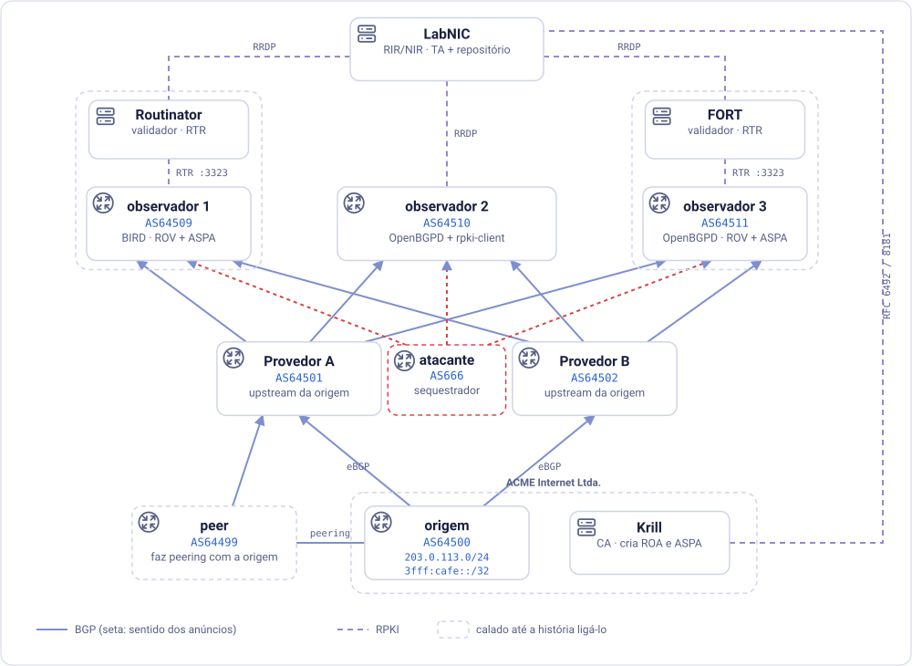

# RPKI SelfLab

*Laboratório autônomo e guia de autoestudo de RPKI, ROA, ROV e ASPA*

*[English](GUIDE.en.md) · [Español](GUIDE.es.md) · [Português](GUIDE.pt.md)*

**Objetivo:** acompanhar um sequestrador e um peer que vaza rotas por um
laboratório rodando na sua própria máquina. Ver o que a validação de origem
(ROV) pega, o que ela deixa passar, e o que o ASPA acrescenta, com cada
veredito conferido por duas pilhas independentes (BIRD + Routinator, e
OpenBGPD + FORT).

Tudo roda em contêineres no seu computador. O roteiro presume que você já
conhece o básico de RPKI, ROAs, ROV e ASPA. Você pode certificar seus recursos
de forma totalmente local ou, se preferir trabalhar com um registro real, no
sistema de testes do Registro.br.

O roteiro é uma única história em nove passos: ele monta **três ataques e
mostra qual verificação barra cada um**. Antes vem uma preparação curta
(instalar o Docker, subir o laboratório, certificar seus recursos), e no fim,
alguns exercícios extras.

> [!TIP]
> **Como usar este laboratório.** O painel controla um laboratório completo:
> roteadores BGP de verdade, dois validadores RPKI de verdade, uma CA e um
> registro, tudo rodando no seu computador. **Seguir este roteiro passo a
> passo é o caminho recomendado**, porque cada passo prepara o seguinte.
> Depois de terminá-lo, use o laboratório como quiser: teste as suas próprias
> configurações, quebre coisas de propósito, invente cenários (a última
> seção, *Explorando por conta própria*, tem ideias). Se algo quebrar, o
> comando do passo em que você está deixa o laboratório de novo do jeito que
> esse passo espera.

No painel, o roteiro é interativo. As saídas esperadas ficam escondidas
atrás de um botão até você rodar o comando, e alguns passos são
**desafios**: a solução fica oculta até você pedir, um cronômetro corre, e
*Conferir meu laboratório* olha o estado real do seu laboratório para ver se
você chegou lá. Se preferir ler direto, tudo o que está escondido abre com
um clique.

## O que o RPKI pede do seu próprio AS, e o que este laboratório implanta

Implantar o RPKI significa fazer duas coisas, publicar e validar, para cada uma
de duas perguntas:

| | A origem publica... | ...e os roteadores validam |
|---|---|---|
| **Quem pode originar um prefixo** | **ROAs** (Route Origin Authorizations) | **ROV** (Route Origin Validation) |
| **Quais caminhos são plausíveis** | um objeto **ASPA** (Autonomous System Provider Authorization) | **verificação ASPA** |

Na vida real, **as duas coisas devem estar no AS que você opera**, e cada uma
protege uma coisa diferente. *Publicar* ROAs e um objeto ASPA protege **os seus
próprios prefixos**: as redes que validam passam a rejeitar um sequestro ou um
vazamento do seu espaço de endereços, e o tráfego destinado a você continua
chegando. *Validar* protege **as decisões dos seus próprios roteadores**: eles
rejeitam rotas falsas para prefixos de outras pessoas, e o seu tráfego, e o dos
seus clientes, não é desviado. Nenhum dos lados funciona sozinho: os seus
objetos protegem você só onde as outras redes validam, e a sua validação
protege você só para os prefixos cujos titulares publicaram objetos. Publique
sem validar, e os seus prefixos ficam protegidos onde os outros validam, mas a
sua própria rede continua aceitando rotas sequestradas para todos os demais.
Valide sem publicar, e a sua rede escapa das rotas falsas para os prefixos
alheios, mas ninguém, nem os seus próprios roteadores, consegue distinguir um
sequestro dos seus prefixos da rota verdadeira.

Neste laboratório, para fins didáticos, as duas coisas ficam separadas:

- **A publicação é implantada apenas no AS de origem** (AS64500, cuja CA vive
  no Krill). Ele é o único AS que cria ROAs e um objeto ASPA.
- **A validação é implantada apenas nos ASes observadores** (observer1 e
  observer2), os dois roteadores que você vai observar. Todo o resto do
  laboratório é um roteador BGP comum que nunca olha para o RPKI.

A validação é implantada nos observadores **em dois estágios, para cada
verificação**. Primeiro o roteador apenas *marca* o que a verificação sinaliza
(uma community, uma preferência menor; nada é descartado, então você vê o
que aconteceria). Só depois ele *descarta*. Descartar as inválidas é o que os
roteadores de verdade fazem; marcar é o ensaio que você faz antes de confiar
numa verificação o bastante para deixá-la rejeitar rotas.

## Glossário

Estes são os termos que o roteiro mais usa. As definições são curtas e
descrevem como cada termo é usado neste laboratório; as RFCs em *Referências*
trazem os detalhes completos. Se você já os conhece, pule direto para a
topologia.

No painel, estes termos aparecem sublinhados com pontinhos onde quer que
surjam no roteiro. Passe o mouse sobre um deles para ver a definição.

### Conceitos

| Termo | Significado |
|---|---|
| **RIR/NIR** | Registro Regional/Nacional de Internet: aloca ASNs e blocos de IP e, em RPKI, certifica que você é o titular deles |
| **CA** | Certificate Authority (Autoridade Certificadora): o motor RPKI que transforma "estes recursos são seus" em certificados e objetos assinados |
| **TA** | Trust Anchor (âncora de confiança): a CA na raiz da cadeia de confiança de um validador; todo outro certificado que o validador aceita se encadeia até ela |
| **TAL** | Trust Anchor Locator: um arquivo pequeno que diz ao validador onde buscar o certificado da TA e qual chave esperar |
| **ROA** | Route Origin Authorization: um objeto assinado dizendo "este ASN pode originar este prefixo, até este comprimento" |
| **ASPA** | Autonomous System Provider Authorization: um objeto assinado em que um AS (o *cliente*) lista todos os seus provedores upstream, os únicos ASes autorizados a repassar as rotas dele para cima |
| **ROV** | Route Origin Validation: confere o *último* AS da rota (o que a originou) contra as ROAs |
| **Verificação ASPA** | confere o *caminho inteiro*, salto a salto, contra os objetos ASPA |
| **Upstream / downstream** | os dois algoritmos de verificação ASPA; qual se aplica depende de quem mandou a rota: um cliente ou um peer lateral (upstream, o mais estrito) ou um provedor (downstream) |
| **RRDP** | RPKI Repository Delta Protocol: como um validador busca os objetos assinados num ponto de publicação |
| **RTR** | RPKI-to-Router protocol: como um validador entrega seus vereditos a um roteador; o ASPA precisa da versão 2 do RTR |
| **VRP** | Validated ROA Payload: a tripla (ASN, prefixo, comprimento máximo) que um validador derivou de uma ROA |
| **AS_PATH** | a lista de ASes por onde um anúncio BGP passou; o último é a origem |
| **Prepend** | repetir o próprio ASN no AS_PATH para o caminho parecer mais longo, e portanto menos atraente |
| **Multihomed** | um AS conectado a mais de um provedor |
| **local_pref** | a preferência local do BGP: a maior vence, e ela é comparada antes do tamanho do AS_PATH |
| **Large community** | uma etiqueta numérica (RFC 8092) anexada a uma rota; o observer1 as usa para registrar os seus vereditos |
| **Role** | o papel declarado numa sessão BGP (RFC 9234: provider, customer, peer...); no OpenBGPD, é ele que escolhe o algoritmo ASPA |
| **Sequestro (hijack)** | anunciar um prefixo que pertence a outra pessoa, como se fosse seu (ou como se viesse através dela) |
| **Vazamento de rota** | repassar uma rota que você aprendeu de um vizinho para outro vizinho para o qual você não deveria (RFC 7908); ninguém mente sobre a origem, mas o caminho tem um formato que não poderia acontecer legitimamente |

### Os softwares do laboratório

| Termo | Significado |
|---|---|
| **Docker** | roda cada parte do laboratório no seu próprio contêiner, um pequeno sistema Linux isolado; o `docker compose` sobe todos juntos |
| **BIRD** | BIRD Internet Routing Daemon, software livre de roteamento (BGP, OSPF e outros) mantido pelo CZ.NIC. Ele roda o observer1, a origem, os dois provedores, o AS666 e o peer; você conversa com ele pelo `birdc` |
| **OpenBGPD** | a implementação livre de BGP do projeto OpenBSD. Ela roda o observer2, calcula ROV e ASPA nativamente, e você conversa com ela pelo `bgpctl` |
| **Krill** | software de CA RPKI da NLnet Labs. Aqui ele é a CA do titular (e, no modo local, também a do registro simulado); tem interface web e a linha de comando `krillc` |
| **Routinator** | validador RPKI da NLnet Labs; alimenta o observer1 |
| **FORT** | FORT Validator, o validador RPKI do NIC México; alimenta o observer2 |

---

## A topologia



O AS64500 é multihomed, e tem uma preferência clara: **o Provedor B é a
entrada, o Provedor A é o backup.** Para conseguir isso, a origem faz
*prepend* do seu próprio ASN duas vezes ao anunciar para o Provedor A
(`64500 64500 64500` em vez de apenas `64500`), então
todo caminho por A parece dois saltos mais longo que o caminho por B, uma
engenharia de tráfego de entrada bem comum.

Os dois provedores repassam o **mesmo prefixo** aos dois observadores, com o
mesmo AS de origem. O laboratório roda a história inteira **duas vezes, em
paralelo**, sobre duas pilhas independentes: o observer1 e o observer2 veem
exatamente os mesmos anúncios e os mesmos objetos RPKI, mas cada um com o seu
próprio roteador e o seu próprio validador.

Em termos de BGP, os observadores ficam *acima* dos dois provedores: eles
vendem trânsito a eles, então os provedores são clientes dos observadores, e
toda rota chega aos observadores vinda de um cliente. Guarde isso para o Passo
5: é esse detalhe que decide qual algoritmo ASPA roda.

Mais dois roteadores entram na história, desenhados com borda tracejada na
figura. Os dois aparecem no painel, e os dois ficam calados até que a história
os ligue:

- **O AS666, o atacante**, tem sessões BGP diretas com os dois observadores,
  como cliente deles. Qualquer cliente pode enviar um anúncio a eles, e
  ninguém o confere a menos que os observadores validem.
- **O peer**, AS64499, tem um link de peering privado com a origem e compra
  trânsito do Provedor A.

| Componente | ASN | Papel |
|---|---|---|
| origem | 64500 | o seu AS; origina os prefixos |
| Provedor A | 64501 | um dos dois upstreams da origem, o backup (a origem faz prepend duas vezes para ele) |
| Provedor B | 64502 | o outro upstream da origem, o preferido |
| observer1 | 64510 | roteador que valida: **BIRD** + **Routinator** |
| observer2 | 64511 | roteador que valida: **OpenBGPD** + **FORT Validator** |
| AS666 | 666 | o atacante: um cliente dos observadores, que sequestra os prefixos da origem |
| peer | 64499 | uma rede legítima que faz peering com a origem e compra trânsito do Provedor A |

Os ASNs 64496-64511 são reservados para documentação (RFC 5398), e é dali que
vem cada ASN deste laboratório (origem, provedores, observadores, peer),
com uma única exceção: o AS666, que não está em nenhum bloco
reservado. Foi escolhido só por ser fácil de lembrar. De qualquer forma,
nenhum deles chega perto da Internet de verdade.

> [!NOTE]
> O ASN e os prefixos da origem ficam no arquivo **`lab.conf`**, na raiz do
> laboratório. Quer outros? Edite lá e rode `./scripts/lab.sh up`: os
> roteadores, os scripts e este roteiro passam a usar os novos valores. (O
> roteiro é escrito com marcadores `{{ NAME }}` em `guide/templates/`, e o
> `up` o compila em `guide/GUIDE.*.md` com os valores do `lab.conf`. Edite os
> templates, nunca os arquivos compilados.)

### Como a história está organizada

Todo passo começa com uma caixa de **Estado**: em qual estágio de implantação
os observadores estão, o que o AS666 e o peer estão fazendo, e quais objetos
RPKI deveriam existir. Se o seu laboratório não bate, a caixa também diz como
colocá-lo de volta. No painel, o cabeçalho mostra com qual passo o seu
laboratório se parece agora (*laboratório ≈ Passo 5*), e as caixas de **Ponto
de controle** dentro de cada passo se marcam sozinhas à medida que o
laboratório chega lá.

Essa recuperação é deliberadamente simples: **cada comando
`./scripts/lab.sh stepN-*` define o estado *inteiro* do seu passo**, não só o
que mudou desde o anterior. Rode `step9-leak-off`, depois `step3-rov-mark`, e
você cai exatamente onde o Passo 3 espera. O vazamento, o estágio de
descarte, tudo o que o Passo 9 deixou para trás some, redefinido pelo próprio
`step3-rov-mark`. Vale para qualquer par de passos, em qualquer direção: os
comandos não presumem que você está indo para a frente, e não deixam nada
para o próximo tropeçar. Três coisas se movem juntas toda vez que um comando
`stepN-*` roda:

- **O estágio de implantação dos observadores.** Eles começam sem nenhuma
  validação, e a história os leva por quatro estágios: as duas verificações
  ficam marcando antes de qualquer uma delas começar a descartar, e só então
  as duas passam a descartar juntas, no Passo 8. Cada comando define um
  estágio inteiro nos **dois** observadores de uma vez, seja qual for o estágio
  em que estavam antes:

  | Estágio | O que os observadores fazem | Comando |
  |---|---|---|
  | `none` | BGP puro, sem validação (como o laboratório começa) | `step1-clean` |
  | `rov-mark` | ROV implantado, rotas inválidas apenas *marcadas* | `step3-rov-mark` |
  | `aspa-mark` | verificação ASPA entra em cena, também só *marcando* | `step5-aspa-mark` |
  | `aspa-drop` | ROV e ASPA passam a *descartar* juntos, em produção | `step8-drop` |

  Cada estágio é um arquivo de configuração completo por observador
  (`bird/observer1-<stage>.conf`, `openbgpd/observer2-<stage>.conf`), e o
  roteiro pede que você os abra: **as linhas que mudam de um arquivo para o
  outro são exatamente o que implantar aquela verificação exige.** Você não
  precisa decorar em que estágio está: o indicador de estágio no cabeçalho do
  painel diz (*validação: nenhuma*, *ROV: marcando*, *ROV: descartando*, ...),
  e fica laranja se os dois observadores não estiverem no mesmo. O observer2
  reinicia toda vez que o estágio muda (o OpenBGPD negocia os seus papéis da
  RFC 9234 e a sua versão do RTR quando uma sessão abre), então dê a ele dez ou
  quinze segundos para se acomodar antes de tirar conclusões do que ele mostra.
- **O AS666 e o peer.** Todo comando `stepN-*` também define o estado
  deles (silêncio, sequestro ingênuo, caminho forjado, vazamento), conforme
  o texto do roteiro para aquele passo descreve, mesmo os comandos cujo nome
  não os menciona (`step6-add-provider-b` e `step8-drop`, por exemplo,
  continuam colocando o AS666 de volta na forma de caminho forjado, já
  que é isso que esses passos esperam).
- **Os objetos RPKI da origem**, no Krill: as ROAs (criadas uma vez, a partir
  do `step3-rov-mark`) e o objeto ASPA, mantido exatamente na lista que cada
  passo espera: `krillc aspas add` substitui o objeto inteiro, então um
  comando pode fazê-lo crescer (Passo 6) ou encolher de volta (pulando para
  o Passo 5 depois que o Passo 6 rodou) com a mesma facilidade.

  Este também é o único lugar em que um comando `stepN-*` pode falhar sem culpa
  sua. A partir do `step3-rov-mark`, cada um começa conferindo se a Preparação
  realmente terminou: a CA existe, tem um pai ativo, tem o número de AS e os
  prefixos do `lab.conf`, e tem um repositório funcionando. Se não tiver, o
  comando para e avisa, em vez de criar, sem avisar, ROAs que o Krill não
  conseguiria publicar. A Preparação é a única parte da história que um comando
  `stepN-*` não pode fazer por você.

Os nomes de todos esses comandos carregam o número do passo a que pertencem.

---

## Preparação 1: instalar o Docker e subir o laboratório

O laboratório tem dois modos, escolhidos com a variável `MODE` no `lab.conf`:

| MODE | Quem certifica | Precisa de Internet? |
|---|---|---|
| `local` (padrão) | o **LabNIC**, um registro simulado que roda dentro do laboratório | só para baixar o laboratório na primeira vez |
| `beta` | o **beta.registro.br**, o sistema de testes do Registro.br | sim, e de um login no beta.registro.br |

Os dois modos usam exatamente os mesmos protocolos: RFC 8183 para os documentos
XML que você troca na configuração, RFC 6492 para a delegação e RFC 8181 para a
publicação. O que muda é o painel onde você cola o XML e o tempo que os objetos
levam para aparecer no validador: segundos no modo local, alguns minutos no
beta. O próximo passo de preparação tem uma versão para cada modo; faça só a
que corresponde ao seu.

### Antes de começar: o Docker

O laboratório precisa do **Docker com o Compose v2** (o comando
`docker compose`), de um computador de 64 bits (Intel/AMD ou ARM, inclusive
Apple Silicon), de cerca de **2 GB de memória para o Docker** e **4 GB livres
em disco**, e de um navegador. Depois de no ar, o laboratório inteiro usa por
volta de 300 MB de memória.

**Linux**

1. Instale o Docker Engine e o plugin do Compose para a sua distribuição:
   https://docs.docker.com/engine/install/
2. Permita que o seu usuário rode o Docker sem `sudo` (saia da sessão e entre
   de novo depois): https://docs.docker.com/engine/install/linux-postinstall/

Prefere um aplicativo gráfico? O Docker Desktop para Linux também funciona:
https://docs.docker.com/desktop/setup/install/linux/

**macOS**

- **OrbStack** (mais leve e mais rápido; o laboratório é testado com ele):
  https://docs.orbstack.dev/quick-start
- ou o **Docker Desktop para Mac**:
  https://docs.docker.com/desktop/setup/install/mac-install/

**Windows**

Os scripts do laboratório são scripts bash, então no Windows eles rodam
dentro do **WSL 2** (um Linux de verdade dentro do Windows), com o Docker
Desktop fornecendo os contêineres:

1. Instale o WSL 2 com o Ubuntu: abra o PowerShell como administrador e rode
   `wsl --install` (detalhes: https://learn.microsoft.com/windows/wsl/install).
2. Instale o Docker Desktop para Windows com o backend WSL 2:
   https://docs.docker.com/desktop/setup/install/windows-install/
3. No Docker Desktop, em *Settings → Resources → WSL integration*, ligue a
   sua distribuição Ubuntu (https://docs.docker.com/desktop/features/wsl/).
4. Abra o terminal do **Ubuntu** e faça tudo a partir dele. Deixe a pasta do
   laboratório dentro do Linux (por exemplo, `~/lab-aspa`), e não em
   `/mnt/c/...`: é muito mais rápido, e evita problemas de fim de linha e de
   permissão.

Não pode ou não quer instalar nada? O laboratório também vem como uma
máquina virtual pronta, com o Docker e as imagens já dentro: veja
`vm/README.pt.md`.

**Confira se o Docker funciona** (no terminal de qualquer sistema):

```cmd @host
docker version
docker compose version
docker run --rm hello-world
```

O último imprime *Hello from Docker!*. Se o Docker é novidade para você, a
introdução oficial vale vinte minutos: https://docs.docker.com/get-started/

### Subir o laboratório

1. No terminal, dentro da pasta do laboratório:

   ```cmd @host
   ./scripts/lab.sh up
   ```

   Na primeira vez, o Docker baixa as imagens e constrói algumas locais, o
   que leva alguns minutos. Se algo der errado, rode
   `./scripts/lab.sh doctor`: ele confere o Docker, as portas, os contêineres
   e a preparação, e diz o que fazer a respeito de cada problema.

   > [!WARNING]
   > O laboratório só precisa da **porta 8080** livre no seu computador. Se
   > outro programa a estiver usando, o `up` para e diz qual; libere-a, ou
   > escolha outra porta em `PANEL_PORT` no `lab.conf`. (Com
   > `EXPOSE_PORTS=yes` no `lab.conf`, ele também publica a porta própria de
   > cada serviço, 3000, 3323, 8081..., o que só é necessário para ligar
   > ferramentas de fora direto a um serviço.)

2. Abra o painel do laboratório no navegador:

   **http://localhost:8080**

   Use exatamente `localhost`: o painel chega a todos os outros serviços por
   nomes como `krill.localhost`, que os navegadores mandam para o seu próprio
   computador.

3. **Um passeio rápido pelo painel.**

   - **Este roteiro** é a coluna da esquerda. ◀ e ▶ passam de um passo a
     outro, e a barrinha logo abaixo mostra o seu progresso.
   - **A topologia** fica no meio: clicar numa caixa mostra o estado, os
     endereços e o terminal daquele componente, à direita. Abaixo dela,
     **Vereditos** lista todas as rotas que os observadores têm, e **Eventos**
     conta, em palavras, tudo o que mudou (as mesmas novidades aparecem por
     alguns segundos no canto da tela).
   - **A barra no alto** fica sempre no mesmo lugar. **Terminal** abre o
     Terminal do laboratório, já na pasta do laboratório; **Comandos** lista
     o que cada comando `./scripts/lab.sh` faz, com um ▶ para rodá-lo;
     **Krill**, **Routinator** e **Registro** abrem essas interfaces web. Os
     terminais e as interfaces web abrem dentro do painel, em abas; ↗ abre a
     aba atual numa aba separada do navegador.

   **Onde rodar cada comando.** Todo bloco de comandos deste roteiro diz no
   cabeçalho onde ele roda: *Rode no observer1 · Shell*, *Rode no Terminal do
   laboratório*, e assim por diante. No painel, **▶ abrir terminal** abre
   exatamente esse terminal, e **copiar** copia os comandos (sem nenhum
   prompt). Se preferir usar o terminal do seu próprio computador, ponha
   `docker exec lab-<caixa>` antes do comando e rode-o na pasta do
   laboratório (por exemplo, `docker exec lab-observer1 birdc show
   protocols`).

4. Confira se os roteadores subiram e se as sessões BGP estão estabelecidas.
   No painel, a caixa de cada roteador mostra quantas das suas sessões BGP
   estão no ar (por exemplo, *BGP 6/6*). Para ver o detalhe:

   ```cmd @observer1
   birdc show protocols
   ```

   ```cmd @observer2
   bgpctl show summary
   ```

   Você deve ver `provider_a_v4`, `provider_a_v6`, `provider_b_v4` e
   `provider_b_v6` em `Established` no observer1, mais `attacker_v4` e
   `attacker_v6`, as sessões com o AS666, que está no ar mas em
   silêncio por enquanto. O observer2 lista as mesmas seis sessões. Ainda não
   há protocolo `routinator`: os observadores não validam nada até o Passo 3.

---

## Preparação 2: certificar seus recursos (MODE=local)

> Faça isto se o `lab.conf` tiver `MODE=local` (o padrão). Se tiver
> `MODE=beta`, pule para a Preparação 2-B.

Aqui você vai fazer **os dois lados** da conversa: o titular, no Krill, e o
registro, no painel do LabNIC. É a mesma troca de XML que acontece entre um
operador de rede e o seu RIR.

### O seu lado: a CA no Krill

1. Abra o Krill: botão **Krill** no alto do painel (ou
   **http://krill.localhost:8080** numa aba própria).

2. Entre com o token **`labpass`**.

3. Crie a sua CA chamada **`acme_ca`**.
   Se a interface do Krill não estiver em inglês, troque o idioma no canto
   superior direito: este roteiro usa os rótulos em inglês.

### O lado do registro: o painel do LabNIC

4. Abra o painel do registro: botão **Registro** no alto (ou
   **http://registry.localhost:8080**).

   Repare na seção *Recursos alocados*: ela lista o ASN e os blocos do seu
   `lab.conf`, e o certificado que o registro está prestes a emitir vai cobrir
   exatamente esse conjunto.

### Parte 1: delegação da CA (RFC 6492)

5. No Krill, vá em *Parent CAs* → *Add a new parent CA* e copie o XML do
   campo *Child Request* (o `child_request`).

6. No painel do LabNIC, cole esse XML no quadro **1 · Delegação da CA** e
   clique em *Emitir certificado*.

7. O registro devolve o `parent_response`. Copie-o.

8. De volta ao Krill, em *Parent CAs* → *Parent Response*, cole o XML. No
   campo *Parent CA name* use **`labnic`** e confirme.

### Parte 2: serviço de publicação (RFC 8181)

9. No Krill, vá em *Repository* → *Add a repository* e copie o XML do
   *Publisher Request* (o `publisher_request`).

10. No painel do LabNIC, cole-o no quadro **2 · Serviço de publicação** e
    clique em *Autorizar publicação*.

11. Copie o `repository_response` que aparece e cole-o no Krill,
    em *Repository* → *Repository Response*. Confirme.

### Conferindo

12. No Krill, a página da CA tem quatro abas (*ROAs*, *ASPAs*, *Parents*,
    *Repository*) e, **à direita**, um quadro com os recursos que o pai
    certificou: o ASN 64500 e os prefixos 203.0.113.0/24 e 3fff:cafe::/32.
    Numa janela estreita, esse quadro desce para **baixo** do botão
    *Add ROA*, onde parece fazer parte de outra coisa. É o mesmo quadro.

    

    Outras formas de ver a mesma coisa: clique na caixa do **Krill** na
    topologia do painel (ela lista os recursos, as ROAs e o ASPA da CA), ou
    rode `krillc show` no terminal do Krill.

13. No painel do LabNIC, a seção *RPKI delegado* agora mostra **ativo**,
    com a data da última troca Up-Down e a contagem de objetos no
    repositório.

<!-- checkpoint: prep -->

> **Por que duas partes separadas?** A primeira diz *quais recursos são seus*;
> a segunda diz *onde você vai publicar os objetos assinados*. Elas são
> independentes: um RIR pode certificar os seus recursos enquanto você publica
> em outro lugar, no seu próprio servidor de publicação, por exemplo.

**Repare no que você *não* fez:** criar uma ROA ou um objeto ASPA. Os seus
recursos estão certificados, mas nada diz quem pode anunciá-los. É aí que a
história começa.

---

## Preparação 2-B: certificar seus recursos (MODE=beta)

> Faça isto somente se o `lab.conf` tiver `MODE=beta`. Precisa de acesso à
> Internet e de um login no beta.registro.br.

1. Abra o Krill (botão **Krill** no alto), entre com o token **`labpass`** e
   crie a CA **`acme_ca`**.

2. Numa aba do navegador, entre em **https://beta.registro.br/login/** (no
   painel, o botão **beta.registro.br** no alto abre o endereço). No Painel, vá
   em *Holdership*, selecione o AS e role até a seção **RPKI** →
   *Configure RPKI*.

3. No Krill, em *Parent CAs* → *Add a new parent CA*, copie o XML do
   campo *Child Request* e cole-o no campo indicado no Registro.br.

4. Em caso de sucesso, aparece "RPKI enabled successfully!", junto com um
   campo **Parent response**. Copie o XML e cole-o no Krill, em
   *Parent CAs* → *Parent Response*, com o nome da CA pai **`nicbr_ca`**.

5. Ainda no Registro.br, vá em *Configure RPKI* → *Configure remote
   publication*. No Krill, em *Repository* → *Add a repository*, copie o
   *Publisher Request* e cole-o lá.

6. O campo se transforma em **Repository response**. Copie-o e cole-o no
   Krill, em *Repository* → *Repository Response*.

7. No fim, o Krill deve mostrar os recursos recebidos do pai, no quadro à
   direita da página da CA (veja a Preparação 2, item 12).

<!-- checkpoint: prep -->

**Repare no que você *não* fez:** criar uma ROA ou um objeto ASPA. Os seus
recursos estão certificados, mas nada diz quem pode anunciá-los. É aí que a
história começa. (No beta, conte com alguns minutos para os objetos chegarem
aos validadores sempre que um passo pedir que você crie um.)

---

## Passo 1: uma linha de base limpa

> **Estado:** estágio `none` (sem validação) · AS666 em silêncio · peer em
> silêncio · sem ROAs, sem ASPA.
>
> **Se o seu for diferente:** `./scripts/lab.sh step1-clean` silencia o
> AS666 e o peer *e* coloca os dois observadores de volta em BGP puro. Se
> sobraram ROAs ou um objeto ASPA de uma execução anterior,
> `./scripts/lab.sh clean-objects` os remove e mantém a sua CA, então você não
> precisa refazer a preparação.

1. Garanta que o laboratório está na linha de base:

   ```cmd @lab
   ./scripts/lab.sh step1-clean
   ```

2. Confira se o prefixo da origem chega aos dois observadores pelos dois
   provedores, e qual deles eles preferem. No observer1 (BIRD):

   ```cmd @observer1
   birdc show route table master4 all 203.0.113.0/24
   ```

   ```output @observer1
   203.0.113.0/24  unicast [provider_b_v4 ...] * (100) [AS64500i]
        bgp_path: 64502 64500
        bgp_local_pref: 100

                unicast [provider_a_v4 ...] (100) [AS64500i]
        bgp_path: 64501 64500 64500 64500
        bgp_local_pref: 100
   ```

   E no observer2 (OpenBGPD):

   ```cmd @observer2
   bgpctl show rib 203.0.113.0/24
   ```

   ```output @observer2
   flags  vs destination          gateway          lpref   med aspath origin
   *>    N-? 203.0.113.0/24          10.200.6.10       100     0 64502 64500 i
   *     N-? 203.0.113.0/24          10.200.5.10       100     0 64501 64500 64500 64500 i
   ```

   Dois caminhos em cada observador: `64502 64500` (o
   selecionado, a entrada preferida da origem, 2 saltos) e
   `64501 64500 64500 64500` (o backup,
   mantido na tabela mas com 4 saltos por causa dos prepends). Nenhum dos
   dois tem veredito: o BIRD ainda não tem communities, o `N-?` do OpenBGPD é
   só "nada para comparar", e o painel mostra `—` para os dois. Isso porque
   **os observadores ainda não estão validando nada.** O indicador de estágio
   no cabeçalho do painel diz *validação: nenhuma*.

3. **Dê uma olhada em como esses roteadores estão configurados.** Abra os
   arquivos de linha de base dos observadores:

   ```cmd @lab
   cat bird/observer1-none.conf
   cat openbgpd/observer2-none.conf
   ```

   Você vai encontrar BGP comum: sessões com os dois provedores (e com o
   AS666, calado por enquanto), e uma política que aceita tudo:

   ```conf @observer1
   template bgp CUSTOMER4 {
       local as OBSERVER1_ASN;
       ipv4 {
           import all;                 # <- BIRD: aceita o que o vizinho enviar
           export none;
           import table on;
       };
   }
   ```

   ```conf @observer2
   deny from any
   allow from any                      # <- OpenBGPD: mesma ideia
   ```

   Não há sessão RTR com o Routinator nem com o FORT (os dois estão rodando,
   mas ninguém os escuta), e nenhuma configuração que use o RPKI. Daqui em
   diante, a história altera esses dois arquivos passo a passo, e essas
   alterações são tudo o que é preciso para implantar validação RPKI num
   roteador.

<!-- checkpoint: step1 -->

**Para guardar:** os validadores, a CA e o repositório já existem, e os
recursos estão certificados. Mesmo assim, nada disso afeta os roteadores
enquanto eles não forem configurados para conversar com um validador.

---

## Passo 2: o sequestro ingênuo

> **Estado:** estágio `none` · AS666 em silêncio (prestes a mudar) · peer em
> silêncio · sem ROAs, sem ASPA.
>
> **Se o seu for diferente:** `./scripts/lab.sh step1-clean`.

O AS666 anuncia o prefixo da origem como se fosse dele.

1. Ligue-o:

   ```cmd @lab
   ./scripts/lab.sh step2-hijack-simple
   ```

2. **Antes de olhar:** o caminho do AS666 é apenas `666`, mais
   curto que o legítimo `64502 64500` (e que o backup por
   A). Qual você espera que os observadores prefiram? E existe *alguma
   coisa* que eles possam usar para distinguir os dois?

<!-- predict id=s2 answer=1: O sequestro: o caminho dele é mais curto, e nada mais distingue os dois | O caminho legítimo pelo Provedor B: os observadores sabem qual é o ASN verdadeiro da origem | Nenhum dos dois: os observadores percebem o conflito e descartam ambos -->

3. Agora olhe, nos dois observadores:

   ```cmd @observer1
   birdc show route table master4 all 203.0.113.0/24
   ```

   ```output @observer1
   203.0.113.0/24  unicast [attacker_v4 ...] * (100) [AS666i]
        bgp_path: 666
        bgp_local_pref: 100
   ```

   ```cmd @observer2
   bgpctl show rib 203.0.113.0/24
   ```

   ```output @observer2
   *>    N-? 203.0.113.0/24          10.200.8.10       100     0 666 i
   *     N-? 203.0.113.0/24          10.200.6.10       100     0 64502 64500 i
   *     N-? 203.0.113.0/24          10.200.5.10       100     0 64501 64500 64500 64500 i
   ```

   O sequestro **venceu**: é a rota selecionada (`*`, `*>`) nos dois
   observadores. O AS_PATH dele é mais curto (1 salto contra 2 e 4), e nada
   mais o distingue. No painel, a caixa do atacante mostra *sequestrando* e
   os seus links para os observadores ficam **laranja**: um observador está
   aceitando o que ele anuncia. A tabela de *Vereditos* ganha novas linhas
   rotuladas *AS666*, sem vereditos, porque ainda não há validação.

<!-- /predict -->

<!-- checkpoint: step2 -->

**Para guardar:** um sequestro com o ASN de origem errado. É o tipo mais
básico de sequestro, e o que as ROAs foram criadas para impedir.

---

## Passo 3: o ROV entra, marcando o que parece errado

> **Estado:** estágio `none` (prestes a mudar) · AS666 fazendo o sequestro
> ingênuo · peer em silêncio · ainda sem ROAs (você vai criá-las aqui), sem
> ASPA.
>
> **Se o seu for diferente:** `./scripts/lab.sh step1-clean`, depois
> `./scripts/lab.sh step2-hijack-simple`.

Este passo tem duas metades, nesta ordem: a **Origem publica** as ROAs, e os
**Observadores validam**, só marcando, por enquanto.

### A Origem publica: crie as ROAs

> [!IMPORTANT]
> **Espere a CA receber o seu certificado antes de criar ROAs.** Logo depois
> da preparação, a CA pode ainda não ter os recursos do pai, e aí o Krill
> aceita a ROA sem criar nada. Confira se o quadro **à direita** da página da
> CA (abaixo de *Add ROA* numa janela estreita) já lista os seus prefixos. Se
> estiver vazio, espere alguns segundos ou rode `krillc bulk refresh` no
> terminal do Krill.

<!-- challenge id=roas check=step3-roas time=300: Crie as duas ROAs que autorizam o AS64500 a originar 203.0.113.0/24 e 3fff:cafe::/32, cada uma com o comprimento máximo igual ao comprimento do próprio prefixo, e faça os dois validadores as enxergarem. -->
<!-- hint: No Krill, a página da CA tem uma aba ROAs com um botão Add ROA. Ou use krillc roas update no terminal do Krill. -->
<!-- hint: O comprimento máximo é o do próprio prefixo: 24 para o IPv4, 32 para o IPv6. Depois, ./scripts/lab.sh refresh no Terminal do laboratório faz os validadores olharem de novo. -->

1. No Krill, na aba **ROAs** da CA, clique em *Add ROA*. As suas ROAs vão
   aparecer na tabela dessa aba.

   

2. Crie a ROA IPv4:

   | campo | valor |
   |---|---|
   | ASN | 64500 |
   | Prefix | 203.0.113.0/24 |
   | Max length | 24 |

3. Crie a ROA IPv6:

   | campo | valor |
   |---|---|
   | ASN | 64500 |
   | Prefix | 3fff:cafe::/32 |
   | Max length | 32 |

   Prefere a linha de comando? No terminal do Krill:

   ```cmd @krill
   krillc roas update --add "203.0.113.0/24-24 => 64500"
   krillc roas update --add "3fff:cafe::/32-32 => 64500"
   krillc roas list
   ```

   (Se o Krill disser que uma ROA é *duplicate*, ela já está lá.)

   > [!NOTE]
   > A coluna *State* do Krill mostra **NOT SEEN** ou **NO ANNOUNCEMENT INFO**
   > para todas as ROAs. Essa coluna compara as suas ROAs com os anúncios BGP
   > que o Krill conhece, e o Krill não enxerga a tabela BGP deste laboratório.
   > Ignore: não quer dizer que haja algo errado.

4. Faça os validadores as pegarem, e confira que pegaram:

   ```cmd @lab
   ./scripts/lab.sh refresh
   ./scripts/validate.sh
   ```

   O `validate.sh` imprime o que o Routinator validou (duas ROAs). No
   painel, as caixas do Routinator e do FORT mostram `2 VRP`, e a do Krill
   mostra `2 ROA`. Se ainda não aparecer nada, **é questão de tempo**: o
   Krill precisa publicar e os validadores precisam reler (segundos no modo
   local, minutos no beta); rode `refresh` de novo.

<!-- /challenge -->

<!-- checkpoint: step3-roas -->

Por enquanto nada mudou para os roteadores: as ROAs estão publicadas e
validadas, mas **nenhum roteador está escutando os validadores.** Olhe os
observadores de novo se quiser: o sequestro ainda está vencendo.

### Os Observadores validam

1. Implante o ROV nos dois observadores, na sua primeira forma segura:

   ```cmd @lab
   ./scripts/lab.sh step3-rov-mark
   ```

2. **Veja do que é feita esta implantação.** Compare os novos arquivos com a
   linha de base que você leu no Passo 1. O `diff` mostra exatamente o que foi
   acrescentado:

   ```cmd @lab
   diff bird/observer1-none.conf bird/observer1-rov-mark.conf
   diff openbgpd/observer2-none.conf openbgpd/observer2-rov-mark.conf
   ```

   > [!IMPORTANT]
   > Não pule os `diff`. Eles são a lição de verdade deste passo: as linhas
   > que eles mostram são tudo o que é preciso para implantar o ROV num
   > roteador.

   As mesmas três peças nos dois roteadores:

   **(a) Uma sessão com um validador**, pela qual o roteador aprende as ROAs:

   ```conf @observer1
   protocol rpki routinator {
       remote 172.30.0.20 port 3323;
       roa4 { table roa4_table; };
       roa6 { table roa6_table; };
       ...
   }
   ```

   ```conf @observer2
   rtr 172.30.0.50 {
       port 3323
   }
   ```

   **(b) Um teste em cada rota**, comparando o seu AS de origem (o *último*
   AS no caminho) e o prefixo com as ROAs. O BIRD calcula isso no filtro de
   importação e registra o resultado numa large community, para você poder
   lê-lo depois; o OpenBGPD calcula nativamente, no atributo `ovs` da rota:

   ```conf @observer1
   filter import_customer_v4 {
       if roa_check(roa4_table, net, bgp_path.last) = ROA_INVALID then {
           bgp_large_community.add((OBSERVER1_ASN,1,0));
           bgp_local_pref = 10;                    # <- (c) uma ação: perde para qualquer rota válida
       } else if roa_check(roa4_table, net, bgp_path.last) = ROA_VALID then
           bgp_large_community.add((OBSERVER1_ASN,1,2));
       else
           bgp_large_community.add((OBSERVER1_ASN,1,1));
       accept;
   }
   ```

   **(c) Uma ação sobre o resultado.** Neste estágio a ação é só *reduzir a
   preferência* de uma rota inválida; nada é rejeitado ainda:

   ```conf @observer2
   match from any ovs invalid    set { localpref 10 }
   ```

   > [!TIP]
   > **Isso não é coisa de BIRD ou de OpenBGPD.** Qualquer roteador que
   > suporte ROV tem as mesmas três peças, com sintaxe diferente: uma sessão
   > com um validador (RTR), uma política que casa com o estado de
   > validação, e uma ação. No Cisco IOS XR é uma `route-policy` testando
   > `validation-state`; no Junos, um `policy-statement` casando com
   > `validation-database`; na Huawei, `if-match rpki` numa route-policy;
   > consulte a documentação da sua plataforma para a sintaxe exata. O BIRD
   > e o OpenBGPD aparecem aqui porque são livres e fáceis de rodar em
   > contêineres, não porque sejam comuns em redes de produção.
   >
   > **Quer digitar você mesmo?** No Terminal do laboratório, copie a linha
   > de base para a pasta `work/` (o único lugar em que o painel pode
   > gravar), acrescente as três peças com o `nano` ou o `vim`, e carregue o
   > seu arquivo no observer1:
   >
   > `cp bird/observer1-none.conf work/meu-rov.conf` · `nano work/meu-rov.conf` ·
   > `docker exec lab-observer1 birdc 'configure "/etc/lab-work/meu-rov.conf"'`
   >
   > O `./scripts/lab.sh step3-rov-mark` traz de volta a versão do roteiro.

3. **Antes de olhar:** o sequestro continua sendo anunciado, exatamente como
   antes. O que você espera que aconteça com ele agora?

<!-- predict id=s3 answer=2: Some das tabelas dos observadores | Fica na tabela, marcado como Invalid e com preferência menor, e perde para os caminhos legítimos | Nada muda: ele continua vencendo, porque o ROV só marca -->

4. Agora olhe as rotas de novo:

   ```cmd @observer1
   birdc show route table master4 all 203.0.113.0/24
   ```

   ```output @observer1
   203.0.113.0/24  unicast [attacker_v4 ...] (100) [AS666i]
        bgp_path: 666
        bgp_local_pref: 10
        bgp_large_community: (64510, 1, 0)                   <- ROV Invalid
   ```

   ```cmd @observer2
   bgpctl show rib 203.0.113.0/24
   ```

   ```output @observer2
   *>    V-? 203.0.113.0/24          10.200.6.10       100     0 64502 64500 i
   *     V-? 203.0.113.0/24          10.200.5.10       100     0 64501 64500 64500 64500 i
   *     !-? 203.0.113.0/24          10.200.8.10        10     0 666 i
   ```

   O sequestro ainda está na tabela, mas agora carrega
   **ROV Invalid** e um `local_pref` de 10, então perde para os caminhos
   legítimos, e o do Provedor B volta a ser a rota selecionada. O indicador
   de estágio no cabeçalho diz *ROV: marcando*, e os links do atacante ficam
   **vermelhos**: ele continua anunciando, e os dois observadores estão
   sinalizando isso. Tudo o que você precisava conferir está certo: o
   sequestro está sinalizado, os caminhos legítimos são `Valid`, e nada
   legítimo foi prejudicado. É para isso que serve o estágio de marcação:
   mostrar o que a verificação faria antes de você deixá-la rejeitar
   qualquer coisa.

   O ROV fica no modo de marcação pelo resto da história. Reduzir a preferência
   só ajuda enquanto existe uma alternativa válida: se a rota inválida for a
   única, o roteador continua usando-a, e um sequestro de um prefixo *mais
   específico* vence de qualquer jeito, porque o roteador encaminha pelo
   prefixo mais longo antes de a preferência entrar em jogo. Marcar é uma fase
   de teste, não uma defesa. O descarte, para o ROV e o ASPA juntos, vem no
   Passo 8, depois que as duas verificações tiverem se provado assim.

<!-- /predict -->

<!-- checkpoint: step3 -->

### Como ler os vereditos

Os dois observadores os mostram de formas diferentes:

- **observer1 (BIRD)** não tem atributo de validação por rota, então os seus
  filtros registram cada veredito numa large community:

  | community | significado | | community | significado |
  |---|---|---|---|---|
  | (64510,1,0) | ROV Invalid | | (64510,2,0) | ASPA Invalid |
  | (64510,1,1) | ROV NotFound | | (64510,2,1) | ASPA Unknown |
  | (64510,1,2) | ROV Valid | | (64510,2,2) | ASPA Valid |

- **observer2 (OpenBGPD)** calcula os dois nativamente. A coluna `vs` é o
  par **ovs-avs**: estado da validação de origem, depois estado da
  verificação ASPA, cada um `V` (valid), `!` (invalid) ou `N`/`?`
  (not-found / unknown). Então `V-!` é ROV Valid e ASPA Invalid. (Nenhuma
  verificação ASPA está implantada ainda, então a segunda metade é `?` por
  enquanto.)

A tabela de *Vereditos* do painel mostra os dois observadores lado a lado,
já decodificados.

**Para guardar:** do que é feito "implantar o ROV" (uma sessão RTR, um teste
em cada rota, uma ação sobre o resultado) e como novos objetos chegam aos
roteadores: o Krill publica, os validadores releem, os roteadores recebem a
mudança pelo RTR. Agora você viu cada um desses saltos.

---

## Passo 4: o caminho forjado

> **Estado:** estágio `rov-mark` · AS666 fazendo o sequestro ingênuo (marcado
> inválido, perdendo) · peer em silêncio · ROAs para os dois prefixos · sem ASPA.
>
> **Se o seu for diferente:** `./scripts/lab.sh step4-hijack-posrov`: ele
> também garante que as ROAs existem e coloca os observadores de volta em
> `rov-mark`.

O ROV só confere o **último** AS do caminho. O que acontece se um atacante
puser ali o AS certo?

1. Passe o AS666 para o ataque de caminho forjado:

   ```cmd @lab
   ./scripts/lab.sh step4-hijack-posrov
   ```

   O AS666 agora anuncia o caminho `666 64500`, como se
   tivesse recebido o prefixo diretamente da origem verdadeira.

   **Essa relação não existe.** O AS666 não tem nenhuma sessão BGP com o
   AS64500, nem de peering nem de trânsito; os dois nem estão conectados. A
   adjacência `666 64500` existe só porque a configuração do AS666 a
   *escreve no caminho*. Veja como no shell do próprio atacante:

   ```cmd @attacker
   cat /etc/bird.conf
   ```

   (É o arquivo `bird/attacker-posrov.conf` na pasta do laboratório.) Ache os
   filtros `forge_export`: `bgp_path.prepend(ORIGIN_ASN)` põe o número da
   origem no caminho *antes* de o roteador acrescentar o seu próprio na
   exportação. Só isso já basta para falsificar o caminho. Compare com
   `bird/attacker-simple.conf` (sem filtro, então o caminho é só
   `666`), e confira que nenhum dos dois arquivos tem uma sessão com a
   origem: só com os dois observadores.

2. **Antes de olhar:** por enquanto o ROV só marca, não descarta nada, mas o
   sequestro ingênuo foi sinalizado como Invalid e perdeu a disputa. Este
   caminho forjado vai ser sinalizado do mesmo jeito?

<!-- predict id=s4 answer=2: Sim: continua sendo o AS666 anunciando o prefixo de outra pessoa | Não: o caminho termina no AS64500, exatamente o que a ROA autoriza, então o ROV diz Valid | Depende do provedor pelo qual ele chega -->

3. Olhe:

   ```cmd @observer2
   bgpctl show rib 203.0.113.0/24
   ```

   ```output @observer2
   flags  vs destination          gateway          lpref   med aspath origin
   *>    V-? 203.0.113.0/24          10.200.8.10       100     0 666 64500 i
   *m    V-? 203.0.113.0/24          10.200.6.10       100     0 64502 64500 i
   *     V-? 203.0.113.0/24          10.200.5.10       100     0 64501 64500 64500 64500 i
   ```

   Não foi sinalizado. O ROV diz `Valid`: o caminho termina em 64500,
   exatamente o que a ROA autoriza, então ele recebe o `local_pref` cheio
   (100) como qualquer rota legítima, e é o selecionado. Os links do atacante
   no painel ficam **laranja**, e não mais vermelhos: o ROV não tem mais nada
   para sinalizar. Os três caminhos são ROV Valid, um deles é forjado, e
   nada do que foi implantado até agora consegue distingui-los.

   > O caminho forjado (`666 64500`, 2 saltos) empata com
   > o do Provedor B (`64502 64500`, também 2), e o
   > atacante ganha o empate por um critério de desempate (o router ID dele
   > por acaso é o menor); o backup do Provedor A tem 4 saltos e nem entra
   > na disputa. O desempate não importa aqui. O que importa é que o ROV
   > considera as três rotas válidas e não oferece nenhum jeito de
   > escolher entre elas.

<!-- /predict -->

<!-- checkpoint: step4 -->

**Para guardar:** a validação de origem consegue distinguir dois caminhos
para o mesmo prefixo, quando a origem é a mesma e uma ROA casa? Não: ela só
olha o último AS.

---

## Passo 5: o ASPA entra, também marcando primeiro

> **Estado:** estágio `rov-mark` · AS666 forjando o caminho · peer em
> silêncio · ROAs para os dois prefixos · ainda sem ASPA (você vai criá-lo
> aqui).
>
> **Se o seu for diferente:** `./scripts/lab.sh step3-rov-mark` e
> `./scripts/lab.sh step4-hijack-posrov`; se um objeto ASPA já existir,
> `krillc aspas remove --customer AS64500` no terminal do Krill.

Mesmo formato do Passo 3: a **Origem publica** um objeto ASPA, depois os
**Observadores validam**, na mesma forma segura, só marcando, que o ROV usou.

### A Origem publica: crie o objeto ASPA

<!-- challenge id=aspa check=step5-aspa time=300: Publique um objeto ASPA para o AS64500 que autorize somente o Provedor A (AS64501) como upstream (sim, só o A: o próximo passo mostra por quê), e faça os dois validadores o enxergarem. -->
<!-- hint: A página da CA no Krill tem uma aba ASPAs com um botão Add ASPA. Na linha de comando, é o krillc aspas add, no terminal do Krill. -->
<!-- hint: No formulário do Krill, o cliente é 64500 e a lista de provedores é 64501: só números, sem "AS". Depois, ./scripts/lab.sh refresh no Terminal do laboratório. -->

1. No Krill, vá à aba **ASPAs** da CA e clique em *Add ASPA*.

   

2. Preencha o formulário declarando quais provedores podem propagar rotas do
   AS64500. Por causa da história, liste **só o Provedor A** por
   enquanto:

   | campo | valor |
   |---|---|
   | Customer ASN | 64500 |
   | Providers ASNs | 64501 |

   Escreva só os números, sem `AS` na frente: o formulário recusa
   `AS64501` ("The provider ASN list is invalid"). Vários
   provedores são separados por vírgulas.

   Prefere a linha de comando? No terminal do Krill (aqui o `AS` é
   obrigatório):

   ```cmd @krill
   krillc aspas list
   krillc aspas add --aspa "AS64500 => AS64501"
   krillc aspas list
   ```

3. Faça os validadores o pegarem:

   ```cmd @lab
   ./scripts/lab.sh refresh
   ```

   > [!IMPORTANT]
   > **Não pule o `refresh`.** Sem ele, os validadores podem levar alguns
   > minutos para notar o novo objeto, e tudo o que você olhar no resto deste
   > passo vai parecer errado. No painel, as caixas do Routinator e do FORT
   > precisam mostrar `2 VRP · 1 ASPA` antes de você seguir.

<!-- /challenge -->

<!-- checkpoint: step5-aspa -->

> **Sobre a notação.** As primeiras versões do perfil ASPA permitiam
> restringir um provedor a uma família de endereços, e versões antigas do
> Krill escreviam isso como `AS64501(v4)`. Versões posteriores do perfil
> **removeram** essa opção, e o Krill 0.16 a rejeita: um único objeto ASPA
> vale para IPv4 e IPv6 ao mesmo tempo.
>
> **Um objeto por AS cliente.** O perfil ASPA espera um único objeto por ASN
> cliente, listando *todos* os seus provedores. O `krillc aspas add` substitui
> o objeto inteiro (então é seguro repetir); para mudar a lista, use
> `krillc aspas update` (ou edite o objeto na aba ASPAs).
>
> **Cuidado com uma flag.** Sem `--enable-aspa`, o Routinator simplesmente
> ignora objetos ASPA. É o erro número um ao montar um laboratório como
> este; aqui ela já está ligada.

Como com as ROAs, nada muda ainda para os roteadores: o objeto está
publicado, e nenhum roteador está verificando caminhos.

### Os Observadores validam

1. Implante a verificação ASPA nos dois observadores; o ROV continua só
   marcando:

   ```cmd @lab
   ./scripts/lab.sh step5-aspa-mark
   ```

   > [!IMPORTANT]
   > Confira o indicador de estágio no cabeçalho do painel: ele precisa dizer
   > **ROV: marcando · ASPA: marcando** (`aspa-mark`). O observer2 reinicia
   > para aplicar o estágio, então dê a ele dez ou quinze segundos antes de
   > olhar as rotas dele.

2. **Compare com o estágio que você acabou de deixar** (`rov-mark`):

   ```cmd @lab
   diff bird/observer1-rov-mark.conf bird/observer1-aspa-mark.conf
   diff openbgpd/observer2-rov-mark.conf openbgpd/observer2-aspa-mark.conf
   ```

   As mesmas três ideias, desta vez aplicadas a caminhos:

   **(a) O validador agora também entrega objetos ASPA.** O ASPA só viaja
   na versão 2 do RTR, então cada roteador o pede:

   ```conf @observer1
   aspa table aspa_table;
   protocol rpki routinator {
       ...
       aspa { table aspa_table; };                 # ASPA só existe na versão 2 do RTR
   }
   ```

   ```conf @observer2
   rtr 172.30.0.50 {
       port 3323
       min-version 2                               # sem isso, nenhum ASPA chega
   }
   ```

   **(b) Um teste em cada caminho**, e **(c) uma ação sobre o resultado**, neste
   estágio só marcando:

   ```conf @observer1
   case aspa_check_upstream(aspa_table) {
       ASPA_INVALID: {
           bgp_large_community.add((OBSERVER1_ASN,2,0));
           bgp_local_pref = 20;                    # perde para um caminho válido
       }
       ASPA_VALID: {
           bgp_large_community.add((OBSERVER1_ASN,2,2));
           bgp_local_pref = 200;                   # prefere um caminho comprovado
       }
       ASPA_UNKNOWN: bgp_large_community.add((OBSERVER1_ASN,2,1));
   }
   ```

   ```conf @observer2
   neighbor 10.200.5.10 {
       remote-as $provider_a_asn
       role provider                               # <- o que liga a verificação ASPA
   }
   ...
   match from any avs invalid    set { localpref 20 }      # perde para um caminho válido
      match from any avs valid      set { localpref 200 }     # prefere um caminho comprovado
   ```

   Subir os caminhos Valid para 200 é uma escolha deste laboratório, para o
   efeito ficar fácil de ver. Em produção, os operadores costumam agir só sobre
   Invalid e deixar os caminhos Valid e Unknown com a mesma preferência.


   > **Por que "upstream"?** O observador trata cada vizinho como um
   > *cliente*: para rotas vindas de um cliente, aplica-se o algoritmo mais
   > estrito, em que todo salto do caminho tem que ser um par
   > cliente→provedor autorizado. O BIRD pede isso pelo nome
   > (`aspa_check_upstream`); o OpenBGPD seleciona pelo papel da RFC 9234 da
   > sessão. É também a verificação que pega vazamentos de rota: você vai
   > conhecer um no Passo 7. O Exercício extra A desmonta isso, e mostra o
   > que muda se você pedir o algoritmo *downstream*.
   >
   > A verificação ASPA é mais nova que o ROV, e o suporte em plataformas
   > comerciais ainda está chegando. Onde existe, tem a mesma anatomia da
   > implantação do ROV que você viu no Passo 3.

3. **Antes de olhar:** o objeto ASPA lista só o Provedor A. Qual caminho você
   espera que os observadores selecionem agora?

<!-- predict id=s5 answer=3: O caminho forjado, que continua empatado com 2 saltos | O caminho do Provedor B, a entrada preferida da origem | O caminho do Provedor A, o backup, o único que o ASPA chama de válido -->

4. Olhe as rotas:

   ```cmd @observer2
   bgpctl show rib 203.0.113.0/24
   ```

   ```output @observer2
   *>    V-V 203.0.113.0/24          10.200.5.10       200     0 64501 64500 64500 64500 i
   *     V-! 203.0.113.0/24          10.200.8.10        20     0 666 64500 i
   *     V-! 203.0.113.0/24          10.200.6.10        20     0 64502 64500 i
   ```

   O caminho forjado agora é **ASPA Invalid**: o salto `64500 →
   666` não está autorizado, já que só 64501 está
   listado. Ele ainda é visível, mas com `local_pref` 20 perde para o
   caminho do Provedor A (`V-V`, 200). Os links do atacante ficam
   **vermelhos** de novo.

   Mas há duas rotas com `V-!`. Olhe com atenção para a segunda: é o **Provedor
   B**, o caminho de entrada preferido da própria origem, fruto da engenharia
   de tráfego do Passo 1. O objeto ASPA que você acabou de criar só lista o
   Provedor A, então o ASPA também chama de inválido o caminho do Provedor B, e
   o que acabou sendo selecionado no lugar dele foi o caminho do Provedor A, o
   *backup*, o mesmo que a origem deliberadamente alongou com os prepends. Como
   nada é descartado ainda, você consegue pegar o erro antes que ele custe
   alguma coisa. O próximo passo o corrige.

<!-- /predict -->

<!-- checkpoint: step5 -->

**Para guardar:** o veredito ASPA que o ROV nunca poderia dar (o caminho em
si é o que está errado, mesmo com a origem certa), e um lembrete de por que
marcar vem antes de descartar: foi o que deixou você pegar um erro no seu
próprio objeto ASPA antes que ele derrubasse alguma coisa.

---

## Passo 6: você esqueceu um provedor

> **Estado:** estágio `aspa-mark` · AS666 forjando o caminho · peer em
> silêncio · ROAs para os dois prefixos · ASPA listando apenas o Provedor A.
>
> **Se o seu for diferente:** `./scripts/lab.sh step5-aspa-mark`, e no terminal
> do Krill `krillc aspas add --aspa "AS64500 => AS64501"` (isso substitui o
> objeto exatamente por essa lista), depois `./scripts/lab.sh refresh`.

A rota do Provedor B, marcada como ASPA Invalid junto com a forjada no fim do
último passo, é *legítima*. É **justamente o caminho que a origem prefere**,
rebaixado só porque o objeto ASPA está incompleto. Os observadores recorrem ao
backup pelo Provedor A, o caminho que a origem alongou de propósito, e a
engenharia de tráfego da própria origem se desfaz. Quando este estágio passar a
descartar em vez de marcar (Passo 8), toda rede que verifica ASPA vai rejeitar
o caminho pelo Provedor B, e o tráfego dessas redes passa para o backup. Se o
Provedor A não existisse, esse tráfego deixaria de chegar à origem. (Este
laboratório não tem plano de dados, então você não vê o tráfego mudar de
caminho; você vê a preferência da rota desabar, o que mostra o mesmo efeito.)

<!-- challenge id=fix check=step6 time=240: Conserte o objeto ASPA para que o caminho preferido da origem volte a ser válido e selecionado, sem mexer em nada além do objeto. -->
<!-- hint: Qual dos dois provedores da origem está faltando no objeto? -->
<!-- hint: Acrescente o AS64502 ao objeto (aba ASPAs no Krill, ou krillc aspas update no terminal dele), depois rode ./scripts/lab.sh refresh. -->

1. Conserte o objeto, no terminal do Krill:

   ```cmd @krill
   krillc aspas update --customer AS64500 --add "AS64502"
   krillc aspas list
   ```

   (Ou, na aba **ASPAs** do Krill, edite o objeto e deixe a lista de
   provedores como `64501, 64502`.) Depois:

   ```cmd @lab
   ./scripts/lab.sh refresh
   ```

2. Confira os observadores:

   ```cmd @observer2
   bgpctl show rib 203.0.113.0/24
   ```

   ```output @observer2
   *>    V-V 203.0.113.0/24          10.200.6.10       200     0 64502 64500 i
   *     V-V 203.0.113.0/24          10.200.5.10       200     0 64501 64500 64500 64500 i
   *     V-! 203.0.113.0/24          10.200.8.10        20     0 666 64500 i
   ```

   Os dois caminhos legítimos voltaram para `V-V` e `local_pref` 200, e o
   Provedor B, a entrada preferida da origem, é reselecionado: uma vez
   empatados na preferência, vence o caminho mais curto. O forjado continua
   rebaixado (`V-!`, 20), e o AS666, ainda anunciando, continua
   derrotado. Repare como o conserto não envolveu o AS666 em nada:
   o objeto ASPA descreve as *suas* relações, e tudo o que as contradiz
   perde, seja quem for que estiver mandando.

   (`./scripts/lab.sh step6-add-provider-b` faz exatamente esse conserto. É
   o comando para pular direto para o estado deste passo mais tarde, de
   qualquer ponto da história, sem digitar o comando `krillc` de novo à
   mão.)

<!-- /challenge -->

<!-- checkpoint: step6 -->

O BIRD pegou a mudança sozinho, sem ninguém tocar no roteador, porque as
suas sessões são configuradas com `import table on` e `rpki reload on`. Para
forçar a revalidação à mão:

```cmd @observer1
birdc reload in provider_b_v4
```

**Para guardar:** o que acontece quando um objeto ASPA esquece um provedor de
verdade (toda rede que verifica ASPA passa a tratar como inválidos os caminhos
por aquele provedor), e como uma correção se propaga: republicar, revalidar,
nenhum roteador tocado à mão.

Deixe o AS666 rodando. Ele é inofensivo agora, e serve de lembrete
útil no painel do que está sendo mantido de fora.

---

## Passo 7: o peer vaza (e o ASPA pega o que o ROV não pega)

> **Estado:** estágio `aspa-mark` · AS666 forjando o caminho (marcado,
> perdendo) · peer em silêncio · ROAs para os dois prefixos · ASPA listando os
> Provedores A e B.
>
> **Se o seu for diferente:** `./scripts/lab.sh step6-add-provider-b`: ele
> monta tudo o que este passo precisa (ASPA listando os dois provedores, peer
> em silêncio) sem o vazamento.

Desta vez não há ataque. O peer, uma rede legítima, tem um link de
peering privado com a origem, então ele *aprende* os prefixos da origem. Um
link de peering é bilateral: o que o peer aprende ali não é para repassar ao
provedor dele. Até que um erro de configuração faz o peer repassá-los ao
Provedor A.

1. Ligue o vazamento:

   ```cmd @lab
   ./scripts/lab.sh step7-leak-on
   ```

   O peer agora reanuncia ao Provedor A o que aprendeu da origem. Nada é
   forjado: o peer está dizendo a verdade sobre de onde a rota veio. No
   painel, a caixa do peer mostra *vazando*.

2. **Antes de olhar:** o Provedor A agora tem duas rotas para o prefixo da
   origem, a da própria origem e a do peer. Qual delas o Provedor A repassa aos
   observadores? E, como os observadores ainda só marcam, você vai conseguir
   vê-la quando ela chegar?

<!-- predict id=s7 answer=2: A rota da própria origem: ela vem direto do seu cliente | A rota do peer: ela é mais curta (2 saltos contra os 3 com prepend) | As duas: o Provedor A repassa todas as rotas que tem -->

3. Olhe primeiro o Provedor A:

   ```cmd @provider-a
   birdc show route 203.0.113.0/24 all
   ```

   ```output @provider-a
   203.0.113.0/24  unicast [customer_peer_v4 ...] * (100) [AS64500i]
        bgp_path: 64499 64500
        bgp_local_pref: 100
                unicast [customer_v4 ...] (100) [AS64500i]
        bgp_path: 64500 64500 64500
        bgp_local_pref: 100
   ```

   O Provedor A só repassa a sua *melhor* rota, e nada de especial foi
   configurado para a do peer vencer: ela é simplesmente **mais curta**, 2
   saltos contra os 3 da própria origem. Os prepends que fizeram do Provedor A
   o *backup* também fizeram de um vazamento por ele a rota preferida. (Isso
   acontece muito na prática: uma rota vazada vence porque a engenharia de
   tráfego de alguém fez o caminho honesto parecer pior. Veja
   `bird/provider-a.conf`: lá não há política nenhuma.)

4. Agora os observadores:

   ```cmd @observer2
   bgpctl show rib 203.0.113.0/24
   ```

   ```output @observer2
   *>    V-V 203.0.113.0/24          10.200.6.10       200     0 64502 64500 i
   *     V-! 203.0.113.0/24          10.200.8.10        20     0 666 64500 i
   *     V-! 203.0.113.0/24          10.200.5.10        20     0 64501 64499 64500 i
   ```

   **O caminho próprio do Provedor A já sumiu.** Ele parou de anunciá-lo no
   momento em que escolheu o caminho mais curto do peer como melhor. Isso
   aconteceu no Provedor A, não nos observadores. O que chega do Provedor A em
   vez disso é o caminho vazado, `64501 64499 64500`, e como marcar nunca
   remove nada da tabela, você consegue olhar direto para ele. Duas coisas a
   notar:

   - **ROV Valid.** A origem realmente é 64500. Nada é forjado. *O ROV nunca
     consegue pegar um vazamento*: a origem é verdadeira; o que está errado é
     *por onde a rota passou*.
   - **ASPA Invalid.** O salto `64500 → 64499` nunca foi
     autorizado: o objeto ASPA da origem lista os Provedores A e B, e o
     peer não é nenhum dos dois.

   O link do peer no painel fica **vermelho**. O caminho do Provedor B
   continua sendo o selecionado (`V-V`, 200); não precisa de nenhuma ajuda
   do ASPA para vencer, já que também é o mais curto, mas o estrago é
   real: a origem perdeu o seu *backup*, e os outros clientes do Provedor A
   agora estão mandando o tráfego deles para a origem através do peer.

<!-- /predict -->

<!-- checkpoint: step7 -->

**Para guardar:** num vazamento de rota nada é falsificado: uma rota é
repassada a um vizinho que não deveria recebê-la. O ROV não consegue
detectá-lo, porque a origem no fim do caminho está correta. O ASPA o detecta
pelo mesmo motivo que detectou o caminho forjado do Passo 4: um salto não
autorizado, esteja onde estiver no caminho.

---

## Passo 8: implantando de verdade (descarte)

> **Estado:** estágio `aspa-mark` · AS666 forjando o caminho (marcado,
> perdendo) · o peer vazando (marcado, perdendo) · ROAs para os dois prefixos ·
> ASPA listando os Provedores A e B.
>
> **Se o seu for diferente:** `./scripts/lab.sh step7-leak-on`: ele monta
> tudo o que este passo precisa, vazamento incluído.

Toda rota inválida que você viu até agora ficou na tabela, rebaixada mas
visível, de propósito, para você poder olhar exatamente o que cada verificação
decidiu antes de confiar nela para valer. **Um roteador de verdade não para por
aí.** Marcar uma rota como inválida e continuar usando-a sempre que nada melhor
aparece não é para isso que o ROV ou o ASPA servem: uma rota rebaixada continua
sendo usada quando é a única, e um sequestro mais específico vence seja qual
for a preferência. Só rejeitar as rotas inválidas fecha essas brechas. Este é o
passo em que isso acontece, para as duas verificações, juntas, do jeito que
você configuraria um roteador de produção desde o início.

1. Passe os dois observadores para o descarte:

   ```cmd @lab
   ./scripts/lab.sh step8-drop
   ```

2. Compare o estágio que você acabou de deixar com este: a mudança é uma
   linha de política por verificação, em cada roteador:

   ```cmd @lab
   diff bird/observer1-aspa-mark.conf bird/observer1-aspa-drop.conf
   diff openbgpd/observer2-aspa-mark.conf openbgpd/observer2-aspa-drop.conf
   ```

   ```conf @observer1
       if roa_check(roa4_table, net, bgp_path.last) = ROA_INVALID then
           reject "ROV Invalid: ", net, " origin AS", bgp_path.last;
       ...
       ASPA_INVALID: reject "ASPA Invalid: ", net, " AS_PATH ", bgp_path;
   ```

   ```conf @observer2
   deny from any ovs invalid
   deny from any avs invalid
   ```

3. **Antes de olhar:** quantas rotas para 203.0.113.0/24 você espera que o
   observer2 mantenha agora?

<!-- predict id=s8 answer=1: Uma: a do Provedor B | Duas: a do Provedor B e o caminho próprio do Provedor A, que volta | Três: nada muda até os validadores atualizarem -->

4. Olhe as rotas de novo:

   ```cmd @observer2
   bgpctl show rib 203.0.113.0/24
   ```

   ```output @observer2
   *>    V-V 203.0.113.0/24          10.200.6.10       200     0 64502 64500 i
   ```

   **Duas rotas desapareceram.** O caminho forjado do
   AS666 sumiu, como esperado. O mesmo aconteceu com a entrada
   que costumava estar sob o Provedor A: o caminho vazado que você acabou
   de inspecionar.

<!-- /predict -->

5. Mas as rotas rejeitadas não se perderam: o BIRD guarda o que rejeitou,
   numa visão separada da tabela. Ache-as no observer1:

<!-- challenge id=filtered time=180: Mostre as rotas para 203.0.113.0/24 que o observer1 rejeitou. -->
<!-- hint: É o mesmo comando birdc show route que você vem usando, com uma palavra a mais. -->

   ```cmd @observer1
   birdc show route table master4 filtered 203.0.113.0/24
   ```

<!-- /challenge -->

   O indicador de estágio agora diz *ROV + ASPA: descartando*. Repare no que o
   descarte **não** consertou: o caminho próprio e legítimo do Provedor A
   continua não aparecendo em lugar nenhum, porque o próprio Provedor A
   continua anunciando a rota vazada *no lugar da* sua, e nenhuma política nos
   observadores consegue fazer o Provedor A propagar algo que ele não está
   mandando. O ASPA protege os observadores de *usar* o vazamento; só a
   correção da política de exportação do peer estanca o vazamento na fonte. É o
   que o Passo 9 faz.

<!-- checkpoint: step8 -->

**Para guardar:**

- **Marcar versus descartar.** Os mesmos vereditos dos Passos 3, 5 e 7: a
  política é o que mudou. Marcar é como você implanta uma verificação sem
  quebrar nada; descartar é o que de fato protege a rede.
- **Descartar não conserta o estrago upstream.** Ele só controla o que os
  próprios observadores aceitam. O Provedor A propagando o vazamento é um
  problema separado, consertado na fonte, não nos observadores.
- **Daqui em diante, as duas verificações continuam descartando.**
  Roteadores de produção ficam no modo de descarte.

---

## Passo 9: arrumando a casa

> **Estado:** estágio `aspa-drop` · AS666 forjando o caminho (derrotado) · o
> peer vazando · ROAs para os dois prefixos · ASPA listando os Provedores A e
> B.

1. Pare o vazamento:

   ```cmd @lab
   ./scripts/lab.sh step9-leak-off
   ```

   O caminho próprio do Provedor A volta nos dois observadores.

2. Se você vai seguir para os exercícios extras, silencie o AS666 também:
   eles ficam mais fáceis de ler sem ele:

   ```cmd @lab
   ./scripts/lab.sh step9-hijack-off
   ```

<!-- checkpoint: step9 -->

Os observadores continuam totalmente implantados, ROV e ASPA ambos
descartando, que é onde um roteador de verdade termina. (`./scripts/lab.sh
step1-clean` é o caminho de volta ao começo de tudo: silencia o
AS666 e o peer, *e* tira a validação dos observadores.)

---

## Resumo: o que pegou o quê, e o que a história respondeu

| Ataque | ROV | ASPA |
|---|---|---|
| Sequestro ingênuo (AS_PATH `666`) | **pega** (origem errada) | nada a verificar (caminho de um só AS) |
| Caminho forjado (AS_PATH `666 64500`) | **enganado** (a origem parece certa) | **pega** (o salto `64500 → 666` não está autorizado) |
| Vazamento de rota (AS_PATH `64501 64499 64500`) | **não enxerga** (a origem é genuína) | **pega** (o salto `64500 → 64499` não está autorizado) |

Os dois são necessários. O ROV barra atacantes que mentem sobre a origem; o
ASPA barra caminhos que não poderiam ter acontecido. E a origem tem que fazer a
sua parte: um ASPA que esquece um provedor de verdade (Passo 6) desvia tráfego
por si só, e o corta de vez se aquele provedor era o único caminho de entrada.

No caminho, a história também respondeu a estas perguntas:

- **Em que consiste, afinal, "implantar validação" num roteador?** Uma
  sessão com um validador, um teste em cada rota ou caminho, e uma ação
  sobre o resultado: as mesmas três peças para o ROV (Passo 3) e o ASPA
  (Passo 5), no roteador de qualquer fabricante.
- **Por que marcar primeiro e descartar depois, e por que descartar,
  afinal?** Marcar deixa você ver o que uma verificação faria antes de
  confiar nela, e foi o que pegou o seu próprio objeto ASPA incompleto no
  Passo 6 antes que ele quebrasse alguma coisa. Descartar é o que os
  roteadores de verdade fazem, e o que faz a verificação proteger alguma
  coisa: o Passo 8 liga as duas verificações de uma vez, do jeito que um
  roteador de produção é configurado desde o início.
- **O ROV consegue distinguir dois caminhos para o mesmo prefixo?** Não
  (Passo 4).
- **Como é um sequestro com o ASN de origem errado?** Passo 2, e como o ROV
  o barra no Passo 3.
- **O que acontece quando um ASPA esquece um provedor de verdade?** Passo 6.
- **Uma correção se propaga sozinha?** O BIRD revalida por conta própria; os
  objetos levam uma republicação e uma revalidação para chegar (Passos 3, 5
  e 6).
- **As duas pilhas independentes concordam?** Todo passo mostra as duas, e elas
  concordam em tudo o que a história examina; o Exercício extra A mostra onde
  não concordam.
- **O que é um vazamento de rota, e por que o ROV não o enxerga?** O Passo 7
  mostra; o Passo 8 mostra o que o descarte conserta, e o que não conserta,
  a respeito dele.

Quatro tópicos não couberam na história e ficaram para os extras abaixo: como os
algoritmos upstream e downstream diferem (e o `role` que escolhe um deles),
um sequestro que acerta o ASN mas erra o comprimento, um olhar por dentro
dos validadores e do RTR, e os vereditos **NotFound** e **Unknown**: os
"sem opinião" que você ainda não conheceu, porque a história nunca deixou um
prefixo descoberto.

---

## Exercícios extras

Os extras presumem que você terminou a história (os observadores em
`aspa-drop`, o peer em silêncio, `step9-hijack-off` executado) com objetos
para os dois prefixos e um ASPA listando os Provedores A e B. Cada um diz
qual estágio quer; os comandos `step` levam os dois observadores até lá de
uma vez.

### A. Upstream, downstream, e o papel que decide

*Estágio:* `step5-aspa-mark`.

No `bird/observer1-aspa-mark.conf` a verificação ASPA é:

```conf @observer1
case aspa_check_upstream(aspa_table) { ... }
```

O observador trata cada vizinho como o seu **cliente**. Para rotas vindas de um
cliente, aplica-se o *Algoritmo para Caminhos Upstream*, o mais estrito: todo
salto do caminho tem que ser uma relação cliente→provedor autorizada. É a
verificação que pega vazamentos de rota. O mesmo algoritmo vale para rotas de
um peer lateral. Só se a sessão fosse com um provedor a chamada certa seria
`aspa_check_downstream()`, mais permissiva. O BIRD oferece as duas.

O OpenBGPD faz isso com um **role** de sessão (RFC 9234). Veja
`openbgpd/observer2-aspa-mark.conf`:

```conf @observer2
neighbor 10.200.5.10 {
    remote-as $provider_a_asn
    role provider
}
```

O OpenBGPD só executa a verificação ASPA numa sessão que tenha um role, e **é
o role que decide qual algoritmo ASPA roda**. `role provider` diz que o
sistema local é o upstream dos provedores (as rotas chegam de um cliente), e
isso seleciona o algoritmo *upstream*, o mesmo que o observer1 pede ao BIRD
com `aspa_check_upstream()`.

Para ver a diferença, você precisa de um caminho que o algoritmo estrito
rejeite e o permissivo não. Tire o Provedor B de volta do objeto ASPA, no
terminal do Krill, e faça o refresh:

```cmd @krill
krillc aspas add --aspa "AS64500 => AS64501"
```

```cmd @lab
./scripts/lab.sh refresh
```

O caminho pelo Provedor B agora aparece como Invalid nos dois observadores.

1. **Antes de mudar qualquer coisa:** os objetos em disco não vão mudar em
   nada, só uma palavra num arquivo de configuração. Você espera que o
   caminho pelo Provedor B continue Invalid, ou que vire?

2. `openbgpd/observer2-extra-a-role-customer.conf` é o
   `openbgpd/observer2-aspa-mark.conf` com exatamente essa uma palavra trocada:
   `role provider` virou `role customer` nos vizinhos do Provedor B
   (10.200.6.10 e fd00:6::10). Compare os dois no Terminal do laboratório:

   ```cmd @lab
   diff openbgpd/observer2-aspa-mark.conf openbgpd/observer2-extra-a-role-customer.conf
   ```

   Depois aplique à mão, não pelo `lab.sh`, já que esse estado só existe
   para este exercício:

   ```cmd @observer2
   cp /etc/openbgpd-lab/observer2-extra-a-role-customer.conf /etc/bgpd.conf && bgpctl reload
   bgpctl show rib 203.0.113.0/24
   ```

   O caminho pelo Provedor B volta **Valid**. Os mesmos objetos, o mesmo
   AS_PATH, um veredito diferente, e nenhuma das duas implementações está
   errada. É a demonstração mais clara deste laboratório de que "este
   caminho é ASPA-válido?" não pode ser respondido sem dizer também *de
   quem* você o recebeu.

3. Agora faça o equivalente no BIRD: `bird/observer1-extra-a-downstream.conf` é
   o `bird/observer1-aspa-mark.conf` com `aspa_check_upstream` trocado por
   `aspa_check_downstream` nos dois filtros. Compare da mesma forma, depois
   aplique à mão (as aspas simples importam: o BIRD precisa das aspas duplas
   em volta do nome do arquivo para recebê-lo):

   ```cmd @observer1
   birdc 'configure "/etc/bird-lab/observer1-extra-a-downstream.conf"'
   ```

   **Antes de olhar:** você espera que o novo veredito do observer1
   coincida com o resultado do `role customer` do observer2 (`Valid`), ou
   com o resultado do seu `role provider` (`Invalid`)?

   ```cmd @observer1
   birdc show route table master4 all 203.0.113.0/24
   ```

   Nenhum dos dois: o BIRD reporta o caminho do Provedor B como **ASPA
   Unknown** (`(64510, 2, 1)`). As duas leituras são bem mais permissivas que
   o algoritmo upstream, que dizia `Invalid`, mas onde o OpenBGPD chama o
   caminho de válido, o BIRD diz que não sabe. As duas implementações leem de
   formas diferentes o mesmo caso de borda do draft.

4. Compare os observadores lado a lado, depois pense nisto: se "upstream" e
   "downstream" é fundamentalmente sobre *de quem você recebeu a rota*, o que
   deveria acontecer numa topologia em que o mesmo vizinho é provedor para um
   prefixo e cliente para outro? (O OpenBGPD amarra o algoritmo ao `role`
   dentro de cada bloco `neighbor`, um por sessão. O BIRD chama
   `aspa_check_*()` no filtro de importação, então um filtro poderia até
   escolher o algoritmo por prefixo. Os drafts do ASPA chamam isso de *complex
   relationships* e admitem que o ASPA não consegue descrevê-las por completo.)

5. Desfaça: devolva o Provedor B ao objeto ASPA e leve os dois observadores
   de volta à configuração `aspa-mark` do roteiro:

   ```cmd @krill
   krillc aspas add --aspa "AS64500 => AS64501, AS64502"
   ```

   ```cmd @lab
   ./scripts/lab.sh step6-add-provider-b
   ```

6. Mais um caso de borda, já que você está aqui: passe o AS666 de
   volta para o seu sequestro ingênuo (`./scripts/lab.sh
   step2-hijack-simple`). Com **um só AS** no caminho não há salto
   cliente→provedor para verificar, então o ASPA não tem nada a dizer sobre
   *quem pode originar um prefixo*: isso nunca foi trabalho dele. O BIRD
   chama esse caminho de `Valid` (`(64510, 2, 2)`), o OpenBGPD de
   `Unknown` (`?`). Mais um caso de borda lido de dois jeitos. Volte com
   `./scripts/lab.sh step9-hijack-off`.

### B. ASN certo, prefixo específico demais

*Estágio:* `step3-rov-mark` (para a rota inválida continuar visível).

O Passo 2 foi um sequestro com o ASN de origem errado. Este é o erro oposto:
a origem é totalmente legítima, mas o prefixo excede o que a ROA autorizou.
Um exemplo em IPv4 significaria desagregar 203.0.113.0/24 até um `/25`, algo
que é filtrado na Internet real em praticamente toda rede, e pareceria
artificial aqui. Anunciar um bloco IPv6 mais específico que um `/32` (um
`/36` ou `/40`, digamos) é uma prática operacional bem comum, e é isso que
este exercício usa. Para deixar claro que não é sobre nenhum dos dois
provedores, ele usa **dois** sub-blocos de 3fff:cafe::/32, um anunciado só ao
Provedor A e o outro só ao Provedor B.

O `bird/origin-extra-b.conf` é o `bird/origin.conf` mais exatamente isso:
duas rotas estáticas para `3fff:cafe:1000::/40` e `3fff:cafe:2000::/40`
(ambas dentro de 3fff:cafe::/32, ambas mais específicas do que
32 autoriza), e o filtro de exportação de cada provedor
ampliado para carregar também o seu próprio sub-bloco. Compare com o
`bird/origin.conf` (`diff bird/origin.conf bird/origin-extra-b.conf` no
Terminal do laboratório) antes de aplicar à mão, na origem:

```cmd @origin
birdc 'configure "/etc/bird-lab/origin-extra-b.conf"'
```

Veja o que cada provedor de fato recebeu:

```cmd @provider-a
birdc show route
```

```cmd @provider-b
birdc show route
```

O Provedor A tem `3fff:cafe:1000::/40`; o Provedor B tem
`3fff:cafe:2000::/40`: cada um só o que era destinado a ele. Agora os
observadores:

```cmd @observer2
bgpctl show rib 3fff:cafe:1000::/40
bgpctl show rib 3fff:cafe:2000::/40
```

```output @observer2
*>    !-? 3fff:cafe:1000::/40  fd00:5::10         10     0 64501 64500 64500 64500 i
```

```output @observer2
*>    !-? 3fff:cafe:2000::/40  fd00:6::10         10     0 64502 64500 i
```

Os dois caminhos são **ROV Invalid**: anúncios legítimos, por provedores
autorizados, sinalizados pelo mesmo motivo. A ROA de 3fff:cafe::/32 só autoriza
anúncios até `/32`, e os dois sub-blocos são mais específicos que isso. A
causa é o comprimento do prefixo, não o provedor. Em `rov-mark` os dois
continuam visíveis, rebaixados, exatamente como o sequestro no Passo 3. Rode
`step8-drop` e eles somem do mesmo jeito que o sequestro sumiu depois.

Desfaça quando terminar (um `configure` puro recarrega o arquivo normal da
origem):

```cmd @origin
birdc configure
```

> **O padrão:** o ROV confere *o que está sendo anunciado e por quem*. O ASPA
> confere *se o caminho que o trouxe até aqui bate com os provedores que cada
> AS nele declarou*. Este exercício, e o sequestro ingênuo do Passo 2, quebram
> o ROV sem tocar no ASPA; o caminho forjado e o vazamento quebram o ASPA sem
> tocar no ROV. Uma implantação de verdade quer os dois rodando.

### C. Por dentro dos validadores, e o RTR

*Estágio:* `step5-aspa-mark` (para existirem tanto a tabela de ROAs quanto a de
ASPAs).

A história só olhou os vereditos dos roteadores. Aqui olhamos como eles
chegaram lá.

1. Abra o Routinator: botão **Routinator** no alto do painel.

   Ele está configurado para validar **apenas** a âncora de confiança do
   próprio laboratório, não a Internet inteira:

   ```conf @routinator
   --no-rir-tals  --extra-tals-dir=/tals  --enable-aspa
   ```

   O TAL é instalado automaticamente quando o laboratório sobe. Em
   `MODE=local` ele vem da âncora de confiança do próprio LabNIC (e
   está disponível para download no painel do registro); em `MODE=beta`, de
   `https://rpki-test-ta.beta.registro.br/ta/ta.tal`.

2. Olhe o conjunto validado, com ROAs e ASPAs, em JSON. No Terminal do
   laboratório, o Routinator é alcançado pelo nome dele dentro da rede do
   laboratório:

   ```cmd @lab
   curl -s http://routinator:8323/json
   ```

   (No terminal do seu próprio computador, os mesmos dados estão em
   `http://localhost:8080/api/routinator/json`.)

3. Veja o que o observer1 recebeu pelo RTR:

   ```cmd @observer1
   birdc show protocols all routinator
   birdc show route table roa4_table
   birdc show route table aspa_table
   ```

   O protocolo RTR precisa estar `Established`. A tabela ASPA só é
   preenchida com a **versão 2 do RTR**, a versão que o Routinator negocia
   quando o ASPA está ligado.

4. E o observer2, que recebe os seus objetos do FORT:

   ```cmd @observer2
   bgpctl show rtr
   bgpctl show sets
   ```

   O `show rtr` tem que dizer `Version: 2`. O ASPA só viaja em PDUs da
   versão 2 do RTR: na versão 1 a sessão ainda sobe e as ROAs ainda chegam,
   mas todo veredito ASPA ficaria `unknown`. O `show sets` lista uma entrada
   de ROA para IPv4, uma para IPv6 e um ASPA (`#ASnum 1`).

### D. NotFound e Unknown

*Estágio:* `step5-aspa-mark`.

A história só mostrou **Valid** e **Invalid**. Os outros dois vereditos,
**NotFound** (nenhuma ROA cobre o prefixo) e **Unknown** (não existe objeto
ASPA para aquele ASN cliente), são na verdade o estado *padrão*, o mais
comum na Internet de verdade, onde a maioria dos prefixos ainda não tem
nenhuma cobertura RPKI. Eles nunca apareceram porque toda rota na história
estava coberta. Faça-os aparecer de propósito, tirando objetos:

1. Remova a ROA IPv4 e o objeto ASPA, no terminal do Krill:

   ```cmd @krill
   krillc roas update --remove "203.0.113.0/24-24 => 64500"
   krillc aspas remove --customer AS64500
   krillc bulk publish
   ```

2. Confirme que realmente sumiram antes de seguir (`krillc roas list` e
   `krillc aspas list` devem voltar ambos sem eles; a caixa do Krill no
   painel mostra o mesmo), depois faça o refresh:

   ```cmd @lab
   ./scripts/lab.sh refresh
   ```

3. Confira os vereditos de `203.0.113.0/24` nos dois observadores: os dois caminhos
   devem agora aparecer como **ROV NotFound, ASPA Unknown**: "não temos
   opinião", não uma rejeição, e por isso ficam na tabela mesmo com as duas
   verificações ligadas. Repare que `3fff:cafe::/32` não é afetado: a ROA dele ainda
   está lá, então ele mantém os seus vereditos normais. A cobertura é por
   prefixo: não ter nenhuma para um não diz nada sobre outro. (É também por
   isso que validar só protege os prefixos cujos titulares publicaram ROAs: um
   sequestro de um prefixo sem ROA aparece como NotFound, e nada o pega.)

4. Restaure os dois objetos e faça o refresh de novo:

   ```cmd @krill
   krillc roas update --add "203.0.113.0/24-24 => 64500"
   krillc aspas add --aspa "AS64500 => AS64501, AS64502"
   krillc bulk publish
   ```

   ```cmd @lab
   ./scripts/lab.sh refresh
   ```

> Se os vereditos do item 4 não voltarem depois de um refresh, geralmente é
> só porque o refresh rodou antes de o Krill terminar de publicar (confira
> com `krillc roas list`/`krillc aspas list` antes, como no item 2). Rodar
> `./scripts/lab.sh refresh` de novo alguns segundos depois resolve.

---

## Explorando por conta própria

Você seguiu a história. Daqui em diante não há roteiro: o laboratório é um
ambiente de testes de RPKI completo, e o melhor jeito de fixar o que você
aprendeu é usá-lo para responder às suas próprias perguntas. Algumas ideias,
de propósito sem solução:

- **Faça o vazamento passar pelo ASPA.** Sobre o que o peer teria que mentir
  para o caminho vazado aparecer como `Valid`? Ainda é um "vazamento", ou
  virou uma falsificação?
- **Uma ROA frouxa.** Recrie a ROA IPv6 com comprimento máximo 48 e refaça o
  Exercício extra B. O que muda? Por que os operadores desaconselham
  comprimentos máximos frouxos (RFC 9319)? Que ataque uma ROA frouxa volta a
  facilitar?
- **O ASPA de outra pessoa.** Tente publicar, a partir da sua CA, um objeto
  ASPA para o Provedor A (cliente AS64501). O Krill recusa: por quê? Quem
  teria que publicá-lo, e algum veredito deste laboratório mudaria se
  publicasse?
- **A sua própria configuração de roteador.** Escreva do zero uma
  configuração do observer1 com ROV e ASPA ambos descartando, em `work/`, e
  carregue-a com `birdc 'configure "/etc/lab-work/<seu-arquivo>.conf"'`.
  Depois faça o mesmo para o observer2 (copie-a por cima do `/etc/bgpd.conf`
  e rode `bgpctl reload`).
- **Outros números.** Troque o ASN e os prefixos no `lab.conf`, rode
  `./scripts/lab.sh up`, e refaça a preparação e a história.
- **O roteador do seu trabalho.** Escreva a política que você implantaria no
  fabricante que usa no trabalho (IOS XR, Junos, ...) para os estágios
  `rov-mark` e `aspa-drop`, usando a anatomia dos Passos 3 e 5.

A pasta `work/` (veja `work/README.pt.md`) é onde ficam os seus próprios
arquivos: ela pode ser gravada pelo Terminal do laboratório, onde o `nano` e
o `vim` estão disponíveis, e todos os roteadores a leem em `/etc/lab-work`.
Sempre que quiser voltar aos trilhos, rode o comando de passo do estado que
você quer, ou `./scripts/lab.sh clean-objects` para recomeçar de uma CA
limpa.

---

## Se algo não funcionar

Comece por **`./scripts/lab.sh doctor`**, no terminal do seu computador: ele
confere o Docker, as portas, os contêineres e a preparação, e diz o que fazer
a respeito de cada problema que encontrar.

| Sintoma | O que conferir |
|---|---|
| O `up` para com "porta ocupada" / "port is already allocated" | Outro programa ou contêiner está usando a porta 8080 (ou, com `EXPOSE_PORTS=yes`, uma das portas próprias dos serviços). O `doctor` diz qual; pare-o, escolha outra porta para o painel em `PANEL_PORT` no `lab.conf`, ou deixe `EXPOSE_PORTS=no` lá. |
| Os terminais ou as interfaces web do painel não abrem | Abra o painel em exatamente **http://localhost:8080**. Aberto pelo endereço IP, esses nomes não resolvem; se você realmente precisa de acesso por IP, defina `EXPOSE_PORTS=yes` no `lab.conf` e rode `up` de novo. |
| O que eu vejo não bate com um passo | Leia a caixa de **Estado** do passo e rode o único comando que ela lista: todo comando `stepN-*` define o seu estado inteiro (atacante, peer, ROAs, ASPA, estágio dos observadores), não só o que mudou desde o passo anterior, então é seguro rodá-lo de qualquer ponto da história. O *laboratório ≈ Passo N* do cabeçalho diz onde o laboratório está agora. |
| Um comando `stepN-*` para com um erro de Krill/CA | A partir do `step3-rov-mark`, todo comando `stepN-*` confere se a Preparação realmente terminou antes de mexer em qualquer coisa: veja "Como a história está organizada". A mensagem diz o que falta (nenhuma CA, mais de uma, ou uma que ainda não está totalmente configurada); resolva isso no Krill e no painel, e rode o mesmo comando de novo. |
| Não acho as minhas ROAs no Krill | Elas estão na tabela da aba **ROAs** da CA. O quadro à direita dessa página (abaixo de *Add ROA* em janelas estreitas) lista os *recursos* da CA, não as ROAs. A caixa do Krill no painel e o `krillc roas list` também as mostram. |
| A rota do AS666 não aparece | Quando um observador está *descartando* o que uma verificação sinaliza (estágio `aspa-drop`, a partir do `step8-drop`), essa rota some da tabela de propósito: olhe em `birdc show route table master4 filtered` no observer1. Antes disso, `none` não tem vereditos e `rov-mark`/`aspa-mark` só rebaixam, então a rota ainda deveria estar lá. Caso contrário, confira se você rodou o comando do passo e se a sessão está no ar: `birdc show protocols` no atacante. |
| Os dois observadores discordam, ou o indicador de estágio está laranja | O indicador no cabeçalho do painel mostra o estágio que cada observador está realmente rodando; laranja significa que diferem. Rode o comando de passo do estágio que você quer (ex.: `./scripts/lab.sh step8-drop`) para colocar os dois no mesmo. Logo depois de uma troca, o observer2 também precisa de dez ou quinze segundos para se acomodar (ele reinicia), então olhe de novo antes de concluir qualquer coisa. |
| Criei a ROA/ASPA mas nada mudou | `./scripts/lab.sh refresh` força os dois validadores a revalidar. Se ainda não mudar, o `refresh` pode ter rodado antes de o Krill terminar de publicar: confira `krillc roas list` / `krillc aspas list`, espere alguns segundos, faça o refresh de novo. |
| Criei a ROA mas ela não aparece no Krill | A CA ainda não tinha o certificado do pai. `krillc bulk refresh` no terminal do Krill, refaça a ROA, depois `krillc bulk publish` |
| O formulário de ASPA do Krill diz "The provider ASN list is invalid" | Escreva os provedores só com números, separados por vírgulas (`64501, 64502`), sem `AS` na frente. |
| `birdc configure "/etc/..."` diz "syntax error, unexpected '/'" | O shell comeu as aspas duplas de que o BIRD precisa. Envolva o comando inteiro em aspas simples: `birdc 'configure "/etc/bird-lab/arquivo.conf"'`. |
| O Routinator não mostra nenhum ASPA | Faltou o `--enable-aspa`, ou o objeto ainda não foi publicado/revalidado. `./scripts/lab.sh refresh`. |
| A tabela `aspa_table` do BIRD está vazia | O RTR negociou a versão 1. Confira `birdc show protocols all routinator` e se o Routinator subiu com `--enable-aspa`. |
| Uma sessão BGP não sobe | `./scripts/lab.sh logs origin provider-a provider-b observer1 observer2 attacker peer` |
| O observer2 mostra `avs` como `unknown` em todo lugar | A sessão RTR negociou a versão 1, ou o FORT é anterior à 1.7.0.experimental. Confira se `bgpctl show rtr` diz `Version: 2`. |
| O observer2 mostra `avs` como `valid` nos DOIS caminhos | A sessão perdeu o seu role da RFC 9234, geralmente depois de um `bgpctl reload` avulso. Rode de novo o comando de passo do estágio (`./scripts/lab.sh step5-aspa-mark` ou `step8-drop`), que reinicia o observer2 com a configuração do estágio. |
| O FORT não sobe ou não busca nada | `docker logs lab-fort`. Deve terminar com "First validation cycle successfully ended". Se o TLS falhar, a CA do laboratório não chegou ao conjunto de CAs confiáveis dele: confira se o volume `pki` está montado. |
| O Krill não consegue falar com o Registro.br | O contêiner precisa de acesso de saída à Internet: `docker exec lab-krill ping -c1 beta.registro.br` |
| Quero apagar as minhas ROAs e o ASPA, mas manter a CA | `./scripts/lab.sh clean-objects`, depois `step1-clean`. Não precisa refazer a preparação. |
| Quero recomeçar do zero | `./scripts/lab.sh reset` (apaga a CA do Krill, o estado do registro do próprio LabNIC e o cache dos dois validadores), depois `up`. Não rode um `docker compose down -v` avulso: o LabNIC e o painel do registro só sobem sob o perfil `local` do compose, e um `docker compose down` avulso os deixa rodando silenciosamente; o `lab.sh` configura isso para você. Rode também do terminal do seu próprio computador, não pelo painel: o `reset` derruba o laboratório inteiro, inclusive os terminais do painel, o que mata o comando pela metade. |
| Os validadores mostram ROAs/ASPA mas a CA do Krill parece completamente vazia | Você está olhando duas CAs diferentes: a sua própria (recém-criada) no Krill, e objetos antigos ainda publicados sob uma CA velha de mesmo nome no registro, sobras de um reset que não limpou tudo. `./scripts/lab.sh reset` (não um `docker compose down -v` avulso) limpa os dois lados juntos. |
| Mudei o `lab.conf` e nada mudou | `./scripts/lab.sh up` regenera o `bird/vars.conf`, recria os roteadores, e também devolve a história ao estado limpo (estágio `none`, AS666 e o peer calados). Se você mudou o ASN ou os prefixos e já tem uma CA, o certificado dela ainda tem os recursos *antigos*: refaça a delegação da Preparação 2 (no modo local, "Add parent" no Krill com o mesmo pai atualiza os recursos a que a CA tem direito; `krillc bulk refresh` força a CA a buscá-los) antes que `step3-rov-mark` em diante volte a funcionar. |
| O painel do registro não abre | Ele só existe em `MODE=local`. Confira o `lab.conf` e rode `./scripts/lab.sh up` |
| O Krill não consegue falar com o LabNIC | O Krill precisa confiar na CA interna do laboratório: `docker logs lab-krill` mostra um erro de TLS se `/pki/ca.pem` não estiver montado |
| Troquei o MODE e a CA sumiu | É de propósito: cada modo tem o seu próprio volume, para um não atropelar o trabalho do outro |
| Os objetos estão no Routinator mas o BIRD não mudou | O BIRD revalida por conta própria, mas leva alguns segundos. Para forçar: `birdc reload in provider_a_v4` no observer1 |

## Referências

- RFC 6811: validação de origem para o BGP
- RFC 9582: perfil da ROA
- RFC 9319: o uso do maxLength no RPKI
- RFC 7908: definição e classificação do problema dos vazamentos de rota BGP
- RFC 9234: prevenção e detecção de vazamento de rotas usando roles
- `draft-ietf-sidrops-aspa-profile`: o perfil do objeto ASPA
- `draft-ietf-sidrops-aspa-verification`: os algoritmos upstream e downstream
- `draft-ietf-sidrops-8210bis`: RTR versão 2, que carrega os ASPAs
- Documentação do Krill: https://krill.docs.nlnetlabs.nl
- Documentação do Routinator: https://routinator.docs.nlnetlabs.nl
- Documentação do FORT Validator: https://nicmx.github.io/FORT-validator/
- Documentação do BIRD: https://bird.network.cz/
- Documentação do OpenBGPD: https://www.openbgpd.org/
- Documentação do Docker: https://docs.docker.com/

*Este guia está licenciado sob [CC BY
4.0](https://creativecommons.org/licenses/by/4.0/). O código do laboratório
está sob Apache-2.0. Veja os arquivos `LICENSE` no repositório.*
