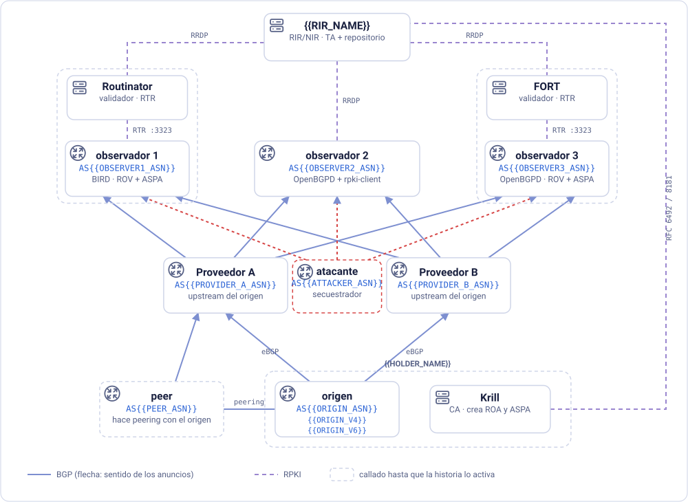

# RPKI SelfLab

*Laboratorio autónomo y guía de autoestudio de RPKI, ROA, ROV y ASPA*

*[English](GUIDE.en.md) · [Español](GUIDE.es.md) · [Português](GUIDE.pt.md)*

**Objetivo:** seguir a un atacante y a un peer con fuga de rutas por un
laboratorio que corre en su propia máquina, y ver qué detecta la validación de
origen (ROV), qué deja pasar, y qué suma el ASPA. Cada veredicto sale de tres
implementaciones: observer1 corre BIRD con Routinator, observer2 corre OpenBGPD
con rpki-client en el mismo host, y observer3 corre OpenBGPD con FORT.

Todo corre en contenedores en su computadora. La guía asume que usted ya conoce
lo básico de RPKI, ROAs, ROV y ASPA. Puede certificar sus recursos de forma
completamente local o, si prefiere trabajar con un registro real, en el sistema
de pruebas de Registro.br.

La guía es una sola historia en nueve pasos: monta **tres ataques y muestra qué
verificación detiene a cada uno**. Antes hay una breve preparación (instalar
Docker, levantar el laboratorio y certificar sus recursos), y al final, algunos
ejercicios extra.

> [!TIP]
> **Cómo usar este laboratorio.** El panel controla un laboratorio completo:
> routers BGP de verdad, tres validadores RPKI de verdad, una CA y un
> registro, todo corriendo en su computadora. **Seguir esta guía paso a paso
> es el camino recomendado**, porque cada paso prepara el siguiente. Una vez
> que la termine, use el laboratorio como quiera: pruebe sus propias
> configuraciones, rompa cosas a propósito, invente escenarios (la última
> sección, *Explorando por su cuenta*, tiene ideas). Si algo se rompe, el
> comando del paso en que está deja el laboratorio otra vez como ese paso lo
> espera.

En el panel, la guía es interactiva. Las salidas esperadas quedan ocultas
detrás de un botón hasta que usted ejecute el comando, y algunos pasos son
**desafíos**: la solución queda oculta hasta que la pida, corre un
cronómetro, y *Verificar mi laboratorio* mira el estado real de su
laboratorio para ver si llegó. Si prefiere leer de corrido, todo lo oculto
se abre con un clic.

## Qué le pide RPKI a su propio AS, y qué despliega este laboratorio

Desplegar RPKI implica hacer dos cosas, publicar y validar, para cada una de
dos preguntas:

| | El origen publica... | ...y los routers validan |
|---|---|---|
| **Quién puede originar un prefijo** | **ROAs** (Route Origin Authorizations) | **ROV** (Route Origin Validation) |
| **Qué caminos son plausibles** | un objeto **ASPA** (Autonomous System Provider Authorization) | **verificación ASPA** |

En la vida real, **las dos van en el AS que usted opera**, y cada una protege
algo distinto. *Publicar* ROAs y un objeto ASPA protege **sus propios
prefijos**: las redes que validan rechazan un secuestro o una fuga de su
espacio de direcciones, y el tráfico dirigido a usted sigue llegando. *Validar*
protege **las decisiones de sus propios routers**: rechazan las rutas falsas
hacia prefijos de otros, y su tráfico, y el de sus clientes, no se desvía.
Ninguno de los dos lados funciona solo: sus objetos lo protegen solo donde las
otras redes validan, y su validación lo protege solo para los prefijos cuyos
titulares publicaron objetos. Publique sin validar, y sus prefijos quedan
protegidos donde los demás validan, pero su propia red sigue aceptando rutas
secuestradas hacia todos los demás. Valide sin publicar, y su red esquiva las
rutas falsas hacia prefijos ajenos, pero nadie, ni siquiera sus propios
routers, puede distinguir un secuestro de sus prefijos de la ruta verdadera.

Este laboratorio separa las dos cosas, con fines didácticos:

- **La publicación se despliega solo en el AS de origen** (AS{{ORIGIN_ASN}}, cuya CA
  vive en Krill). Es el único AS que crea ROAs y un objeto ASPA.
- **La validación se despliega solo en los AS observadores** (observer1,
  observer2 y observer3), los tres routers que va a observar. Todo lo demás en
  el laboratorio es un router BGP común que nunca mira RPKI.

La validación se despliega en los observadores **en dos etapas, para cada
verificación**. Primero el router solo *marca* lo que la verificación señala:
una community, una preferencia menor, nada se descarta todavía, así que usted
puede ver qué pasaría. Después lo *descarta* de verdad. Descartar las
inválidas es lo que hacen los routers reales; marcar es el ensayo, el paso
que se da antes de confiar lo suficiente en una verificación como para
dejarla rechazar rutas.

> [!NOTE]
> **Hospedado o delegado.** Hay dos formas de operar la CA que firma sus
> objetos. En el modelo **hospedado**, el RIR o NIR guarda las claves y
> publica los objetos, y usted solo carga las ROAs (y el ASPA, donde se
> ofrece) en el portal del registro. Varios RIR ofrecen ese modelo. En el
> modelo **delegado**, usted corre su propia CA (aquí, Krill) y recibe un
> certificado del registro. Los objetos igual tienen que publicarse en un
> repositorio, y muchas veces el RIR o NIR también lo ofrece, como servicio
> de publicación, así que no hace falta mantener uno propio. Ese es el
> esquema que enseña este laboratorio: la CA es suya, el repositorio es del
> registro. Las ROAs, el ROV y el ASPA funcionan igual en los dos modelos; lo
> que cambia es quién opera la CA.

## Glosario

Estos son los términos que más usa la guía. Las definiciones son breves y
describen cómo se usa cada término en este laboratorio; los RFC de
*Referencias* tienen los detalles completos. Si ya los conoce, pase
directamente a la topología.

En el panel, estos términos aparecen subrayados con puntos dondequiera que
surjan en la guía. Pase el mouse sobre uno para ver su definición.

### Conceptos

| Término | Significado |
|---|---|
| **RIR/NIR** | Registro Regional/Nacional de Internet: asigna ASN y bloques de IP y, en RPKI, certifica que usted es el titular |
| **CA** | Certificate Authority (Autoridad Certificadora): el motor RPKI que convierte "estos recursos son suyos" en certificados y objetos firmados |
| **TA** | Trust Anchor (ancla de confianza): la CA en la raíz de la cadena de confianza de un validador; todo otro certificado que el validador acepta se encadena hasta ella |
| **Hospedado / delegado** | las dos formas de operar su CA: hospedado, cuando el registro la opera por usted, o delegado, cuando usted corre la suya y el registro la certifica; este laboratorio usa el modelo delegado |
| **TAL** | Trust Anchor Locator: un archivo pequeño que le dice al validador dónde buscar el certificado de la TA y qué clave esperar |
| **ROA** | Route Origin Authorization: un objeto firmado que dice "este ASN puede originar este prefijo, hasta esta longitud" |
| **ASPA** | Autonomous System Provider Authorization: un objeto firmado en el que un AS (el *cliente*) lista a todos sus proveedores upstream, los únicos AS autorizados a pasar sus rutas hacia arriba |
| **ROV** | Route Origin Validation: verifica el *último* AS de la ruta (el que la originó) contra las ROAs |
| **Verificación ASPA** | verifica el *camino completo*, salto a salto, contra los objetos ASPA |
| **Upstream / downstream** | los dos algoritmos de verificación ASPA; cuál se aplica depende de quién le mandó la ruta: un cliente o un peer lateral (upstream, el más estricto) o un proveedor (downstream) |
| **RRDP** | RPKI Repository Delta Protocol: cómo un validador obtiene los objetos firmados de un punto de publicación |
| **RTR** | RPKI-to-Router protocol: cómo un validador entrega sus veredictos a un router; el ASPA necesita la versión 2 de RTR |
| **VRP** | Validated ROA Payload: la tripla (ASN, prefijo, longitud máxima) que un validador derivó de una ROA |
| **AS_PATH** | la lista de AS por los que pasó un anuncio BGP; el último es el origen |
| **Prepend** | repetir el propio ASN en el AS_PATH para que un camino parezca más largo, y por lo tanto menos atractivo |
| **Multihomed** | un AS conectado a más de un proveedor |
| **local_pref** | la preferencia local de BGP: gana la más alta, y se compara antes que la longitud del AS_PATH |
| **Large community** | una etiqueta numérica (RFC 8092) adjunta a una ruta; observer1 las usa para registrar sus veredictos |
| **Role** | el rol declarado en una sesión BGP (RFC 9234: provider, customer, peer...); en OpenBGPD, es lo que elige el algoritmo ASPA |
| **Secuestro (hijack)** | anunciar un prefijo que pertenece a otro, como si fuera suyo (o como si viniera a través de él) |
| **Fuga de ruta** | pasar una ruta que aprendió de un vecino a otro vecino al que no debería (RFC 7908); nadie miente sobre el origen, pero el camino tiene una forma que no podría ocurrir legítimamente |

### El software del laboratorio

| Término | Significado |
|---|---|
| **Docker** | corre cada pieza del laboratorio en su propio contenedor, un pequeño sistema Linux aislado; `docker compose` los levanta a todos juntos |
| **BIRD** | BIRD Internet Routing Daemon, software libre de ruteo (BGP, OSPF y otros) de CZ.NIC. Corre observer1, el origen, los dos proveedores, el AS{{ATTACKER_ASN}} y el peer; se le habla con `birdc` |
| **OpenBGPD** | la implementación libre de BGP del proyecto OpenBSD. Corre observer2 y observer3, calcula ROV y ASPA de forma nativa, y se le habla con `bgpctl` |
| **Krill** | software de CA RPKI de NLnet Labs. Aquí es la CA del titular (y, en modo local, también la del registro simulado); tiene interfaz web y la línea de comandos `krillc` |
| **Routinator** | validador RPKI de NLnet Labs; alimenta a observer1 |
| **FORT** | FORT Validator, el validador RPKI de NIC México; alimenta a observer3 |
| **rpki-client** | el validador RPKI del proyecto OpenBSD. En observer2 corre en el mismo host del router y escribe lo que validó en un archivo que OpenBGPD incluye (también sabe escribir salida para BIRD, y JSON) |
| **RTRTR** | un servidor RTR de NLnet Labs que sirve la salida de otro validador; el ejercicio extra E lo usa para entregar los datos de rpki-client a los routers por RTR |

---

## La topología



El AS{{ORIGIN_ASN}} es multihomed y tiene una preferencia clara: **el Proveedor B es la
entrada, el Proveedor A es el respaldo.** Para lograrlo, el origen hace
*prepend* de su propio ASN dos veces cuando anuncia al Proveedor A
(`{{ORIGIN_ASN}} {{ORIGIN_ASN}} {{ORIGIN_ASN}}` en lugar de solo `{{ORIGIN_ASN}}`),
así que cualquier camino que pase por A parece dos saltos más largo que el
que pasa por B. Es una forma muy común de ingeniería de tráfico entrante.

Los dos proveedores pasan el **mismo prefijo** a los tres observadores, con el
mismo AS de origen. Los observadores ven exactamente los mismos anuncios y los
mismos objetos RPKI, pero cada uno combina un router y un validador a su
manera, así que cada paso se puede comparar entre tres implementaciones.

observer1 y observer3 siguen el esquema más común: un validador en una
máquina aparte (Routinator, FORT) descarga el repositorio y le entrega el
resultado al router por RTR. observer2 lo hace a la manera de OpenBSD:
rpki-client corre en el mismo host del router, escribe las ROAs y los ASPAs
validados en un archivo (`/var/db/rpki-client/openbgpd`), y la configuración
del router lo incluye con `include`. Una tarea periódica (cron, en
producción; aquí, cada dos minutos y en cada comando de paso) vuelve a
ejecutar rpki-client y recarga el router. Por eso la figura no tiene enlace
RTR con observer2: la línea de RRDP llega directo a él.

En términos de BGP, los observadores están *por encima* de los dos proveedores:
les venden tránsito, así que los proveedores son clientes de los observadores,
y toda ruta llega a los observadores desde un cliente. Téngalo en cuenta para
el Paso 5: es lo que decide qué algoritmo ASPA corre.

Dos routers más se suman a la historia, dibujados con borde punteado en la
figura. Los dos están en el panel, y los dos se quedan callados hasta que la
historia los activa:

- **El AS{{ATTACKER_ASN}}, el atacante**, tiene sesiones BGP directas con los tres
  observadores, como cliente de ellos. Cualquier cliente puede enviarles un
  anuncio, y nadie lo verifica a menos que los observadores validen.
- **El peer**, AS{{PEER_ASN}}, tiene un enlace de peering privado con el origen, y le
  compra tránsito al Proveedor A.

| Componente | ASN | Rol |
|---|---|---|
| origen | {{ORIGIN_ASN}} | su AS; origina los prefijos |
| Proveedor A | {{PROVIDER_A_ASN}} | uno de los dos upstreams del origen, el respaldo (el origen hace prepend dos veces hacia él) |
| Proveedor B | {{PROVIDER_B_ASN}} | el otro upstream del origen, el preferido |
| observer1 | {{OBSERVER1_ASN}} | router que valida: **BIRD** + **Routinator** |
| observer2 | {{OBSERVER2_ASN}} | router que valida: **OpenBGPD** + **rpki-client**, en el mismo host, por archivo |
| observer3 | {{OBSERVER3_ASN}} | router que valida: **OpenBGPD** + **FORT Validator** |
| AS{{ATTACKER_ASN}} | {{ATTACKER_ASN}} | el atacante: un cliente de los observadores, que secuestra los prefijos del origen |
| peer | {{PEER_ASN}} | una red legítima que hace peering con el origen, y compra tránsito al Proveedor A |

Los ASN 64496–64511 son ASN reservados para documentación (RFC 5398), y
todos los del laboratorio caen ahí dentro: el origen, los proveedores, los
observadores y el peer AS{{PEER_ASN}}. La única excepción es el
AS{{ATTACKER_ASN}}: ese no está en ningún bloque reservado, 666 es
simplemente fácil de recordar. De cualquier forma, todos son inofensivos
aquí: esta red nunca toca la Internet real.

> [!NOTE]
> El ASN y los prefijos del origen están en el archivo **`lab.conf`**, en la
> raíz del laboratorio. Si quiere otros, edítelos ahí y ejecute
> `./scripts/lab.sh up`: los routers, los scripts y esta guía pasan a usar
> los nuevos valores. (La guía está escrita con marcadores `{{ NAME }}` en
> `guide/templates/`; `up` la compila en `guide/GUIDE.*.md` con los valores
> de `lab.conf`. Edite las plantillas, nunca los archivos compilados.)

### Cómo está organizada la historia

Cada paso empieza con un cuadro de **Estado**: en qué etapa de despliegue están
los observadores, qué están haciendo el AS{{ATTACKER_ASN}} y el peer, y qué objetos RPKI
deberían existir ya. Si su laboratorio no coincide, el mismo cuadro le dice
cómo volver a dejarlo así. En el panel, el encabezado muestra a qué paso se
parece su laboratorio en este momento (*laboratorio ≈ Paso 5*), y los cuadros
de **Punto de control** dentro de cada paso se marcan solos a medida que el
laboratorio llega ahí.

Esa recuperación es deliberadamente simple: **cada comando
`./scripts/lab.sh stepN-*` fija el estado *entero* de su paso**, no solo lo
que cambió desde el anterior. Ejecute `step9-leak-off` y después
`step3-rov-mark`, y llega exactamente adonde el Paso 3 espera: la fuga, la
etapa de descarte, todo lo que dejó el Paso 9 desaparece, porque
`step3-rov-mark` lo reinicia por su cuenta. Y eso vale para cualquier par de
pasos, en cualquier dirección: los comandos no suponen que usted avanza en
orden, ni dejan nada a medio camino para que el siguiente tropiece con eso.
Cada vez que corre un comando `stepN-*`, tres cosas se mueven juntas:

- **La etapa de despliegue de los observadores.** Empiezan sin ninguna
  validación, y la historia los lleva por cuatro etapas: las dos
  verificaciones marcan antes de que ninguna descarte nada, y después las dos
  empiezan a descartar juntas, en el Paso 8. Cada comando fija una etapa
  completa en **los tres** observadores a la vez, sin importar en qué etapa
  estuvieran antes:

  | Etapa | Qué hacen los observadores | Comando |
  |---|---|---|
  | `none` | BGP común, sin validación (así empieza el laboratorio) | `step1-clean` |
  | `rov-mark` | ROV desplegado, rutas inválidas solo *marcadas* | `step3-rov-mark` |
  | `aspa-mark` | se suma la verificación ASPA, también solo *marcando* | `step5-aspa-mark` |
  | `aspa-drop` | el ROV y el ASPA empiezan los dos a *descartar*, en producción | `step8-drop` |

  Cada etapa es un archivo de configuración completo por observador
  (`bird/observer1-<stage>.conf`, `openbgpd/observer2-<stage>.conf`,
  `openbgpd/observer3-<stage>.conf`), y la guía le pide que los abra: **las líneas que cambian de un archivo al siguiente son
  exactamente lo que requiere desplegar esa verificación.** No hace falta que
  recuerde en qué etapa está: el indicador de etapa en el encabezado del panel
  lo dice (*validación: ninguna*, *ROV: marcando*, *ROV: descartando*, ...), y
  se pone naranja si los observadores no coinciden. observer2 y observer3 se
  reinician cada vez que cambia la etapa (OpenBGPD negocia sus roles RFC 9234
  y, en observer3, su versión de RTR al abrir sesión), así que deles diez o
  quince segundos para estabilizarse antes de sacar conclusiones de lo que
  muestran.
- **El AS{{ATTACKER_ASN}} y el peer.** Todo comando `stepN-*` también fija su
  estado (callado, secuestro ingenuo, camino falsificado, en fuga) al que
  describe el texto de la guía para ese paso, incluso los comandos cuyo
  nombre no los menciona (`step6-add-provider-b` y `step8-drop`, por ejemplo,
  igual vuelven a dejar al AS{{ATTACKER_ASN}} en su forma de camino
  falsificado, porque eso es lo que esos pasos esperan).
- **Los objetos RPKI del origen**, en Krill: las ROAs (creadas una sola vez,
  desde `step3-rov-mark` en adelante) y el objeto ASPA, mantenido con
  exactamente la lista que cada paso espera: `krillc aspas add` reemplaza el
  objeto entero, así que un comando puede hacerlo crecer (Paso 6) o volver a
  achicarlo (al saltar al Paso 5 después de haber corrido el Paso 6) con la
  misma facilidad.

  Este es también el único punto donde un comando `stepN-*` puede fallar sin
  culpa propia. Desde `step3-rov-mark` en adelante, cada uno empieza
  comprobando que la Preparación realmente haya terminado: que la CA exista,
  tenga un padre activo, tenga el número de AS y los prefijos de `lab.conf`, y
  tenga un repositorio funcionando. Si algo de eso falta, el comando se detiene
  y se lo dice, en vez de crear en silencio ROAs que Krill no podría publicar.
  La Preparación es la única parte de la historia que un comando `stepN-*` no
  puede hacer por usted.

Los nombres de todos estos comandos llevan el número del paso al que pertenecen.

---

## Preparación 1: Instalar Docker y levantar el laboratorio

El laboratorio tiene dos modos, elegidos con la variable `MODE` en `lab.conf`:

| MODE | Quién certifica | ¿Necesita Internet? |
|---|---|---|
| `local` (por defecto) | **{{RIR_NAME}}**, un registro simulado que corre dentro del laboratorio | solo para descargar el laboratorio la primera vez |
| `beta` | **beta.registro.br**, el sistema de pruebas de Registro.br | sí, y un usuario en beta.registro.br |

Los dos modos usan exactamente los mismos protocolos: RFC 8183 para los
documentos XML que se intercambian en la configuración, RFC 6492 para la
delegación y RFC 8181 para la publicación. Lo que cambia es el panel donde pega
los XML, y cuánto tardan los objetos en aparecer en el validador: segundos en
modo local, unos minutos en beta. El próximo paso de preparación tiene una
versión por modo; haga solo la que le corresponde.

### Antes de empezar: Docker

El laboratorio necesita **Docker con Compose v2** (el comando
`docker compose`), una computadora de 64 bits (Intel/AMD o ARM, Apple
Silicon incluido), unos **2 GB de memoria para Docker** y **4 GB libres en
disco**, y un navegador. Una vez en marcha, todo el laboratorio usa
alrededor de 300 MB de memoria.

**Linux**

1. Instale Docker Engine y el plugin de Compose para su distribución:
   https://docs.docker.com/engine/install/
2. Permita que su usuario use Docker sin `sudo` (cierre la sesión y vuelva
   a entrar después): https://docs.docker.com/engine/install/linux-postinstall/

¿Prefiere una aplicación gráfica? Docker Desktop para Linux también funciona:
https://docs.docker.com/desktop/setup/install/linux/

**macOS**

- **OrbStack** (más liviano y más rápido; el laboratorio se prueba con él):
  https://docs.orbstack.dev/quick-start
- o **Docker Desktop para Mac**:
  https://docs.docker.com/desktop/setup/install/mac-install/

**Windows**

Los scripts del laboratorio son scripts bash, así que en Windows corren
dentro de **WSL 2** (un Linux de verdad dentro de Windows), con Docker
Desktop poniendo los contenedores:

1. Instale WSL 2 con Ubuntu: abra PowerShell como administrador y ejecute
   `wsl --install` (detalles: https://learn.microsoft.com/windows/wsl/install).
2. Instale Docker Desktop para Windows con el backend WSL 2:
   https://docs.docker.com/desktop/setup/install/windows-install/
3. En Docker Desktop, en *Settings → Resources → WSL integration*, active su
   distribución Ubuntu (https://docs.docker.com/desktop/features/wsl/).
4. Abra la terminal de **Ubuntu** y haga todo desde ahí. Deje la carpeta del
   laboratorio dentro de Linux (por ejemplo `~/rpki-selflab`), y no en
   `/mnt/c/...`: es mucho más rápido, y evita problemas de fin de línea y de
   permisos.

¿No puede o no quiere instalar nada? El laboratorio también viene como una
máquina virtual lista, con Docker y las imágenes ya adentro: vea
`vm/README.es.md`.

**Verifique que Docker funciona** (en la terminal de cualquier sistema):

```cmd @host
docker version
docker compose version
docker run --rm hello-world
```

El último imprime *Hello from Docker!*. Si Docker es nuevo para usted, la
introducción oficial vale veinte minutos: https://docs.docker.com/get-started/

### Levantar el laboratorio

1. En la terminal, dentro de la carpeta del laboratorio:

   ```cmd @host
   ./scripts/lab.sh up
   ```

   La primera vez, Docker descarga las imágenes y construye algunas
   locales, lo que tarda unos minutos. Si algo sale mal, ejecute
   `./scripts/lab.sh doctor`: revisa Docker, los puertos, los contenedores y
   la preparación, y dice qué hacer con cada problema.

   > [!WARNING]
   > El laboratorio solo necesita el **puerto {{PANEL_PORT}}** libre en su
   > computadora. Si otro programa lo está usando, `up` se detiene y dice
   > cuál; libérelo, o elija otro puerto en `PANEL_PORT` en `lab.conf`. (Con
   > `EXPOSE_PORTS=yes` en `lab.conf`, también publica el puerto
   > propio de cada servicio, 3000, 3323, 8081..., lo que solo hace falta para
   > conectar herramientas de afuera directamente a un servicio.)

2. Abra el panel del laboratorio en el navegador:

   **http://localhost:{{PANEL_PORT}}**

   Use exactamente `localhost`: el panel llega a todos los demás servicios
   con nombres como `krill.localhost`, que los navegadores dirigen a su
   propia computadora.

3. **Un recorrido rápido por el panel.**

   - **Esta guía** es la columna de la izquierda. ◀ y ▶ pasan de un paso a
     otro, y la barrita de abajo muestra su progreso.
   - **La topología** está en el medio: al hacer clic en un recuadro se ven el
     estado, las direcciones y la terminal de ese componente, a la derecha.
     Debajo, una pestaña por observador lista todas las rutas que tiene, con
     sus veredictos (un ≠ en una pestaña indica que ese observador no
     coincide con los otros en alguna ruta), y **Eventos** cuenta, en
     palabras, todo lo que cambió (las mismas novedades aparecen unos
     segundos en una esquina).
   - **La barra de arriba** está siempre en el mismo lugar. **Terminal** abre
     la Terminal del laboratorio, ya en la carpeta del laboratorio;
     **Comandos** muestra qué hace cada comando `./scripts/lab.sh`, con un ▶
     para ejecutarlo; **Krill**, **Routinator** y **Registro** abren esas
     interfaces web. Las terminales y las interfaces web se abren dentro del
     panel, en pestañas; ↗ abre la actual en una pestaña aparte del navegador.

   **Dónde ejecutar cada comando.** Cada bloque de comandos de esta guía dice
   en su encabezado dónde se ejecuta: *Ejecute en observer1 · Shell*,
   *Ejecute en la Terminal del laboratorio*, etc. En el panel, **▶ abrir
   terminal** abre exactamente esa terminal, y **copiar** copia los comandos
   (sin ningún prompt). Si prefiere usar la terminal de su propia
   computadora, anteponga `docker exec lab-<recuadro>` al comando y
   ejecútelo en la carpeta del laboratorio (por ejemplo,
   `docker exec lab-observer1 birdc show protocols`).

4. Verifique que los routers levantaron y que las sesiones BGP están
   establecidas. En el panel, el recuadro de cada router muestra cuántas de
   sus sesiones BGP están arriba (por ejemplo *BGP 6/6*). Para ver el detalle:

   ```cmd @observer1
   birdc show protocols
   ```

   ```cmd @observer2
   bgpctl show summary
   ```

   ```cmd @observer3
   bgpctl show summary
   ```

   Debería ver `provider_a_v4`, `provider_a_v6`, `provider_b_v4` y
   `provider_b_v6` en `Established` en observer1, más `attacker_v4` y
   `attacker_v6`, las sesiones con el AS{{ATTACKER_ASN}}, que está arriba pero
   en silencio por ahora. observer2 y observer3 listan las mismas seis
   sesiones. Todavía no hay un protocolo `routinator`: los observadores no
   validan nada hasta el Paso 3.

---

## Preparación 2: Certificar sus recursos (MODE=local)

> Haga esto si `lab.conf` tiene `MODE=local` (el valor por defecto). Si tiene
> `MODE=beta`, pase a la Preparación 2-B.

Aquí va a actuar en **los dos lados** de la conversación: el titular, en Krill,
y el registro, en el panel de {{RIR_NAME}}. Es el mismo intercambio de XML que ocurre
entre un operador de red y su RIR. Este es el modelo **delegado** (vea
*Hospedado o delegado*, más arriba): en el modelo hospedado, toda esta
preparación no existe, porque el registro opera la CA por usted.

### Su lado: la CA en Krill

1. Abra Krill: botón **Krill** arriba del panel (o
   **http://krill.localhost:{{PANEL_PORT}}** en una pestaña propia).

2. Inicie sesión con el token **`labpass`**.

3. Cree su CA con el nombre **`acme_ca`**.
   Si la interfaz de Krill no está en inglés, cámbiela en la esquina superior
   derecha: esta guía usa los rótulos en inglés, los mismos de las capturas.

### El lado del registro: el panel de {{RIR_NAME}}

4. Abra el panel del registro: botón **Registro** de arriba (o
   **http://registry.localhost:{{PANEL_PORT}}**).

   Fíjese en la sección *Recursos asignados*: lista el ASN y los bloques de su
   `lab.conf`, y el certificado que el registro está por emitir va a cubrir
   exactamente ese conjunto.

### Parte 1: Delegación de la CA (RFC 6492)

5. En Krill, vaya a *Parent CAs* → *Add a new parent CA* y copie el XML del
   campo *Child Request* (el `child_request`).

6. En el panel de {{RIR_NAME}}, pegue ese XML en el recuadro
   **1 · Delegación de la CA** y haga clic en *Emitir certificado*.

7. El registro devuelve el `parent_response`. Cópielo.

8. De vuelta en Krill, en *Parent CAs* → *Parent Response*, pegue el XML. En
   el campo *Parent CA name* use **`labnic`** y confirme.

### Parte 2: Servicio de publicación (RFC 8181)

9. En Krill, vaya a *Repository* → *Add a repository* y copie el XML del
   *Publisher Request* (el `publisher_request`).

10. En el panel de {{RIR_NAME}}, péguelo en el recuadro
    **2 · Servicio de publicación** y haga clic en *Autorizar publicación*.

11. Copie el `repository_response` que aparece y péguelo en Krill, en
    *Repository* → *Repository Response*. Confirme.

### Verificando

12. En Krill, la página de la CA tiene cuatro pestañas (*ROAs*, *ASPAs*,
    *Parents*, *Repository*) y, **a la derecha**, un recuadro con los
    recursos que certificó el padre: el ASN {{ORIGIN_ASN}} y los prefijos
    {{ORIGIN_V4}} y {{ORIGIN_V6}}. En una ventana angosta, ese recuadro baja
    **debajo** del botón *Add ROA*, donde parece pertenecer a otra cosa. Es el
    mismo recuadro.

    

    Otras formas de ver lo mismo: haga clic en el recuadro **Krill** de la
    topología del panel (lista los recursos, las ROAs y el ASPA de la CA), o
    ejecute `krillc show` en la terminal de Krill.

13. En el panel de {{RIR_NAME}}, la sección *RPKI delegado* pasa a mostrar
    **activo**, con la fecha del último intercambio Up-Down y la cantidad de
    objetos en el repositorio.

<!-- checkpoint: prep -->

> **¿Por qué dos partes separadas?** La primera dice *qué recursos son suyos*;
> la segunda dice *dónde va a publicar los objetos firmados*. Son
> independientes: un RIR puede certificar sus recursos mientras usted publica
> en otro lugar, en su propio servidor de publicación, por ejemplo.

**Fíjese en lo que *no* hizo:** no creó ninguna ROA, ni ningún objeto ASPA.
Sus recursos están certificados, pero nada todavía dice quién puede
anunciarlos. Ahí empieza la historia.

---

## Preparación 2-B: Certificar sus recursos (MODE=beta)

> Haga esto solo si `lab.conf` tiene `MODE=beta`. Necesita acceso a Internet y
> un usuario en beta.registro.br.

1. Abra Krill (botón **Krill** de arriba), entre con el token **`labpass`** y
   cree la CA **`acme_ca`**.

2. En una pestaña del navegador, entre en **https://beta.registro.br/login/**
   (en el panel, el botón **beta.registro.br** de arriba lo abre). En el Panel,
   vaya a *Titularidad*, seleccione el AS y baje hasta la sección **RPKI** →
   *Configurar RPKI*.

3. En Krill, en *Parent CAs* → *Add a new parent CA*, copie el XML del campo
   *Child Request* y péguelo en el campo indicado de Registro.br.

4. Si tiene éxito aparece "¡RPKI habilitado con éxito!" y surge el campo
   **Parent response**. Copie el XML y péguelo en Krill, en *Parent CAs* →
   *Parent Response*, con el nombre de CA padre **`nicbr_ca`**.

5. Todavía en Registro.br, vaya a *Configurar RPKI* → *Configurar publicación
   remota*. En Krill, en *Repository* → *Add a repository*, copie el *Publisher
   Request* y péguelo ahí.

6. El campo se convierte en **Repository response**. Cópielo y péguelo en
   Krill, en *Repository* → *Repository Response*.

7. Al final, Krill debe mostrar los recursos recibidos del padre, en el
   recuadro de la derecha de la página de la CA (vea la Preparación 2,
   punto 12).

<!-- checkpoint: prep -->

**Fíjese en lo que *no* hizo:** no creó ninguna ROA, ni ningún objeto ASPA.
Sus recursos están certificados, pero nada todavía dice quién puede
anunciarlos. Ahí empieza la historia. (En beta, cuente con que los objetos
tarden unos minutos en llegar a los validadores cada vez que un paso le pida
crear uno.)

---

## Paso 1: Una base limpia

> **Estado:** etapa `none` (sin validación) · AS{{ATTACKER_ASN}} en silencio · peer en
> silencio · sin ROAs, sin ASPA.
>
> **Si el suyo difiere:** `./scripts/lab.sh step1-clean` silencia al AS{{ATTACKER_ASN}} y al
> peer *y* devuelve los tres observadores a BGP común. Si quedaron ROAs o un
> objeto ASPA de una ejecución anterior, `./scripts/lab.sh clean-objects` los
> borra y conserva su CA, así que no hace falta rehacer la preparación.

1. Asegúrese de que el laboratorio esté en su base:

   ```cmd @lab
   ./scripts/lab.sh step1-clean
   ```

2. Verifique que el prefijo del origen llega a los observadores, por los
   dos proveedores, y cuál prefieren. En observer1 (BIRD):

   ```cmd @observer1
   birdc show route table master4 all {{ORIGIN_V4}}
   ```

   ```output @observer1
   {{ORIGIN_V4}}  unicast [provider_b_v4 ...] * (100) [AS{{ORIGIN_ASN}}i]
        bgp_path: {{PROVIDER_B_ASN}} {{ORIGIN_ASN}}
        bgp_local_pref: 100

                unicast [provider_a_v4 ...] (100) [AS{{ORIGIN_ASN}}i]
        bgp_path: {{PROVIDER_A_ASN}} {{ORIGIN_ASN}} {{ORIGIN_ASN}} {{ORIGIN_ASN}}
        bgp_local_pref: 100
   ```

   Y en observer3 (OpenBGPD):

   ```cmd @observer3
   bgpctl show rib {{ORIGIN_V4}}
   ```

   ```output @observer3
   flags  vs destination          gateway          lpref   med aspath origin
   *>    N-? {{ORIGIN_V4}}          10.200.6.10       100     0 {{PROVIDER_B_ASN}} {{ORIGIN_ASN}} i
   *     N-? {{ORIGIN_V4}}          10.200.5.10       100     0 {{PROVIDER_A_ASN}} {{ORIGIN_ASN}} {{ORIGIN_ASN}} {{ORIGIN_ASN}} i
   ```

   observer2, el otro OpenBGPD, muestra las mismas dos líneas, solo que con
   las direcciones de sus propios vecinos (`10.200.12.10` y `10.200.11.10`).

   Dos caminos en cada observador: `{{PROVIDER_B_ASN}} {{ORIGIN_ASN}}` (el
   seleccionado, la entrada preferida del origen, 2 saltos) y
   `{{PROVIDER_A_ASN}} {{ORIGIN_ASN}} {{ORIGIN_ASN}} {{ORIGIN_ASN}}` (el
   respaldo, que se mantiene en la tabla pero con 4 saltos por los prepends).
   Ninguno tiene veredicto todavía: BIRD no tiene communities, el `N-?` de
   OpenBGPD es solo "nada con qué comparar", y el panel muestra `—` en los
   dos. Es lógico: **los observadores todavía no validan nada.** El indicador
   de etapa del encabezado del panel dice *validación: ninguna*.

3. **Eche un vistazo a cómo están configurados estos routers.** Abra los
   archivos base de los observadores:

   ```cmd @lab
   cat bird/observer1-none.conf
   cat openbgpd/observer3-none.conf
   ```

   Va a encontrar BGP común: sesiones con los dos proveedores (y con el
   AS{{ATTACKER_ASN}}, que está en silencio por ahora), y una política que
   acepta todo:

   ```conf @observer1
   template bgp CUSTOMER4 {
       local as OBSERVER1_ASN;
       ipv4 {
           import all;                 # <- BIRD: acepta lo que envíe el vecino
           export none;
           import table on;
       };
   }
   ```

   ```conf @observer3
   deny from any
   allow from any                      # <- OpenBGPD: la misma idea
   ```

   (`openbgpd/observer2-none.conf` es igual al de observer3, con sus propias
   direcciones.) No hay sesión RTR con Routinator ni con FORT (los dos están
   corriendo, pero nadie los escucha), nadie incluye el archivo de
   rpki-client, y ninguna configuración usa RPKI. De aquí en adelante, la
   historia modifica estos archivos paso a paso, y esos cambios son todo lo
   que hace falta para desplegar la validación RPKI en un router.

<!-- checkpoint: step1 -->

**Para recordar:** los validadores, la CA y el repositorio ya existen, y los
recursos ya están certificados. Aun así, nada de esto afecta a los routers
mientras no se los configure para hablar con un validador.

---

## Paso 2: El secuestro ingenuo

> **Estado:** etapa `none` · AS{{ATTACKER_ASN}} en silencio (a punto de cambiar) · peer
> en silencio · sin ROAs, sin ASPA.
>
> **Si el suyo difiere:** `./scripts/lab.sh step1-clean`.

El AS{{ATTACKER_ASN}} anuncia el prefijo del origen como si fuera suyo, sin
más vueltas.

1. Actívelo:

   ```cmd @lab
   ./scripts/lab.sh step2-hijack-simple
   ```

2. **Antes de mirar:** el camino del AS{{ATTACKER_ASN}} es solo
   `{{ATTACKER_ASN}}`, más corto que el legítimo `{{PROVIDER_B_ASN}} {{ORIGIN_ASN}}`
   (y que el respaldo por A). ¿Cuál espera que prefieran los observadores?
   ¿Hay *algo* que puedan usar para distinguir uno de otro?

<!-- predict id=s2 answer=1: El secuestro: su camino es más corto, y nada más los distingue | El camino legítimo por el Proveedor B: los observadores saben cuál es el ASN verdadero del origen | Ninguno: los observadores notan el conflicto y descartan los dos -->

3. Ahora mire, en observer1 y en observer3 (observer2 muestra lo mismo que
   observer3):

   ```cmd @observer1
   birdc show route table master4 all {{ORIGIN_V4}}
   ```

   ```output @observer1
   {{ORIGIN_V4}}  unicast [attacker_v4 ...] * (100) [AS{{ATTACKER_ASN}}i]
        bgp_path: {{ATTACKER_ASN}}
        bgp_local_pref: 100
   ```

   ```cmd @observer3
   bgpctl show rib {{ORIGIN_V4}}
   ```

   ```output @observer3
   *>    N-? {{ORIGIN_V4}}          10.200.8.10       100     0 {{ATTACKER_ASN}} i
   *     N-? {{ORIGIN_V4}}          10.200.6.10       100     0 {{PROVIDER_B_ASN}} {{ORIGIN_ASN}} i
   *     N-? {{ORIGIN_V4}}          10.200.5.10       100     0 {{PROVIDER_A_ASN}} {{ORIGIN_ASN}} {{ORIGIN_ASN}} {{ORIGIN_ASN}} i
   ```

   El secuestro **ganó**. Es la ruta seleccionada (`*`, `*>`) en los tres
   observadores: su camino es más corto (1 salto contra 2 y 4), y nada más lo
   distingue de los legítimos. En el panel, el recuadro del atacante dice
   *secuestrando* y sus enlaces a los observadores se ponen **naranjas**: un
   observador está aceptando lo que anuncia. Las pestañas de veredictos suman
   filas nuevas rotuladas *AS{{ATTACKER_ASN}}*, sin veredictos, porque
   todavía no hay validación.

<!-- /predict -->

<!-- checkpoint: step2 -->

**Para recordar:** un secuestro con el ASN de origen equivocado. Es el tipo
más básico de secuestro, y el que las ROAs fueron creadas para detener.

---

## Paso 3: Entra el ROV, marcando lo que parece mal

> **Estado:** etapa `none` (a punto de cambiar) · AS{{ATTACKER_ASN}} haciendo el
> secuestro ingenuo · peer en silencio · todavía sin ROAs (las va a crear
> aquí), sin ASPA.
>
> **Si el suyo difiere:** `./scripts/lab.sh step1-clean`, y luego
> `./scripts/lab.sh step2-hijack-simple`.

Este paso tiene dos mitades, en este orden: primero el **Origen publica** las
ROAs, y después los **Observadores las validan**, por ahora solo marcando.

### El Origen publica: crear las ROAs

> [!IMPORTANT]
> **Espere a que la CA reciba su certificado antes de crear ROAs.** Justo
> después de la preparación, la CA puede todavía no tener los recursos del
> padre, y entonces Krill acepta la ROA sin crear nada. Verifique que el
> recuadro **de la derecha** de la página de la CA (debajo de *Add ROA* en una
> ventana angosta) ya lista sus prefijos. Si está vacío, espere unos segundos
> o ejecute `krillc bulk refresh` en la terminal de Krill.

<!-- challenge id=roas check=step3-roas time=300: Cree las dos ROAs que autorizan al AS{{ORIGIN_ASN}} a originar {{ORIGIN_V4}} y {{ORIGIN_V6}}, cada una con la longitud máxima igual a la longitud de su propio prefijo, y haga que los validadores las vean. -->
<!-- hint: En Krill, la página de la CA tiene una pestaña ROAs con un botón Add ROA. O use krillc roas update en la terminal de Krill. -->
<!-- hint: La longitud máxima es la del propio prefijo: {{ORIGIN_V4_MAXLEN}} para el de IPv4, {{ORIGIN_V6_MAXLEN}} para el de IPv6. Después, ./scripts/lab.sh refresh en la Terminal del laboratorio hace que los validadores vuelvan a mirar. -->

1. En Krill, en la pestaña **ROAs** de la CA, haga clic en *Add ROA*. Sus ROAs
   van a aparecer en la tabla de esa pestaña.

   

2. Cree la ROA de IPv4:

   | campo | valor |
   |---|---|
   | ASN | {{ORIGIN_ASN}} |
   | Prefix | {{ORIGIN_V4}} |
   | Max length | {{ORIGIN_V4_MAXLEN}} |

3. Cree la ROA de IPv6:

   | campo | valor |
   |---|---|
   | ASN | {{ORIGIN_ASN}} |
   | Prefix | {{ORIGIN_V6}} |
   | Max length | {{ORIGIN_V6_MAXLEN}} |

   ¿Prefiere la línea de comandos? En la terminal de Krill:

   ```cmd @krill
   krillc roas update --add "{{ORIGIN_V4}}-{{ORIGIN_V4_MAXLEN}} => {{ORIGIN_ASN}}"
   krillc roas update --add "{{ORIGIN_V6}}-{{ORIGIN_V6_MAXLEN}} => {{ORIGIN_ASN}}"
   krillc roas list
   ```

   (Si Krill dice que una ROA es un *duplicate*, ya está ahí.)

   > [!NOTE]
   > La columna *State* de Krill muestra **NOT SEEN** o **NO ANNOUNCEMENT
   > INFO** en todas las ROAs. Esa columna compara sus ROAs con los anuncios
   > BGP que Krill conoce, y Krill no ve la tabla BGP de este laboratorio.
   > Ignórela: no significa que algo esté mal.

4. Haga que los validadores las recojan, y verifique que lo hicieron:

   ```cmd @lab
   ./scripts/lab.sh refresh
   ./scripts/validate.sh
   ```

   `validate.sh` imprime lo que Routinator validó (dos ROAs). En el panel,
   los recuadros de Routinator y FORT muestran `2 VRP`, el de observer2
   también (es la cuenta de rpki-client), y el de Krill muestra `2 ROA`. Si todavía no aparece nada, no se preocupe: **es cuestión de
   tiempo** (Krill tiene que publicar y los validadores tienen que releer,
   segundos en modo local, minutos en beta). Ejecute `refresh` de nuevo.

<!-- /challenge -->

<!-- checkpoint: step3-roas -->

Por ahora nada cambió para los routers: las ROAs ya están publicadas y
validadas, pero **ningún router está escuchando a los validadores.** Mire los
observadores de nuevo si quiere: el secuestro sigue ganando, como antes.

### Los Observadores validan

1. Despliegue el ROV en los tres observadores, en su primera forma segura:

   ```cmd @lab
   ./scripts/lab.sh step3-rov-mark
   ```

2. **Vea de qué está hecho este despliegue.** Compare los archivos nuevos
   con la base que leyó en el Paso 1. `diff` muestra exactamente lo que se
   agregó:

   ```cmd @lab
   diff bird/observer1-none.conf bird/observer1-rov-mark.conf
   diff openbgpd/observer2-none.conf openbgpd/observer2-rov-mark.conf
   diff openbgpd/observer3-none.conf openbgpd/observer3-rov-mark.conf
   ```

   > [!IMPORTANT]
   > No omita los `diff`. Son la verdadera lección de este paso: las
   > líneas que muestran son todo lo que hace falta para desplegar ROV en un
   > router.

   Las mismas tres piezas en los tres routers:

   **(a) Una fuente de datos validados.** En observer1 y observer3 es una
   sesión con un validador, por la cual el router aprende las ROAs:

   ```conf @observer1
   protocol rpki routinator {
       remote 172.30.0.20 port 3323;
       roa4 { table roa4_table; };
       roa6 { table roa6_table; };
       ...
   }
   ```

   ```conf @observer3
   rtr 172.30.0.50 {
       port 3323
   }
   ```

   observer2 no tiene ninguna sesión. rpki-client, en el mismo host, escribió
   las ROAs en un archivo como un `roa-set`, y bgpd incluye ese archivo como
   cualquier otra parte de su configuración:

   ```conf @observer2
   include "/var/db/rpki-client/openbgpd"
   ```

   Mire lo que trae:

   ```cmd @observer2
   cat /var/db/rpki-client/openbgpd
   ```

   ```output @observer2
   roa-set {
   	{{ORIGIN_V4}} source-as {{ORIGIN_ASN}} expires ...
   	{{ORIGIN_V6}} source-as {{ORIGIN_ASN}} expires ...
   }

   aspa-set {
   }
   ```

   El `aspa-set` está vacío porque todavía no existe un objeto ASPA. Cuando
   las ROAs cambian, rpki-client reescribe el archivo y bgpd lo recarga: en
   producción, eso es una tarea de cron, típicamente cada hora; aquí, cada
   dos minutos y en cada comando de paso. Un archivo no tiene versión de
   protocolo que negociar ni requiere otro daemon, pero el router solo se
   entera de un cambio en la ejecución siguiente.

   **(b) Una prueba en cada ruta**, comparando su AS de origen (el *último* AS
   del camino) y su prefijo con las ROAs. BIRD la calcula en el filtro de
   importación y guarda el resultado en una large community, para que pueda
   leerlo después; OpenBGPD la calcula de forma nativa en el atributo `ovs`
   de la ruta:

   ```conf @observer1
   filter import_customer_v4 {
       if roa_check(roa4_table, net, bgp_path.last) = ROA_INVALID then {
           bgp_large_community.add((OBSERVER1_ASN,1,0));
           bgp_local_pref = 10;                    # <- (c) una acción: pierde contra cualquier ruta válida
       } else if roa_check(roa4_table, net, bgp_path.last) = ROA_VALID then
           bgp_large_community.add((OBSERVER1_ASN,1,2));
       else
           bgp_large_community.add((OBSERVER1_ASN,1,1));
       accept;
   }
   ```

   **(c) Una acción sobre el resultado.** En esta etapa la acción es solo
   *bajar la preferencia* de una ruta inválida, sin rechazar nada:

   ```conf @observer3
   match from any ovs invalid    set { localpref 10 }
   ```

   > [!TIP]
   > **Esto no es cosa de BIRD ni de OpenBGPD.** Cualquier router que
   > soporte ROV tiene las mismas tres piezas, con distinta sintaxis: una
   > sesión con un validador (RTR), una política que compara el estado de
   > validación, y una acción. En Cisco IOS XR es una `route-policy` que
   > prueba `validation-state`; en Junos, una `policy-statement` que compara
   > `validation-database`; en Huawei, `if-match rpki` en una route-policy.
   > Consulte la documentación de su plataforma para la sintaxis exacta. Aquí
   > usamos BIRD y OpenBGPD porque son libres y fáciles de correr en
   > contenedores, no porque sean comunes en redes de producción.
   >
   > **¿Quiere escribirlo usted mismo?** En la Terminal del laboratorio,
   > copie la base a la carpeta `work/` (el único lugar donde el panel puede
   > escribir), agregue las tres piezas con `nano` o `vim`, y cargue su
   > archivo en observer1:
   >
   > `cp bird/observer1-none.conf work/mi-rov.conf` · `nano work/mi-rov.conf` ·
   > `docker exec lab-observer1 birdc 'configure "/etc/lab-work/mi-rov.conf"'`
   >
   > `./scripts/lab.sh step3-rov-mark` vuelve a la versión de la guía.

3. **Antes de mirar:** el secuestro se sigue anunciando, exactamente igual que
   antes. ¿Qué espera que le pase ahora?

<!-- predict id=s3 answer=2: Desaparece de las tablas de los observadores | Se queda en la tabla, marcado como Invalid y con menor preferencia, y pierde contra los caminos legítimos | Nada cambia: sigue ganando, porque el ROV solo marca -->

4. Ahora mire las rutas de nuevo:

   ```cmd @observer1
   birdc show route table master4 all {{ORIGIN_V4}}
   ```

   ```output @observer1
   {{ORIGIN_V4}}  unicast [attacker_v4 ...] (100) [AS{{ATTACKER_ASN}}i]
        bgp_path: {{ATTACKER_ASN}}
        bgp_local_pref: 10
        bgp_large_community: ({{OBSERVER1_ASN}}, 1, 0)                   <- ROV Invalid
   ```

   ```cmd @observer3
   bgpctl show rib {{ORIGIN_V4}}
   ```

   ```output @observer3
   *>    V-? {{ORIGIN_V4}}          10.200.6.10       100     0 {{PROVIDER_B_ASN}} {{ORIGIN_ASN}} i
   *     V-? {{ORIGIN_V4}}          10.200.5.10       100     0 {{PROVIDER_A_ASN}} {{ORIGIN_ASN}} {{ORIGIN_ASN}} {{ORIGIN_ASN}} i
   *     !-? {{ORIGIN_V4}}          10.200.8.10        10     0 {{ATTACKER_ASN}} i
   ```

   El secuestro sigue en la tabla, pero ahora lleva
   **ROV Invalid** y un `local_pref` de 10, así que pierde contra los
   caminos legítimos, y el del Proveedor B vuelve a ser la ruta
   seleccionada. El indicador de etapa del encabezado dice *ROV: marcando*, y
   los enlaces del atacante se ponen **rojos**: sigue anunciando, y los tres
   observadores lo están marcando. Todo lo que tenía que salir bien salió
   bien: el secuestro está marcado, los caminos legítimos son `Valid`, y nada
   legítimo salió perjudicado. Para eso sirve la etapa de marcado: muestra
   qué haría la verificación antes de dejar que rechace algo.

   El ROV se queda en modo de marcado por el resto de la historia. Bajar la
   preferencia solo ayuda mientras exista una alternativa válida: si la ruta
   inválida es la única, el router la sigue usando, y un secuestro de un
   prefijo *más específico* gana de todos modos, porque el router reenvía por
   el prefijo más largo antes de que la preferencia entre en juego. Marcar es
   una fase de prueba, no una defensa. El descarte, para el ROV y el ASPA
   juntos, llega en el Paso 8, una vez que las dos verificaciones se hayan
   probado así.

<!-- /predict -->

<!-- checkpoint: step3 -->

### Cómo leer los veredictos

Los observadores los muestran de dos formas:

- **observer1 (BIRD)** no tiene un atributo de validación por ruta, así que
  sus filtros registran cada veredicto en una large community:

  | community | significado | | community | significado |
  |---|---|---|---|---|
  | ({{OBSERVER1_ASN}},1,0) | ROV Invalid | | ({{OBSERVER1_ASN}},2,0) | ASPA Invalid |
  | ({{OBSERVER1_ASN}},1,1) | ROV NotFound | | ({{OBSERVER1_ASN}},2,1) | ASPA Unknown |
  | ({{OBSERVER1_ASN}},1,2) | ROV Valid | | ({{OBSERVER1_ASN}},2,2) | ASPA Valid |

- **observer2 y observer3 (OpenBGPD)** calculan los dos de forma nativa. La columna `vs`
  es el par **ovs-avs**: estado de validación de origen, luego estado de
  validación ASPA, cada uno `V` (válido), `!` (inválido), o `N`/`?`
  (not-found / unknown). Así, `V-!` es ROV Valid y ASPA Invalid. (Todavía no
  hay verificación ASPA desplegada, así que la segunda mitad queda en `?` por
  ahora.)

Las pestañas de veredictos del panel, una por observador, ya los muestran
decodificados.

**Para recordar:** de qué está hecho "desplegar ROV" (una fuente de datos
validados, una prueba en cada ruta, una acción sobre el resultado) y cómo
llegan los objetos nuevos a los routers: Krill publica, los validadores
releen, y los routers reciben el cambio por RTR o, en observer2, cuando
rpki-client reescribe el archivo y bgpd lo recarga. Ya vio cada uno de esos
saltos.

---

## Paso 4: El camino falsificado

> **Estado:** etapa `rov-mark` · AS{{ATTACKER_ASN}} haciendo el secuestro ingenuo (marcado,
> perdiendo) · peer en silencio · ROAs para los dos prefijos · sin ASPA.
>
> **Si el suyo difiere:** `./scripts/lab.sh step4-hijack-posrov`, que también
> se asegura de que existan las ROAs y vuelve a poner a los observadores en
> `rov-mark`.

El ROV solo verifica el **último** AS del camino. ¿Qué pasa si un atacante
pone ahí el AS correcto?

1. Cambie el AS{{ATTACKER_ASN}} al ataque del camino falsificado:

   ```cmd @lab
   ./scripts/lab.sh step4-hijack-posrov
   ```

   El AS{{ATTACKER_ASN}} ahora anuncia el camino `{{ATTACKER_ASN}} {{ORIGIN_ASN}}`:
   como si hubiera recibido el prefijo directamente del origen real.

   **Esa relación no existe.** El AS{{ATTACKER_ASN}} no tiene ninguna sesión BGP con el
   AS{{ORIGIN_ASN}}, ni de peering ni de tránsito; ni siquiera están conectados. La
   adyacencia `{{ATTACKER_ASN}} {{ORIGIN_ASN}}` existe solo porque la configuración del AS{{ATTACKER_ASN}}
   *la escribe directamente en el camino*. Vea cómo en el shell del propio
   atacante:

   ```cmd @attacker
   cat /etc/bird.conf
   ```

   (Es el archivo `bird/attacker-posrov.conf` en la carpeta del laboratorio.)
   Encuentre los filtros `forge_export`: `bgp_path.prepend(ORIGIN_ASN)` pone el
   número del origen en el camino *antes* de que el router agregue el suyo al
   exportar. Con eso basta para falsificar el camino. Compárelo con
   `bird/attacker-simple.conf` (sin filtro, así que el camino es solo
   `{{ATTACKER_ASN}}`), y verifique que ninguno de los dos archivos tiene una sesión con
   el origen: solo con los observadores.

2. **Antes de mirar:** el ROV por ahora solo marca, no descarta nada, pero el
   secuestro ingenuo igual quedó marcado Invalid y perdió la carrera. ¿Este
   camino falsificado va a correr la misma suerte?

<!-- predict id=s4 answer=2: Sí: sigue siendo el AS{{ATTACKER_ASN}} anunciando el prefijo de otro | No: el camino termina en el AS{{ORIGIN_ASN}}, exactamente lo que autoriza la ROA, así que el ROV dice Valid | Depende del proveedor por el que llegue -->

3. Mire:

   ```cmd @observer3
   bgpctl show rib {{ORIGIN_V4}}
   ```

   ```output @observer3
   flags  vs destination          gateway          lpref   med aspath origin
   *>    V-? {{ORIGIN_V4}}          10.200.8.10       100     0 {{ATTACKER_ASN}} {{ORIGIN_ASN}} i
   *m    V-? {{ORIGIN_V4}}          10.200.6.10       100     0 {{PROVIDER_B_ASN}} {{ORIGIN_ASN}} i
   *     V-? {{ORIGIN_V4}}          10.200.5.10       100     0 {{PROVIDER_A_ASN}} {{ORIGIN_ASN}} {{ORIGIN_ASN}} {{ORIGIN_ASN}} i
   ```

   No quedó marcado. El ROV dice `Valid`, porque el camino termina en
   {{ORIGIN_ASN}}, que es exactamente lo que autoriza la ROA. Recibe el
   `local_pref` completo (100) igual que cualquier ruta legítima, y sale
   seleccionada. Los enlaces del atacante en el panel se ponen **naranjas**,
   ya no rojos: el ROV no tiene nada que marcar aquí. Los tres caminos son
   ROV Valid, uno de ellos es falsificado, y nada de lo desplegado hasta
   ahora puede distinguirlos.

   > El camino falsificado (`{{ATTACKER_ASN}} {{ORIGIN_ASN}}`, 2 saltos) empata
   > con el del Proveedor B (`{{PROVIDER_B_ASN}} {{ORIGIN_ASN}}`, también 2
   > saltos), y el atacante gana el empate por un criterio de desempate: su
   > router ID resulta ser el más bajo. El respaldo del Proveedor A tiene 4
   > saltos y ni entra en la carrera. El desempate no importa aquí. Lo
   > que importa es que el ROV considera válidas las tres rutas y no
   > ofrece ninguna forma de elegir entre ellas.

<!-- /predict -->

<!-- checkpoint: step4 -->

**Para recordar:** ¿puede la validación de origen distinguir dos caminos para
el mismo prefijo, cuando el origen es el mismo y una ROA coincide? No: solo
mira el último AS.

---

## Paso 5: Entra el ASPA, también marcando primero

> **Estado:** etapa `rov-mark` · AS{{ATTACKER_ASN}} falsificando el camino · peer en
> silencio · ROAs para los dos prefijos · todavía sin ASPA (lo va a crear
> aquí).
>
> **Si el suyo difiere:** `./scripts/lab.sh step3-rov-mark` y
> `./scripts/lab.sh step4-hijack-posrov`; si ya existe un objeto ASPA,
> `krillc aspas remove --customer AS{{ORIGIN_ASN}}` en la terminal de Krill.

La misma forma que el Paso 3: primero el **Origen publica** un objeto ASPA, y
luego los **Observadores lo validan**, con la misma cautela de solo marcar que
usó el ROV.

### El Origen publica: crear el objeto ASPA

<!-- challenge id=aspa check=step5-aspa time=300: Publique un objeto ASPA para el AS{{ORIGIN_ASN}} que autorice solo al Proveedor A (AS{{PROVIDER_A_ASN}}) como upstream (sí, solo a A: el próximo paso muestra por qué), y haga que los validadores lo vean. -->
<!-- hint: La página de la CA en Krill tiene una pestaña ASPAs con un botón Add ASPA. En la línea de comandos, es krillc aspas add, en la terminal de Krill. -->
<!-- hint: En el formulario de Krill, el cliente es {{ORIGIN_ASN}} y la lista de proveedores es {{PROVIDER_A_ASN}}: solo números, sin "AS". Después, ./scripts/lab.sh refresh en la Terminal del laboratorio. -->

1. En Krill, vaya a la pestaña **ASPAs** de la CA y haga clic en *Add ASPA*.

   

2. Complete el formulario declarando qué proveedores pueden propagar rutas
   del AS{{ORIGIN_ASN}}. Por el bien de la historia, liste **solo al
   Proveedor A** por ahora:

   | campo | valor |
   |---|---|
   | Customer ASN | {{ORIGIN_ASN}} |
   | Providers ASNs | {{PROVIDER_A_ASN}} |

   Escriba solo los números, sin `AS` adelante: el formulario rechaza
   `AS{{PROVIDER_A_ASN}}` ("The provider ASN list is invalid"). Varios
   proveedores se separan con comas.

   ¿Prefiere la línea de comandos? En la terminal de Krill (aquí el `AS` es
   obligatorio):

   ```cmd @krill
   krillc aspas list
   krillc aspas add --aspa "AS{{ORIGIN_ASN}} => AS{{PROVIDER_A_ASN}}"
   krillc aspas list
   ```

3. Haga que los validadores lo recojan:

   ```cmd @lab
   ./scripts/lab.sh refresh
   ```

   > [!IMPORTANT]
   > **No omita el `refresh`.** Sin él, los validadores pueden tardar un
   > par de minutos en notar el objeto nuevo, y todo lo que mire en el resto
   > de este paso le va a parecer mal. En el panel, los recuadros de
   > Routinator y FORT, y el final del recuadro de observer2, tienen que
   > mostrar `2 VRP · 1 ASPA` antes de seguir.

<!-- /challenge -->

<!-- checkpoint: step5-aspa -->

> **Sobre la notación.** Las primeras versiones del perfil ASPA permitían
> restringir un proveedor a una familia de direcciones, y versiones antiguas de
> Krill lo escribían como `AS{{PROVIDER_A_ASN}}(v4)`. Versiones posteriores del perfil
> **eliminaron** esa opción, y Krill 0.16 la rechaza: un único objeto ASPA se
> aplica a IPv4 e IPv6 a la vez.
>
> **Un objeto por AS cliente.** El perfil ASPA espera un único objeto por ASN
> cliente, listando *a todos* sus proveedores. `krillc aspas add` reemplaza el
> objeto entero, así que es seguro repetirlo; para cambiar la lista, use
> `krillc aspas update` (o edite el objeto en la pestaña ASPAs).
>
> **Ojo con este flag.** Sin `--enable-aspa`, Routinator simplemente ignora
> los objetos ASPA: es el error número uno al armar un laboratorio como este.
> Aquí ya está activado.

Igual que con las ROAs, todavía no cambia nada para los routers: el objeto ya
está publicado, pero ningún router está verificando caminos.

### Los Observadores validan

1. Despliegue la verificación ASPA en los tres observadores. El ROV sigue solo
   marcando:

   ```cmd @lab
   ./scripts/lab.sh step5-aspa-mark
   ```

   > [!IMPORTANT]
   > Mire el indicador de etapa en el encabezado del panel: tiene que decir
   > **ROV: marcando · ASPA: marcando** (`aspa-mark`). observer2 y observer3
   > se reinician para aplicarla, así que deles diez o quince segundos antes de
   > mirar sus rutas.

2. **Compare con la etapa que acaba de dejar** (`rov-mark`):

   ```cmd @lab
   diff bird/observer1-rov-mark.conf bird/observer1-aspa-mark.conf
   diff openbgpd/observer2-rov-mark.conf openbgpd/observer2-aspa-mark.conf
   diff openbgpd/observer3-rov-mark.conf openbgpd/observer3-aspa-mark.conf
   ```

   Las mismas tres ideas, esta vez para caminos:

   **(a) El router ahora también recibe los objetos ASPA.** Por RTR solo
   viajan en la versión 2, así que observer1 y observer3 la piden:

   ```conf @observer1
   aspa table aspa_table;
   protocol rpki routinator {
       ...
       aspa { table aspa_table; };                 # el ASPA solo existe en RTR versión 2
   }
   ```

   ```conf @observer3
   rtr 172.30.0.50 {
       port 3323
       min-version 2                               # sin esto, nunca llega ningún ASPA
   }
   ```

   observer2 no necesita ningún cambio aquí. El `aspa-set` siempre estuvo en
   el archivo de rpki-client (vacío hasta ahora), y a partir de este paso
   trae el objeto que usted creó:

   ```cmd @observer2
   bgpctl show sets
   ```

   ```output @observer2
   Type   Name                                 #IPv4   #IPv6 #ASnum Last Change
   ROA    RPKI ROA                                 1       1      -    00:00:12
   ASPA   RPKI ASPA                                -       -      1    00:00:12
   ```

   En observer2 solo cambian (b) y (c), más abajo: las mismas líneas que en
   observer3.

   **(b) Una prueba en cada camino**, y **(c) una acción sobre el
   resultado**: en esta etapa, solo marcar:

   ```conf @observer1
   case aspa_check_upstream(aspa_table) {
       ASPA_INVALID: {
           bgp_large_community.add((OBSERVER1_ASN,2,0));
           bgp_local_pref = 20;                    # pierde contra un camino válido
       }
       ASPA_VALID: {
           bgp_large_community.add((OBSERVER1_ASN,2,2));
           bgp_local_pref = 200;                   # prefiere un camino comprobado
       }
       ASPA_UNKNOWN: bgp_large_community.add((OBSERVER1_ASN,2,1));
   }
   ```

   ```conf @observer3
   neighbor 10.200.5.10 {
       remote-as $provider_a_asn
       role provider                               # <- lo que activa la verificación ASPA
   }
   ...
   match from any avs invalid    set { localpref 20 }      # pierde contra un camino válido
      match from any avs valid      set { localpref 200 }     # prefiere un camino comprobado
   ```

   Subir los caminos Valid a 200 es una elección de este laboratorio, para que
   el efecto se vea fácil. En producción, los operadores suelen actuar solo
   sobre Invalid y dejar los caminos Valid y Unknown con la misma preferencia.


   > **¿Por qué "upstream"?** El observador trata a cada vecino como su
   > *cliente*. Para las rutas que vienen de un cliente se aplica el
   > algoritmo más estricto: cada salto del camino tiene que ser un par
   > cliente→proveedor autorizado. BIRD lo pide por nombre
   > (`aspa_check_upstream`); OpenBGPD lo selecciona mediante el rol RFC 9234
   > de la sesión. Es también la verificación que detecta las fugas de ruta,
   > y va a conocer una en el Paso 7. El Ejercicio extra A lo desarma, para
   > mostrar qué cambia si se pide en cambio el algoritmo *downstream*.
   >
   > La verificación ASPA es más nueva que el ROV, y el soporte en
   > plataformas comerciales todavía está llegando. Donde existe, tiene la
   > misma anatomía que el despliegue de ROV que vio en el Paso 3.

3. **Antes de mirar:** el objeto ASPA lista solo al Proveedor A. ¿Qué camino
   espera que seleccionen ahora los observadores?

<!-- predict id=s5 answer=3: El camino falsificado, que sigue empatado con 2 saltos | El camino del Proveedor B, la entrada preferida del origen | El camino del Proveedor A, el respaldo, el único que el ASPA considera válido -->

4. Mire las rutas:

   ```cmd @observer3
   bgpctl show rib {{ORIGIN_V4}}
   ```

   ```output @observer3
   *>    V-V {{ORIGIN_V4}}          10.200.5.10       200     0 {{PROVIDER_A_ASN}} {{ORIGIN_ASN}} {{ORIGIN_ASN}} {{ORIGIN_ASN}} i
   *     V-! {{ORIGIN_V4}}          10.200.8.10        20     0 {{ATTACKER_ASN}} {{ORIGIN_ASN}} i
   *     V-! {{ORIGIN_V4}}          10.200.6.10        20     0 {{PROVIDER_B_ASN}} {{ORIGIN_ASN}} i
   ```

   El camino falsificado ahora es **ASPA Invalid**: el salto
   `{{ORIGIN_ASN}} → {{ATTACKER_ASN}}` no está autorizado, ya que solo
   {{PROVIDER_A_ASN}} figura en la lista. Sigue visible, pero con un
   `local_pref` de 20 pierde contra el camino del Proveedor A (`V-V`, 200).
   Los enlaces del atacante se ponen **rojos** otra vez.

   Pero hay dos rutas con `V-!`. Mire de cerca la segunda: es la del
   **Proveedor B**, la entrada preferida del propio origen, la misma de la
   ingeniería de tráfico del Paso 1. El objeto ASPA que acaba de crear solo
   lista al Proveedor A, así que el ASPA también da por inválido el camino
   del Proveedor B, y lo que queda seleccionado en su lugar es el camino del
   Proveedor A: el *respaldo*, el que el origen alargó a propósito con sus
   prepends. Como todavía no se descarta nada, alcanza a ver este error antes
   de que le cueste algo. El próximo paso lo corrige.

<!-- /predict -->

<!-- checkpoint: step5 -->

**Para recordar:** el veredicto ASPA que el ROV nunca podría dar (el camino
mismo es lo que está mal, aunque el origen sea correcto), y un recordatorio
de por qué marcar va antes que descartar: le permitió detectar un error en su
propio objeto ASPA antes de que tirara nada abajo.

---

## Paso 6: Se olvidó de un proveedor

> **Estado:** etapa `aspa-mark` · AS{{ATTACKER_ASN}} falsificando el camino · peer en
> silencio · ROAs para los dos prefijos · ASPA listando solo al Proveedor A.
>
> **Si el suyo difiere:** `./scripts/lab.sh step5-aspa-mark`, y en la
> terminal de Krill `krillc aspas add --aspa "AS{{ORIGIN_ASN}} => AS{{PROVIDER_A_ASN}}"`
> (esto reemplaza el objeto por exactamente esa lista), luego
> `./scripts/lab.sh refresh`.

La ruta del Proveedor B, marcada como ASPA Invalid junto con la falsificada al
final del paso anterior, es *legítima*. Es **justamente el camino que el origen
prefiere**, degradado solo porque el objeto ASPA está incompleto. Los
observadores recurren al respaldo por el Proveedor A, el camino que el origen
alargó a propósito, y la ingeniería de tráfico del propio origen se deshace.
Una vez que esta etapa empiece a descartar en lugar de marcar (Paso 8), toda
red que verifique ASPA va a rechazar el camino por el Proveedor B, y el tráfico
de esas redes pasa al respaldo. Si el Proveedor A no existiera, ese tráfico
dejaría de llegar al origen. (Este laboratorio no tiene plano de datos, así que
no se puede ver cómo el tráfico cambia de camino; pero se puede ver cómo se
desploma la preferencia de la ruta, lo que muestra el mismo efecto.)

<!-- challenge id=fix check=step6 time=240: Arregle el objeto ASPA para que el camino preferido del origen vuelva a ser válido y seleccionado, sin tocar nada más que el objeto. -->
<!-- hint: ¿Cuál de los dos proveedores del origen falta en el objeto? -->
<!-- hint: Agregue el AS{{PROVIDER_B_ASN}} al objeto (pestaña ASPAs en Krill, o krillc aspas update en su terminal), y luego ejecute ./scripts/lab.sh refresh. -->

1. Arregle el objeto, en la terminal de Krill:

   ```cmd @krill
   krillc aspas update --customer AS{{ORIGIN_ASN}} --add "AS{{PROVIDER_B_ASN}}"
   krillc aspas list
   ```

   (O, en la pestaña **ASPAs** de Krill, edite el objeto y deje la lista de
   proveedores como `{{PROVIDER_A_ASN}}, {{PROVIDER_B_ASN}}`.) Después:

   ```cmd @lab
   ./scripts/lab.sh refresh
   ```

2. Verifique los observadores:

   ```cmd @observer3
   bgpctl show rib {{ORIGIN_V4}}
   ```

   ```output @observer3
   *>    V-V {{ORIGIN_V4}}          10.200.6.10       200     0 {{PROVIDER_B_ASN}} {{ORIGIN_ASN}} i
   *     V-V {{ORIGIN_V4}}          10.200.5.10       200     0 {{PROVIDER_A_ASN}} {{ORIGIN_ASN}} {{ORIGIN_ASN}} {{ORIGIN_ASN}} i
   *     V-! {{ORIGIN_V4}}          10.200.8.10        20     0 {{ATTACKER_ASN}} {{ORIGIN_ASN}} i
   ```

   Los dos caminos legítimos volvieron a `V-V` y `local_pref` 200, y el
   Proveedor B (la entrada preferida del origen) vuelve a ser el
   seleccionado: una vez empatados en preferencia, gana el camino más corto.
   El falsificado sigue degradado (`V-!`, 20), y el AS{{ATTACKER_ASN}}, que
   sigue anunciando igual que antes, sigue derrotado. Note que el arreglo no
   involucró al AS{{ATTACKER_ASN}} para nada: el objeto ASPA describe *sus*
   relaciones, y todo lo que las contradiga pierde, venga de quien venga.

   (`./scripts/lab.sh step6-add-provider-b` hace exactamente este arreglo. Es
   el comando para saltar directamente al estado de este paso más adelante,
   desde cualquier punto de la historia, sin volver a escribir el comando
   `krillc` a mano.)

<!-- /challenge -->

<!-- checkpoint: step6 -->

BIRD recogió el cambio por sí solo, sin que nadie tocara el router, porque sus
sesiones están configuradas con `import table on` y `rpki reload on`. Para
forzar la revalidación a mano:

```cmd @observer1
birdc reload in provider_b_v4
```

**Para recordar:** qué pasa cuando un objeto ASPA se olvida de un proveedor
real (toda red que verifica ASPA trata como inválidos los caminos que pasan por
ese proveedor), y cómo se propaga un arreglo: republicar, revalidar, sin tocar
ningún router a mano.

Deje el AS{{ATTACKER_ASN}} corriendo. Ahora es inofensivo, y le va a servir de
recordatorio en el panel de lo que se está manteniendo afuera.

---

## Paso 7: El peer filtra (y el ASPA detecta lo que el ROV no puede)

> **Estado:** etapa `aspa-mark` · AS{{ATTACKER_ASN}} falsificando el camino (marcado,
> perdiendo) · peer en silencio · ROAs para los dos prefijos · ASPA listando
> a los Proveedores A y B.
>
> **Si el suyo difiere:** `./scripts/lab.sh step6-add-provider-b`, que deja
> listo todo lo que este paso necesita (ASPA listando a los dos proveedores,
> peer en silencio) sin la fuga.

Esta vez no hay ningún ataque. El peer, una red legítima, tiene un enlace de
peering privado con el origen, así que *aprende* los prefijos del origen. Un
enlace de peering es bilateral: lo que el peer aprende ahí no es para
pasárselo a su propio proveedor. Hasta que un error de configuración hace que
el peer se los pase al Proveedor A.

1. Active la fuga:

   ```cmd @lab
   ./scripts/lab.sh step7-leak-on
   ```

   El peer ahora re-anuncia al Proveedor A lo que aprendió del origen. No se
   falsifica nada: el peer dice la verdad sobre de dónde vino la ruta. En el
   panel, el recuadro del peer dice *filtrando*.

2. **Antes de mirar:** el Proveedor A ahora tiene dos rutas para el prefijo del
   origen: la del propio origen, y la del peer. ¿Cuál le pasa el Proveedor A a
   los observadores? Y como los observadores todavía solo marcan, ¿va a poder
   verla cuando llegue?

<!-- predict id=s7 answer=2: La ruta del propio origen: viene directo de su cliente | La ruta del peer: es más corta (2 saltos contra los 3 con prepend) | Las dos: el Proveedor A pasa todas las rutas que tiene -->

3. Mire primero el Proveedor A:

   ```cmd @provider-a
   birdc show route {{ORIGIN_V4}} all
   ```

   ```output @provider-a
   {{ORIGIN_V4}}  unicast [customer_peer_v4 ...] * (100) [AS{{ORIGIN_ASN}}i]
        bgp_path: {{PEER_ASN}} {{ORIGIN_ASN}}
        bgp_local_pref: 100
                unicast [customer_v4 ...] (100) [AS{{ORIGIN_ASN}}i]
        bgp_path: {{ORIGIN_ASN}} {{ORIGIN_ASN}} {{ORIGIN_ASN}}
        bgp_local_pref: 100
   ```

   El Proveedor A solo pasa su *mejor* ruta, y nadie configuró nada especial
   para que ganara la del peer: simplemente es **más corta**, 2 saltos contra
   los 3 del propio origen. Los prepends que hicieron del Proveedor A el
   *respaldo* también hicieron que una fuga a través de él fuera la ruta
   preferida. Pasa mucho en la práctica: una ruta filtrada gana porque la
   ingeniería de tráfico de alguien hizo que el camino honesto pareciera peor.
   (Vea `bird/provider-a.conf`: ahí no hay ninguna política.)

4. Ahora los observadores:

   ```cmd @observer3
   bgpctl show rib {{ORIGIN_V4}}
   ```

   ```output @observer3
   *>    V-V {{ORIGIN_V4}}          10.200.6.10       200     0 {{PROVIDER_B_ASN}} {{ORIGIN_ASN}} i
   *     V-! {{ORIGIN_V4}}          10.200.8.10        20     0 {{ATTACKER_ASN}} {{ORIGIN_ASN}} i
   *     V-! {{ORIGIN_V4}}          10.200.5.10        20     0 {{PROVIDER_A_ASN}} {{PEER_ASN}} {{ORIGIN_ASN}} i
   ```

   **El camino propio del Proveedor A ya desapareció.** Dejó de anunciarlo en
   el momento en que eligió como mejor el camino más corto del peer. Eso pasó
   en el Proveedor A, no en los observadores. Lo que llega desde el Proveedor A
   en su lugar es el camino filtrado, `{{PROVIDER_A_ASN}} {{PEER_ASN}} {{ORIGIN_ASN}}`, y como marcar
   nunca saca nada de la tabla, puede mirarlo de frente. Dos cosas para notar:

   - **ROV Valid.** El origen realmente es {{ORIGIN_ASN}}. No hay nada falsificado. *El
     ROV nunca puede detectar una fuga*: el origen es el verdadero; lo que está
     mal es *por dónde pasó la ruta*.
   - **ASPA Invalid.** El salto `{{ORIGIN_ASN}} → {{PEER_ASN}}` nunca fue
     autorizado. El objeto ASPA del origen lista a los Proveedores A y B, y el
     peer no es ninguno de los dos.

   El enlace del peer en el panel se pone **rojo**. El camino del Proveedor B
   sigue siendo el seleccionado (`V-V`, 200): no necesita ninguna ayuda del
   ASPA para ganar, porque además es el más corto. Pero el daño ya es real: el
   origen perdió su *respaldo*, y los demás clientes del Proveedor A están
   mandando ahora su tráfico al origen a través del peer.

<!-- /predict -->

<!-- checkpoint: step7 -->

**Para recordar:** en una fuga de ruta no se falsifica nada: una ruta se le
pasa a un vecino que no debería recibirla. El ROV no puede detectarla, porque
el origen al final del camino es el correcto. El ASPA la detecta por la misma
razón que detectó la falsificación del Paso 4: hay un salto no autorizado,
esté donde esté en el camino.

---

## Paso 8: Desplegando de verdad (descarte)

> **Estado:** etapa `aspa-mark` · AS{{ATTACKER_ASN}} falsificando el camino (marcado,
> perdiendo) · el peer filtrando (marcado, perdiendo) · ROAs para los dos
> prefijos · ASPA listando a los Proveedores A y B.
>
> **Si el suyo difiere:** `./scripts/lab.sh step7-leak-on`, que deja listo
> todo lo que este paso necesita, fuga incluida.

Cada ruta inválida que vio hasta ahora se quedó en la tabla, degradada pero
visible. Fue a propósito, para que pudiera mirar exactamente qué decidió cada
verificación antes de confiar en ella de verdad. **Un router real no se queda
ahí.** Marcar una ruta como inválida y seguir usándola cuando no aparece nada
mejor no es para lo que sirven el ROV ni el ASPA: una ruta degradada se sigue
usando cuando es la única, y un secuestro más específico gana sea cual sea la
preferencia. Solo rechazar las rutas inválidas cierra esas brechas. Este es el
paso donde eso pasa, para las dos verificaciones juntas, de la misma forma en
que configuraría un router de producción desde el primer día.

1. Cambie los tres observadores a descartar:

   ```cmd @lab
   ./scripts/lab.sh step8-drop
   ```

2. Compare la etapa que acaba de dejar con esta: el cambio es una línea de
   política por verificación, en cada router:

   ```cmd @lab
   diff bird/observer1-aspa-mark.conf bird/observer1-aspa-drop.conf
   diff openbgpd/observer2-aspa-mark.conf openbgpd/observer2-aspa-drop.conf
   diff openbgpd/observer3-aspa-mark.conf openbgpd/observer3-aspa-drop.conf
   ```

   ```conf @observer1
       if roa_check(roa4_table, net, bgp_path.last) = ROA_INVALID then
           reject "ROV Invalid: ", net, " origin AS", bgp_path.last;
       ...
       ASPA_INVALID: reject "ASPA Invalid: ", net, " AS_PATH ", bgp_path;
   ```

   ```conf @observer3
   deny from any ovs invalid
   deny from any avs invalid
   ```

3. **Antes de mirar:** ¿cuántas rutas para {{ORIGIN_V4}} espera que mantenga
   ahora observer3?

<!-- predict id=s8 answer=1: Una: la del Proveedor B | Dos: la del Proveedor B y el camino propio del Proveedor A, que vuelve | Tres: nada cambia hasta que los validadores se actualicen -->

4. Mire las rutas de nuevo:

   ```cmd @observer3
   bgpctl show rib {{ORIGIN_V4}}
   ```

   ```output @observer3
   *>    V-V {{ORIGIN_V4}}          10.200.6.10       200     0 {{PROVIDER_B_ASN}} {{ORIGIN_ASN}} i
   ```

   **Desaparecieron dos rutas.** El camino falsificado del
   AS{{ATTACKER_ASN}} se fue, como era de esperar. Pero también se fue la
   entrada que antes estaba bajo el Proveedor A: el camino filtrado que acaba
   de inspeccionar.

<!-- /predict -->

5. Las rutas rechazadas no se perdieron del todo: BIRD guarda lo que rechazó,
   en una vista aparte de su tabla. Encuéntrelas en observer1:

<!-- challenge id=filtered time=180: Muestre las rutas para {{ORIGIN_V4}} que observer1 rechazó. -->
<!-- hint: Es el mismo comando birdc show route que viene usando, con una palabra más. -->

   ```cmd @observer1
   birdc show route table master4 filtered {{ORIGIN_V4}}
   ```

<!-- /challenge -->

   El indicador de etapa ahora dice *ROV + ASPA: descartando*. Note lo que
   descartar **no** arregló: el camino propio y legítimo del Proveedor A sigue
   sin aparecer por ningún lado, porque el Proveedor A mismo sigue anunciando
   la ruta filtrada *en lugar de* la suya, y ninguna política en los
   observadores puede hacer que el Proveedor A propague algo que no está
   enviando. El ASPA protege a los observadores de *usar* la fuga; solo el
   arreglo de la política de exportación del peer detiene la fuga en la fuente.
   Es lo que hace el Paso 9.

<!-- checkpoint: step8 -->

**Para recordar:**

- **Marcar versus descartar.** Los mismos veredictos de los Pasos 3, 5 y 7;
  lo único que cambió fue la política. Marcar es cómo se despliega una
  verificación sin romper nada; descartar es lo que de verdad protege la red.
- **Descartar no repara el daño río arriba.** Solo controla lo que los
  propios observadores aceptan. Que el Proveedor A propague la fuga es un
  problema aparte, que se arregla en la fuente y no en los observadores.
- **De aquí en adelante, las dos verificaciones siguen descartando.** Los
  routers de producción se quedan en modo de descarte.

---

## Paso 9: Ordenar la casa

> **Estado:** etapa `aspa-drop` · AS{{ATTACKER_ASN}} falsificando el camino (derrotado) ·
> el peer filtrando · ROAs para los dos prefijos · ASPA listando a los
> Proveedores A y B.

1. Detenga la fuga:

   ```cmd @lab
   ./scripts/lab.sh step9-leak-off
   ```

   El propio camino del Proveedor A vuelve en los tres observadores.

2. Si va a seguir con los ejercicios extra, silencie también al
   AS{{ATTACKER_ASN}}: van a ser más fáciles de leer sin él:

   ```cmd @lab
   ./scripts/lab.sh step9-hijack-off
   ```

<!-- checkpoint: step9 -->

Los observadores quedan completamente desplegados, con ROV y ASPA los dos
descartando: ahí es donde termina un router real. (`./scripts/lab.sh
step1-clean` es el camino de vuelta al comienzo de todo: silencia al
AS{{ATTACKER_ASN}} y al peer, *y* le saca la validación a los observadores.)

---

## Repaso: qué detectó qué, y qué respondió la historia

| Ataque | ROV | ASPA |
|---|---|---|
| Secuestro ingenuo (AS_PATH `{{ATTACKER_ASN}}`) | **lo detecta** (origen equivocado) | nada que verificar (camino de un solo AS) |
| Camino falsificado (AS_PATH `{{ATTACKER_ASN}} {{ORIGIN_ASN}}`) | **engañado** (el origen parece correcto) | **lo detecta** (el salto `{{ORIGIN_ASN}} → {{ATTACKER_ASN}}` no está autorizado) |
| Fuga de ruta (AS_PATH `{{PROVIDER_A_ASN}} {{PEER_ASN}} {{ORIGIN_ASN}}`) | **no la ve** (el origen es genuino) | **la detecta** (el salto `{{ORIGIN_ASN}} → {{PEER_ASN}}` no está autorizado) |

Hacen falta los dos. El ROV detiene a los atacantes que mienten sobre el
origen; el ASPA detiene los caminos que no podrían haber ocurrido. Y el origen
tiene que hacer su parte: un ASPA que se olvida de un proveedor real (Paso 6)
desvía tráfico por sí solo, y lo corta del todo si ese proveedor era la única
entrada.

De paso, la historia también respondió estas preguntas:

- **¿En qué consiste realmente "desplegar validación" en un router?** Una
  fuente de datos validados (una sesión RTR con un validador, o un archivo
  que escribe un validador en el mismo host), una prueba en cada ruta o
  camino, y una acción sobre el resultado: las mismas tres piezas para el ROV (Paso 3) y el ASPA
  (Paso 5), sin importar el fabricante del router.
- **¿Por qué marcar primero y descartar después, y por qué descartar?**
  Marcar le permite ver qué haría una verificación antes de confiar en ella,
  y fue justo lo que le permitió detectar su propio objeto ASPA incompleto en
  el Paso 6 antes de que tirara algo abajo. Descartar es lo que hacen los
  routers reales, y lo que hace que la verificación proteja algo de verdad:
  el Paso 8 activa las dos verificaciones a la vez, tal como se configura un
  router de producción desde el principio.
- **¿Puede el ROV distinguir dos caminos para el mismo prefijo?** No (Paso 4).
- **¿Cómo se ve un secuestro con el ASN de origen equivocado?** Paso 2, y
  cómo lo detiene el ROV en el Paso 3.
- **¿Qué pasa cuando un ASPA se olvida de un proveedor real?** Paso 6.
- **¿Se propaga un arreglo por sí solo?** BIRD revalida por su cuenta; los
  objetos necesitan una republicación y una revalidación para llegar (Pasos
  3, 5 y 6).
- **¿Coinciden las tres implementaciones?** El panel muestra las tres en cada
  paso, y coinciden en todo lo que la historia mira; el Ejercicio extra A
  muestra dónde BIRD y OpenBGPD dejan de coincidir.
- **¿Qué es una fuga de ruta, y por qué el ROV no la puede ver?** El Paso 7 la
  muestra; el Paso 8 muestra qué arregla descartar, y qué se le escapa.

Cinco temas no entraron en la historia y quedaron para los extras de abajo:
en qué se diferencian los algoritmos upstream y downstream (y el `role` que
elige entre uno y otro), un secuestro que acierta el ASN pero se equivoca en
la longitud, una mirada por dentro de los validadores y de RTR, los
veredictos **NotFound** y **Unknown** (los de "sin opinión" que todavía no
conoció, porque en la historia nunca quedó un prefijo sin cobertura) y cómo
rpki-client alimenta a los routers que solo hablan RTR.

---

## Ejercicios extra

Los extras asumen que ya terminó la historia (los observadores en
`aspa-drop`, el peer en silencio, `step9-hijack-off` ejecutado), con objetos
para los dos prefijos y un ASPA que lista a los Proveedores A y B. Cada uno
indica qué etapa necesita; los comandos `step` llevan a los tres observadores
ahí de una sola vez.

### A. Upstream, downstream, y el rol que decide

*Etapa:* `step5-aspa-mark`.

En `bird/observer1-aspa-mark.conf` la verificación ASPA es:

```conf @observer1
case aspa_check_upstream(aspa_table) { ... }
```

El observador trata a cada vecino como su **cliente**. Para las rutas que
vienen de un cliente se aplica el *Algoritmo para Caminos Upstream*, el más
estricto: cada salto del camino tiene que ser una relación cliente→proveedor
autorizada. Esta es la verificación que detecta las fugas de ruta. El mismo
algoritmo vale para las rutas de un peer lateral. Solo si la sesión fuera con
un proveedor la llamada correcta sería `aspa_check_downstream()`, bastante más
permisiva. BIRD ofrece las dos.

OpenBGPD lo hace con un **rol** de sesión (RFC 9234). Mire
`openbgpd/observer3-aspa-mark.conf`:

```conf @observer3
neighbor 10.200.5.10 {
    remote-as $provider_a_asn
    role provider
}
```

OpenBGPD solo hace la verificación ASPA en una sesión que tiene un rol, y
**el rol decide qué algoritmo ASPA corre**. `role provider` dice que el
sistema local es el upstream de los proveedores (las rutas llegan de un
cliente), y eso selecciona el algoritmo *upstream*, el mismo que observer1 le
pide a BIRD con `aspa_check_upstream()`.

Para ver la diferencia hace falta un camino que el algoritmo estricto rechace
y el permisivo no. Saque otra vez al Proveedor B del objeto ASPA, en la
terminal de Krill, y refresque:

```cmd @krill
krillc aspas add --aspa "AS{{ORIGIN_ASN}} => AS{{PROVIDER_A_ASN}}"
```

```cmd @lab
./scripts/lab.sh refresh
```

El camino por el Proveedor B ahora figura como Invalid en los tres observadores.

1. **Antes de cambiar nada:** los objetos no se van a tocar para nada, solo
   una palabra en un archivo de configuración. ¿Espera que el camino por el
   Proveedor B siga figurando como Invalid, o que cambie?

2. `openbgpd/observer3-extra-a-role-customer.conf` es
   `openbgpd/observer3-aspa-mark.conf` con exactamente esa palabra cambiada:
   `role provider` por `role customer` en los vecinos del Proveedor B
   (10.200.6.10 y fd00:6::10). Compare los dos en la Terminal del
   laboratorio:

   ```cmd @lab
   diff openbgpd/observer3-aspa-mark.conf openbgpd/observer3-extra-a-role-customer.conf
   ```

   Luego aplíquelo a mano, no mediante `lab.sh`, ya que este estado solo
   existe para este ejercicio:

   ```cmd @observer3
   cp /etc/openbgpd-lab/observer3-extra-a-role-customer.conf /etc/bgpd.conf && bgpctl reload
   bgpctl show rib {{ORIGIN_V4}}
   ```

   El camino por el Proveedor B vuelve como **Valid**. Los mismos objetos, el
   mismo AS_PATH, un veredicto distinto, y ninguna de las dos
   implementaciones está equivocada. Es la demostración más clara de este
   laboratorio de que "¿es este camino ASPA-válido?" no se puede responder
   sin decir también *de quién* lo recibió.

3. Ahora haga el equivalente en BIRD: `bird/observer1-extra-a-downstream.conf`
   es `bird/observer1-aspa-mark.conf` con `aspa_check_upstream` cambiado por
   `aspa_check_downstream` en los dos filtros. Compárelo de la misma manera, y
   luego aplíquelo a mano (las comillas simples importan: BIRD necesita las
   comillas dobles alrededor del nombre del archivo para recibirlo):

   ```cmd @observer1
   birdc 'configure "/etc/bird-lab/observer1-extra-a-downstream.conf"'
   ```

   **Antes de mirar:** ¿espera que el nuevo veredicto de observer1 coincida
   con el resultado de `role customer` de observer3 (`Valid`), o con su
   resultado de `role provider` (`Invalid`)?

   ```cmd @observer1
   birdc show route table master4 all {{ORIGIN_V4}}
   ```

   Ninguno de los dos: BIRD informa el camino del Proveedor B como **ASPA
   Unknown** (`({{OBSERVER1_ASN}}, 2, 1)`). Las dos lecturas son mucho más permisivas que
   el algoritmo upstream, que dijo `Invalid`. Pero donde OpenBGPD llama válido
   al camino, BIRD dice que no puede saberlo. Las dos implementaciones leen de
   manera distinta el mismo caso borde del draft.

4. Compare los observadores lado a lado, y piense en esto: si "upstream" y
   "downstream" tiene que ver fundamentalmente con *de quién recibió la ruta*,
   ¿qué debería pasar en una topología donde el mismo vecino es proveedor de un
   prefijo y cliente de otro? (OpenBGPD ata el algoritmo al `role` dentro de
   cada bloque `neighbor`, uno por sesión. BIRD llama a `aspa_check_*()` desde
   el filtro de importación, así que un filtro hasta podría elegir el algoritmo
   por prefijo. Los drafts de ASPA llaman a esto *complex relationships* y
   admiten que el ASPA no puede describirlas del todo.)

5. Deshaga: vuelva a agregar al Proveedor B al objeto ASPA y devuelva los
   observadores a la configuración `aspa-mark` de la guía:

   ```cmd @krill
   krillc aspas add --aspa "AS{{ORIGIN_ASN}} => AS{{PROVIDER_A_ASN}}, AS{{PROVIDER_B_ASN}}"
   ```

   ```cmd @lab
   ./scripts/lab.sh step6-add-provider-b
   ```

6. Un caso de borde más, ya que está en esto: vuelva a poner al
   AS{{ATTACKER_ASN}} en su secuestro ingenuo (`./scripts/lab.sh
   step2-hijack-simple`). Con **un solo AS** en el camino no hay ningún salto
   cliente→proveedor que verificar, así que el ASPA no tiene nada que decir
   sobre *quién puede originar un prefijo*: ese nunca fue su trabajo. BIRD
   llama `Valid` a un camino así (`({{OBSERVER1_ASN}}, 2, 2)`), OpenBGPD
   `Unknown` (`?`). Otro caso borde leído de dos maneras. Vuelva con
   `./scripts/lab.sh step9-hijack-off`.

### B. ASN correcto, prefijo demasiado específico

*Etapa:* `step3-rov-mark` (para que la ruta inválida siga visible).

El Paso 2 fue un secuestro con el ASN de origen equivocado. Este es el error
opuesto: el origen es completamente legítimo, pero el prefijo excede lo que
la ROA autorizó. Un ejemplo en IPv4 significaría desagregar {{ORIGIN_V4}}
hasta un `/25`, algo que en la Internet real se filtra en toda la red y que
aquí resultaría artificial. Anunciar un bloque IPv6 más específico que un
`/32` (un `/36` o un `/40`, por ejemplo) es en cambio una práctica operativa
del todo normal, así que este ejercicio usa eso. Y para dejar en claro que no
se trata de un problema del Proveedor A o del B, usa **dos** sub-bloques de
{{ORIGIN_V6}}: uno anunciado solo al Proveedor A y el otro solo al
Proveedor B.

`bird/origin-extra-b.conf` es `bird/origin.conf` más exactamente eso: dos
rutas estáticas para `3fff:cafe:1000::/40` y `3fff:cafe:2000::/40` (ambas
dentro de {{ORIGIN_V6}}, ambas más específicas de lo que autoriza
{{ORIGIN_V6_MAXLEN}}), y el filtro de exportación de cada proveedor ampliado
para llevar también su propio sub-bloque. Compárelo con `bird/origin.conf`
(`diff bird/origin.conf bird/origin-extra-b.conf` en la Terminal del
laboratorio) antes de aplicarlo a mano, en el origen:

```cmd @origin
birdc 'configure "/etc/bird-lab/origin-extra-b.conf"'
```

Vea qué recibió realmente cada proveedor:

```cmd @provider-a
birdc show route
```

```cmd @provider-b
birdc show route
```

El Proveedor A tiene `3fff:cafe:1000::/40`; el Proveedor B tiene
`3fff:cafe:2000::/40`. Cada uno solo el que le correspondía. Ahora los
observadores:

```cmd @observer3
bgpctl show rib 3fff:cafe:1000::/40
bgpctl show rib 3fff:cafe:2000::/40
```

```output @observer3
*>    !-? 3fff:cafe:1000::/40  fd00:5::10         10     0 {{PROVIDER_A_ASN}} {{ORIGIN_ASN}} {{ORIGIN_ASN}} {{ORIGIN_ASN}} i
```

```output @observer3
*>    !-? 3fff:cafe:2000::/40  fd00:6::10         10     0 {{PROVIDER_B_ASN}} {{ORIGIN_ASN}} i
```

Los dos caminos salen **ROV Invalid**: anuncios legítimos, por proveedores
autorizados, marcados por la misma razón. La ROA de {{ORIGIN_V6}} solo autoriza
anuncios hasta `/{{ORIGIN_V6_MAXLEN}}`, y los dos sub-bloques son más específicos que eso. La
causa es la longitud del prefijo, no el proveedor. En `rov-mark` los dos se
quedan visibles, degradados, exactamente igual que el secuestro del Paso 3.
Ejecute `step8-drop` y desaparecen de la misma forma en que después desapareció
aquel secuestro.

Deshaga cuando termine (un `configure` a secas recarga el archivo normal del
origen):

```cmd @origin
birdc configure
```

> **El patrón:** el ROV verifica *qué se está anunciando y quién lo anuncia*.
> El ASPA verifica *si el camino que lo trajo hasta aquí coincide con los
> proveedores que declaró cada AS que aparece en él*. Este ejercicio, junto con
> el secuestro ingenuo del Paso 2, rompe el ROV sin tocar el ASPA; el camino
> falsificado y la fuga rompen el ASPA sin tocar el ROV. Un despliegue serio
> quiere los dos funcionando.

### C. Dentro de los validadores, y RTR

*Etapa:* `step5-aspa-mark` (para que existan tanto la tabla de ROAs como la de
ASPAs).

La historia solo miró los veredictos que daban los routers. Esto mira cómo
llegaron hasta ahí.

1. Abra Routinator: botón **Routinator** arriba del panel.

   Está configurado para validar **solo** el ancla de confianza del propio
   laboratorio, no toda la Internet:

   ```conf @routinator
   --no-rir-tals  --extra-tals-dir=/tals  --enable-aspa
   ```

   El TAL se instala automáticamente cuando el laboratorio levanta. En
   `MODE=local` viene del ancla de confianza de {{RIR_NAME}} (y se puede
   descargar del panel del registro); en `MODE=beta`, de
   `https://rpki-test-ta.beta.registro.br/ta/ta.tal`.

2. Mire el conjunto validado, con ROAs y ASPAs, en JSON. Desde la Terminal
   del laboratorio, a Routinator se llega por su nombre dentro de la red del
   laboratorio:

   ```cmd @lab
   curl -s http://routinator:8323/json
   ```

   (Desde la terminal de su propia computadora, los mismos datos están en
   `http://localhost:{{PANEL_PORT}}/api/routinator/json`.)

3. Vea qué recibió observer1 por RTR:

   ```cmd @observer1
   birdc show protocols all routinator
   birdc show route table roa4_table
   birdc show route table aspa_table
   ```

   El protocolo RTR tiene que estar `Established`. La tabla ASPA solo se
   llena con **RTR versión 2**, la versión que Routinator negocia cuando el
   ASPA está activado.

4. Y observer3, que recibe sus objetos de FORT:

   ```cmd @observer3
   bgpctl show rtr
   bgpctl show sets
   ```

   `show rtr` tiene que decir `Version: 2`. El ASPA solo viaja en PDUs de RTR
   versión 2: en la versión 1 la sesión se establece igual y las ROAs llegan
   igual, pero todo veredicto ASPA se quedaría en `unknown`. `show sets` lista
   una entrada de ROA para IPv4, una para IPv6, y un ASPA (`#ASnum 1`).

5. observer2 recibe los mismos objetos sin nada de RTR. Mire el archivo que
   escribió rpki-client, lo que bgpd cargó de él, y ejecute rpki-client a
   mano:

   ```cmd @observer2
   cat /var/db/rpki-client/openbgpd
   bgpctl show sets
   rpki-refresh
   cat /run/rpki-client.log
   ```

   `rpki-refresh` hace en el laboratorio el papel de la tarea de cron de un
   despliegue real: ejecuta `rpki-client -o -j` (el archivo para OpenBGPD,
   más el JSON) y recarga bgpd si algo cambió. `/run/rpki-client.log` es el
   resumen que hace rpki-client de esa ejecución: cuántas ROAs y cuántos
   ASPAs encontró, y cuántos VRPs derivó. rpki-client también sabe escribir
   en el formato de BIRD, con `-B`: un archivo así le permitiría a observer1
   prescindir de RTR también.

### D. NotFound y Unknown

*Etapa:* `step5-aspa-mark`.

La historia solo mostró **Valid** e **Invalid**. Los otros dos veredictos,
**NotFound** (ninguna ROA cubre el prefijo) y **Unknown** (no existe ningún
objeto ASPA para ese ASN cliente), son en realidad el estado *por defecto*, y
el más común en la Internet real, donde la mayoría de los prefijos todavía no
tiene ninguna cobertura RPKI. Nunca aparecieron en la historia porque cada
ruta estaba cubierta. Ahora los va a hacer aparecer a propósito, sacando
objetos:

1. Quite la ROA de IPv4 y el objeto ASPA, en la terminal de Krill:

   ```cmd @krill
   krillc roas update --remove "{{ORIGIN_V4}}-{{ORIGIN_V4_MAXLEN}} => {{ORIGIN_ASN}}"
   krillc aspas remove --customer AS{{ORIGIN_ASN}}
   krillc bulk publish
   ```

2. Confirme que realmente se fueron antes de seguir (`krillc roas list` y
   `krillc aspas list` deberían responder los dos sin ellos; el recuadro de
   Krill en el panel muestra lo mismo), y luego refresque:

   ```cmd @lab
   ./scripts/lab.sh refresh
   ```

3. Verifique los veredictos de `{{ORIGIN_V4}}` en los observadores: los dos
   caminos deberían figurar ahora como **ROV NotFound, ASPA Unknown**. Es "no
   tenemos opinión", no un rechazo, así que se quedan en la tabla aunque las
   dos verificaciones estén activas. Note que `{{ORIGIN_V6}}` no se ve afectado: su
   propia ROA sigue ahí, así que mantiene sus veredictos normales. La cobertura
   es por prefijo; no tenerla en uno no dice nada sobre el otro. (Por la misma
   razón, validar solo protege los prefijos cuyos titulares publicaron ROAs: un
   secuestro de un prefijo sin ROA figura como NotFound, y nada lo detecta.)

4. Restaure los dos objetos y refresque de nuevo:

   ```cmd @krill
   krillc roas update --add "{{ORIGIN_V4}}-{{ORIGIN_V4_MAXLEN}} => {{ORIGIN_ASN}}"
   krillc aspas add --aspa "AS{{ORIGIN_ASN}} => AS{{PROVIDER_A_ASN}}, AS{{PROVIDER_B_ASN}}"
   krillc bulk publish
   ```

   ```cmd @lab
   ./scripts/lab.sh refresh
   ```

> Si los veredictos del punto 4 no vuelven después de un refresh,
> normalmente es que el refresh corrió antes de que Krill terminara de
> publicar (verifique con `krillc roas list`/`krillc aspas list` primero,
> como en el punto 2). Ejecute `./scripts/lab.sh refresh` de nuevo unos
> segundos después y se resuelve.

### E. rpki-client por RTR, con RTRTR

*Etapa:* `step6-add-provider-b`.

observer2 lee sus datos de un archivo porque OpenBGPD sabe incluir uno.
Muchos routers no saben: la mayoría de los comerciales solo reciben datos
RPKI por RTR. La respuesta habitual es un servidor RTR delante de
rpki-client, que lee su salida JSON. Este ejercicio monta uno en el propio
observer2, con RTRTR, de NLnet Labs. (StayRTR es el compañero habitual de
rpki-client, pero sus versiones actuales no transportan ASPA.)

1. Ponga el laboratorio en la etapa de este ejercicio:

   ```cmd @lab
   ./scripts/lab.sh step6-add-provider-b
   ```

2. Encienda RTRTR en observer2. Lee `/var/db/rpki-client/json`, el JSON que
   rpki-client escribe junto al archivo de OpenBGPD, y lo sirve en el puerto
   3323:

   ```cmd @observer2
   rpki-rtr start
   rpki-rtr status
   ```

3. **Antes de cambiar nada:** observer2 está por cambiar el archivo por una
   sesión RTR, alimentada por la misma ejecución de rpki-client. ¿Espera que
   cambie algún veredicto?

4. `openbgpd/observer2-extra-e-rtr.conf` es
   `openbgpd/observer2-aspa-mark.conf` con el `include` reemplazado por un
   bloque `rtr` que apunta a RTRTR, en el mismo host. Compare los dos en la
   Terminal del laboratorio:

   ```cmd @lab
   diff openbgpd/observer2-aspa-mark.conf openbgpd/observer2-extra-e-rtr.conf
   ```

   Después aplíquelo a mano, como en el Ejercicio A:

   ```cmd @observer2
   cp /etc/openbgpd-lab/observer2-extra-e-rtr.conf /etc/bgpd.conf && bgpctl reload
   bgpctl show rtr
   bgpctl show sets
   bgpctl show rib {{ORIGIN_V4}}
   ```

   `show rtr` dice `Version: 2`, `show sets` lista las mismas ROAs y el mismo
   ASPA que antes, y ningún veredicto se mueve: `V-V` en los caminos de los
   dos proveedores, `V-!` en el del AS{{ATTACKER_ASN}}. Los mismos datos, entregados de
   otra forma.

5. Si quiere, apunte también observer1 a él. `bird/observer1-extra-e-rtr.conf`
   es `bird/observer1-aspa-mark.conf` con la sesión RTR apuntada a observer2
   (172.30.0.36, puerto 3323) en lugar de Routinator:

   ```cmd @observer1
   birdc 'configure "/etc/bird-lab/observer1-extra-e-rtr.conf"'
   birdc show protocols all rpki_client
   birdc show route table aspa_table
   ```

   BIRD pasa a validar con lo que encontró rpki-client, y sus veredictos
   tampoco cambian. Cualquier router que hable RTR puede usar rpki-client de
   esta forma.

6. Discuta:
   - **¿Archivo o RTR?** Un archivo no requiere otro daemon ni tiene versión
     de protocolo que negociar, pero el router solo se entera de un cambio
     en la ejecución siguiente (cada hora, en un cron típico). RTR entrega
     los cambios en cuanto el validador los tiene, y funciona con routers que
     no saben incluir un archivo.
   - **¿Dónde corre el validador?** En observer2 todo está en un solo host.
     En producción, el servidor RTR suele correr en máquinas aparte, junto al
     validador, y cada router se conecta a dos o más de ellos.
   - **¿Y BIRD?** La opción `-B` de rpki-client escribe un archivo en el
     formato de BIRD. ¿Qué ganaría observer1, y qué perdería, si incluyera un
     archivo así en lugar de usar RTR?

7. Deshaga: `./scripts/lab.sh step6-add-provider-b` reinicia observer2, lo que
   también apaga RTRTR, y vuelve a poner observer1 con Routinator.

---

## Explorando por su cuenta

Ya siguió la historia. De aquí en adelante no hay guion: el laboratorio es un
entorno de pruebas de RPKI completo, y la mejor forma de fijar lo que
aprendió es usarlo para responder sus propias preguntas. Algunas ideas, a
propósito sin solución:

- **Haga que la fuga pase el ASPA.** ¿Sobre qué tendría que mentir el peer
  para que el camino filtrado figure como `Valid`? ¿Sigue siendo una "fuga" a
  esa altura, o ya se convirtió en una falsificación?
- **Una ROA floja.** Vuelva a crear la ROA de IPv6 con longitud máxima 48 y
  rehaga el Ejercicio extra B. ¿Qué cambia? ¿Por qué los operadores
  desaconsejan las longitudes máximas flojas (RFC 9319)? ¿Qué ataque vuelve
  a facilitar una ROA floja?
- **El ASPA de otro.** Intente publicar, desde su CA, un objeto ASPA para el
  Proveedor A (cliente AS{{PROVIDER_A_ASN}}). Krill lo rechaza: ¿por qué? ¿Quién tendría
  que publicarlo, y cambiaría algún veredicto de este laboratorio si lo
  hiciera?
- **Su propia configuración de router.** Escriba desde cero una
  configuración de observer1 con ROV y ASPA los dos descartando, en `work/`,
  y cárguela con `birdc 'configure "/etc/lab-work/<su-archivo>.conf"'`.
  Después haga lo mismo con observer3 (cópiela sobre `/etc/bgpd.conf` y
  ejecute `bgpctl reload`).
- **Otros números.** Cambie el ASN y los prefijos en `lab.conf`, ejecute
  `./scripts/lab.sh up`, y rehaga la preparación y la historia.
- **El router de su trabajo.** Escriba la política que desplegaría en el
  fabricante que usa en el trabajo (IOS XR, Junos, ...) para las etapas
  `rov-mark` y `aspa-drop`, usando la anatomía de los Pasos 3 y 5.

La carpeta `work/` (vea `work/README.es.md`) es donde viven sus propios
archivos: se puede escribir desde la Terminal del laboratorio, donde están
`nano` y `vim`, y todos los routers la leen en `/etc/lab-work`. Cuando quiera
volver al camino, ejecute el comando de paso del estado que quiere, o
`./scripts/lab.sh clean-objects` para empezar de nuevo desde una CA limpia.

---

## Si algo no funciona

Empiece por **`./scripts/lab.sh doctor`**, en la terminal de su propia
computadora: revisa Docker, los puertos, los contenedores y la preparación, y
dice qué hacer con cada problema que encuentra.

| Síntoma | Qué verificar |
|---|---|
| `up` se detiene con "puerto ocupado" / "port is already allocated" | Otro programa o contenedor está usando el puerto {{PANEL_PORT}} (o, con `EXPOSE_PORTS=yes`, uno de los puertos propios de los servicios). `doctor` dice cuál; deténgalo, elija otro puerto para el panel en `PANEL_PORT` en `lab.conf`, o deje `EXPOSE_PORTS=no` ahí. |
| Las terminales o las interfaces web del panel no abren | Abra el panel exactamente en **http://localhost:{{PANEL_PORT}}**. Abierto por dirección IP, esos nombres no resuelven; si de verdad necesita acceso por IP, ponga `EXPOSE_PORTS=yes` en `lab.conf` y vuelva a ejecutar `up`. |
| Lo que veo no coincide con un paso | Lea el cuadro de **Estado** del paso y ejecute el único comando que lista: cada comando `stepN-*` fija todo su estado (atacante, peer, ROAs, ASPA, etapa de los observadores), no solo lo que cambió desde el paso anterior, así que es seguro ejecutarlo desde cualquier punto de la historia. El *laboratorio ≈ Paso N* del encabezado le dice dónde está el laboratorio ahora. |
| Un comando `stepN-*` se detiene con un error de Krill/CA | Desde `step3-rov-mark` en adelante, todo comando `stepN-*` verifica que la Preparación realmente haya terminado antes de tocar nada; vea "Cómo está organizada la historia". El mensaje dice qué falta (ninguna CA, más de una, o una que todavía no está completamente configurada); arregle eso en Krill y en el panel, y vuelva a ejecutar el mismo comando. |
| No encuentro mis ROAs en Krill | Están en la tabla de la pestaña **ROAs** de la CA. El recuadro de la derecha de esa página (debajo de *Add ROA* en ventanas angostas) lista los *recursos* de la CA, no sus ROAs. El recuadro de Krill en el panel y `krillc roas list` también las muestran. |
| La ruta del AS{{ATTACKER_ASN}} no aparece | Cuando un observador está *descartando* lo que una verificación marca (etapa `aspa-drop`, desde `step8-drop` en adelante), esa ruta desaparece de la tabla a propósito: mire en `birdc show route table master4 filtered` en observer1. Antes de eso, en `none` no hay veredictos, y en `rov-mark`/`aspa-mark` solo se degrada, así que la ruta debería seguir ahí. Si no, verifique que ejecutó el comando del paso y que la sesión está arriba: `birdc show protocols` en el atacante. |
| Los observadores no coinciden, o el indicador de etapa está naranja | El indicador en el encabezado del panel muestra la etapa que cada observador realmente está corriendo; naranja significa que difieren. Ejecute el comando de paso de la etapa que quiere (p. ej. `./scripts/lab.sh step8-drop`) para dejar los tres en la misma. Justo después de un cambio, observer2 y observer3 también necesitan diez o quince segundos para estabilizarse (se reinician), así que mire de nuevo antes de sacar conclusiones. |
| Creé la ROA/ASPA pero nada cambió | `./scripts/lab.sh refresh` hace que Routinator y FORT revaliden y vuelve a ejecutar rpki-client. Si sigue sin cambiar, puede que `refresh` haya corrido antes de que Krill terminara de publicar: verifique `krillc roas list` / `krillc aspas list`, espere unos segundos, refresque de nuevo. |
| Creé la ROA pero no aparece en Krill | La CA todavía no tenía el certificado del padre. `krillc bulk refresh` en la terminal de Krill, rehaga la ROA, y luego `krillc bulk publish` |
| El formulario de ASPA de Krill dice "The provider ASN list is invalid" | Escriba los proveedores solo con números, separados por comas (`{{PROVIDER_A_ASN}}, {{PROVIDER_B_ASN}}`), sin `AS` adelante. |
| `birdc configure "/etc/..."` dice "syntax error, unexpected '/'" | El shell se comió las comillas dobles que BIRD necesita. Envuelva el comando entero en comillas simples: `birdc 'configure "/etc/bird-lab/archivo.conf"'`. |
| Routinator no muestra ningún ASPA | Faltó `--enable-aspa`, o el objeto todavía no fue publicado/revalidado. `./scripts/lab.sh refresh`. |
| La tabla `aspa_table` de BIRD está vacía | RTR negoció la versión 1. Verifique `birdc show protocols all routinator` y si Routinator levantó con `--enable-aspa`. |
| Una sesión BGP no levanta | `./scripts/lab.sh logs origin provider-a provider-b observer1 observer2 observer3 attacker peer` |
| observer3 muestra `avs` como `unknown` en todas partes | La sesión RTR negoció la versión 1, o FORT es anterior a 1.7.0.experimental. Verifique que `bgpctl show rtr` diga `Version: 2`. |
| observer3 muestra `avs` como `valid` en LOS DOS caminos | La sesión perdió su rol RFC 9234, normalmente después de un `bgpctl reload` a secas. Vuelva a ejecutar el comando de paso de la etapa (`./scripts/lab.sh step5-aspa-mark` o `step8-drop`), que reinicia observer3 con la configuración de la etapa. |
| observer2 no tiene ROAs ni ASPA (`bgpctl show sets` muestra ceros) | rpki-client no validó: `docker exec lab-observer2 cat /run/rpki-client.log` muestra por qué. Busque un error de TLS (la CA interna del laboratorio debería estar en el almacén de confianza del contenedor) o un TAL que falta (`ls /tals`). `./scripts/lab.sh doctor` también informa la última ejecución. |
| observer2 no cambió después de un `refresh` | `refresh` ejecuta rpki-client, y bgpd solo recarga si el archivo cambió. Si `cat /var/db/rpki-client/openbgpd` todavía no tiene el objeto nuevo, Krill no había terminado de publicar: ejecute `rpki-refresh` en observer2 unos segundos después. |
| FORT no arranca o no obtiene nada | `docker logs lab-fort`. Debería terminar con "First validation cycle successfully ended". Si TLS falla, la CA del laboratorio no llegó a su almacén de confianza: verifique que el volumen `pki` esté montado. |
| Krill no puede comunicarse con Registro.br | El contenedor necesita acceso saliente a Internet: `docker exec lab-krill ping -c1 beta.registro.br` |
| Quiero borrar mis ROAs y el ASPA, pero conservar la CA | `./scripts/lab.sh clean-objects`, y luego `step1-clean`. No hace falta rehacer la preparación. |
| Quiero empezar de cero | `./scripts/lab.sh reset` (borra la CA de Krill, el estado propio del registro {{RIR_NAME}}, y las cachés de los validadores), y luego `up`. No ejecute un `docker compose down -v` a secas: {{RIR_NAME}} y el panel del registro solo levantan bajo el perfil `local` de compose, y un `docker compose down` a secas los deja corriendo sin avisar; `lab.sh` lo configura por usted. Ejecútelo además desde la terminal de su propia computadora, no desde el panel: `reset` tira abajo todo el laboratorio, incluidas las terminales del panel, lo que mata el comando a la mitad. |
| Los validadores muestran ROAs/ASPA pero la CA de Krill se ve completamente vacía | Está mirando dos CAs distintas: la suya (recién creada) en Krill, y objetos viejos todavía publicados bajo una CA anterior del mismo nombre en el registro, sobrantes de un reset que no limpió del todo. `./scripts/lab.sh reset` (no un `docker compose down -v` a secas) limpia los dos lados juntos. |
| Cambié `lab.conf` y no cambió nada | `./scripts/lab.sh up` regenera `bird/vars.conf`, recrea los routers, y también devuelve la historia a su estado limpio (etapa `none`, AS{{ATTACKER_ASN}} y el peer callados). Si cambió el ASN o los prefijos y ya tiene una CA, su certificado todavía tiene los recursos *antiguos*: rehaga el paso de delegación de la Preparación 2 (en modo local, "Add parent" en Krill con el mismo padre actualiza los recursos a los que la CA tiene derecho; `krillc bulk refresh` obliga a la CA a recogerlos) antes de que `step3-rov-mark` en adelante vuelva a funcionar. |
| El panel del registro no abre | Solo existe en `MODE=local`. Verifique `lab.conf` y ejecute `./scripts/lab.sh up` |
| Krill no puede comunicarse con {{RIR_NAME}} | Krill necesita confiar en la CA interna del laboratorio: `docker logs lab-krill` muestra un error TLS si `/pki/ca.pem` no está montado |
| Cambié el MODE y la CA desapareció | Es a propósito: cada modo tiene su propio volumen, para que uno no pise el trabajo del otro |
| Los objetos están en Routinator pero BIRD no cambió | BIRD revalida por sí solo, pero tarda unos segundos. Para forzarlo: `birdc reload in provider_a_v4` en observer1 |

## Referencias

- RFC 6811: validación de origen para BGP
- RFC 9582: perfil de la ROA
- RFC 9319: el uso de maxLength en RPKI
- RFC 7908: definición del problema y clasificación de las fugas de ruta BGP
- RFC 9234: prevención y detección de fugas de ruta usando roles
- `draft-ietf-sidrops-aspa-profile`: el perfil del objeto ASPA
- `draft-ietf-sidrops-aspa-verification`: los algoritmos upstream y downstream
- `draft-ietf-sidrops-8210bis`: RTR versión 2, que transporta los ASPAs
- Documentación de Krill: https://krill.docs.nlnetlabs.nl
- Documentación de Routinator: https://routinator.docs.nlnetlabs.nl
- Documentación de FORT Validator: https://nicmx.github.io/FORT-validator/
- rpki-client: https://www.rpki-client.org/
- Documentación de RTRTR: https://rtrtr.docs.nlnetlabs.nl
- Documentación de BIRD: https://bird.network.cz/
- Documentación de OpenBGPD: https://www.openbgpd.org/
- Documentación de Docker: https://docs.docker.com/

*Esta guía está licenciada bajo [CC BY
4.0](https://creativecommons.org/licenses/by/4.0/). El código del laboratorio
está bajo Apache-2.0. Vea los archivos `LICENSE` en el repositorio.*
